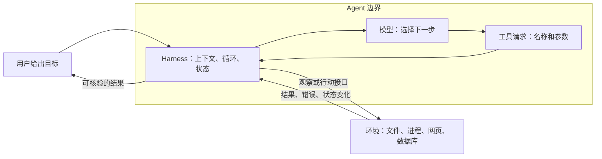

# 第一章　认识 Pi，完成第一个任务

你可以向聊天模型问“怎样修复这个程序”，也可以让 Pi 打开程序、修改文件、运行检查，再告诉你结果。两者的区别不在于聊天框长什么样，而在于系统能否把建议变成可观察、可核验的行动。

本章不要求你写过 Agent，也不要求你懂 TypeScript。你只需要愿意打开终端，在一个练习目录里观察文件如何变化。本章先分清模型、上下文、工具和 Harness，再说明 Agent 怎样接触外部环境；随后安装 Pi、配置模型账户，完成一个可以独立验收的订单修复；最后学习会话操作和项目约定。读完以后，你应该能解释一次任务中谁作出决定、谁修改文件、谁提供正确性的证据。

## 1.1 先认清我们在使用什么

**大语言模型**，简称 LLM，是根据输入内容生成输出的模型。输入可以包含文字，有的模型还接受图像。它可以解释代码、拟定步骤，也可以生成“调用哪个工具、传入哪些参数”的请求。但模型本身并不因此获得你电脑的文件访问权。

**工具**是宿主程序提供的执行接口。例如，`read` 接收文件路径，返回文件内容；`write` 接收路径和文本，写入文件。模型产生调用请求，真正打开文件的是工具背后的程序。

**上下文**是本次请求中实际交给模型的信息：任务说明、系统指令、工具定义、相关文件片段，以及之前的对话和工具结果。文件放在磁盘上，不等于模型已经读过它。

可以用一个便于入门的等式来理解：

> Agent = LLM + 上下文 + 工具。

等式省略了一个关键角色：谁负责把三者组织成能够持续运行的系统？这个角色通常称为 **Harness**，本书也称它为运行框架。它构造上下文，把工具请求送去执行，保存状态，决定何时继续调用模型，并提供验证、拦截、纠正等接入点。

其中，模型承担“下一步做什么”的主要策略决策；Harness 承担“这个决策怎样进入真实执行过程”的职责。模型可以提出读文件，Harness 检查参数并调度工具，文件系统才返回内容。对生产系统而言，权限和验证也是 Harness 的责任范围，但具体框架不一定替你实现完整的权限系统。Pi 就没有内建的操作系统沙箱；这一点不能从上述概念定义中推导出来，必须查看它的实际边界。

**Pi Coding Agent** 是一个主要在终端中使用的编码助手，也是一个可以扩展、嵌入其他程序的 Harness。它默认提供 `read`、`bash`、`edit`、`write` 四个工具，把许多业务选择留给扩展，而不是要求所有用户接受同一种计划模式、团队结构或记忆服务。这里的“简洁”描述的是核心接口和组合方式，并不是说整个项目只有几十行代码。

本书以官方源码提交 [`71dca871`](https://github.com/earendil-works/pi/tree/71dca871bc80b6bc97be37f0ca3189399d651fff) 为依据。该快照中 Coding Agent 的包版本是 `0.85.1`，包名为 `@earendil-works/pi-coding-agent`。网上较早的资料可能使用旧仓库名和旧包名；跟随本书时请先对齐版本。[包定义](https://github.com/earendil-works/pi/blob/71dca871bc80b6bc97be37f0ca3189399d651fff/packages/coding-agent/package.json)

## 1.2 Agent 与环境隔着什么

环境不仅是电脑文件，也可以是数据库、网页、用户、其他 Agent，甚至机器人所处的物理世界。Agent 并不直接拥有这些环境的完整状态。它只能通过接口取得观察，并通过接口发起行动。



假设你说：“找出记账程序为什么把退款也算成收入。”Pi 需要读取代码和数据。模型看到的只是工具交回来的片段，无法凭空知道另一张表里还藏着退款记录。修改之后，它还需要运行检查。工具报告写入成功，只能证明写入发生了，不能证明记账逻辑正确。

这里已经出现了[第五章工具契约](05-tools.md#51-工具是一份契约不只是一个函数)要展开的设计原则：工具返回成功，要说清楚究竟是哪件事成功。写入成功和业务验证成功是两份不同的证据。

因此，判断 Agent 的工作不能只看它最后说了什么。还要看：它观察到了哪些证据，做过哪些改动，用什么检查确认结果。这三个问题会贯穿全书。

## 1.3 安装：区分终端、Pi 和模型服务

终端是输入命令的窗口。`node` 是运行 JavaScript 程序的软件；`npm` 是安装这类软件包的工具；`pi` 则是安装之后启动 Pi 的命令。下面的命令使用 macOS/Linux 常见的终端语法，Windows 用户可以参考官方 [Windows 指南](https://github.com/earendil-works/pi/blob/71dca871bc80b6bc97be37f0ca3189399d651fff/packages/coding-agent/docs/windows.md)。

先检查 Node.js：

```bash
node --version
npm --version
```

本书版本要求 **Node.js 22.19.0 或更高版本**。如果提示找不到命令，或版本过旧，请先从 [Node.js 官方下载页](https://nodejs.org/en/download) 安装满足要求的版本，然后重新打开终端。`npm` 随常见的 Node.js 安装方式一起提供。

安装固定版本，减少教程与实际行为的差异：

```bash
npm install -g --ignore-scripts @earendil-works/pi-coding-agent@0.85.1
pi --version
```

`-g` 表示把命令安装到当前 npm 配置的全局位置；`--ignore-scripts` 禁止安装期间运行依赖包的生命周期脚本，也是该版本官方安装说明采用的选项。如果安装提示目录权限不足，优先修正 Node/npm 的用户安装配置，不要把 `sudo` 当作默认补救。

Pi 还需要连接模型服务。安装软件和取得模型访问权限是两件事。运行：

```bash
pi
```

然后在 **Pi 的输入框里**输入：

```text
/login
```

选择你已有账户对应的服务，按提示登录。也可以在登录菜单中配置 API key。API key 是模型服务的访问凭证，不要写进项目文件或提交到 Git。完成后通过 `/model` 选择一个支持工具调用的模型。不同供应商的可用模型、订阅资格和计费方式可能变化，应以登录时显示的选项与供应商说明为准。

`/login` 和 `/model` 不是普通 shell 命令；它们由 Pi 解释。以后看到以 `/` 开头的操作，除非特别说明，都应在 Pi 内输入。[安装与认证说明](https://github.com/earendil-works/pi/blob/71dca871bc80b6bc97be37f0ca3189399d651fff/packages/coding-agent/docs/quickstart.md)

## 1.4 一个能亲手核验的练习

这本书提供一个很小的订单汇总程序。你不需要先读懂它；先观察输入和输出。打开终端，从本书仓库根目录执行：

```bash
node examples/order-report/setup.mjs
cd .workshop/order-report
node check.mjs
```

`setup.mjs` 会新建练习目录，复制数据、带缺陷的程序和检查脚本。它遇到已有目录会停止，避免覆盖你上次的练习。初始化后的检查应该失败：程序把退款也加到了收入里。这是刻意保留的教学缺陷。

练习数据只有三条：

| 订单 | 状态 | 金额，单位为分 |
| --- | --- | ---: |
| A-001 | paid | 1200 |
| A-002 | refunded | 500 |
| A-003 | paid | 2300 |

`paid` 表示已支付，`refunded` 表示已退款。本练习的业务约定是：汇总仍为已支付状态的订单；退款订单不计入。本练习不涉及现金流水净额，因此也不把退款再扣一次。正确结果是 **3500 分，2 笔订单**。先明确口径，代码才有可验证的目标。

现在在这个目录启动 Pi：

```bash
pi
```

输入下面的请求：

```text
请修复当前目录的订单汇总程序。
业务规则：只有 status 为 paid 的订单计入汇总，amountCents 的单位是分。
先读取相关文件，再修改 report.mjs；不要修改 orders.json 和 check.mjs。
运行 node check.mjs 验证，并说明修改原因和实际检查结果。
```

这条请求提供了目标、业务规则、允许修改的范围和验收方式。它没有替模型写出每一步实现。你应该在界面中看到类似的过程：读取文件，发现累加逻辑，编辑代码，通过 `bash` 运行检查，然后给出解释。具体工具顺序可能不同，模型也可能先列目录，这不构成失败。

完成后，在 Pi 中输入 `/quit` 返回终端，再独立运行：

```bash
node check.mjs
node report.mjs
node ../../examples/order-report/verify.mjs .
```

成功时，检查输出 `PASS: paid orders = 2, totalCents = 3500`，程序输出包含 `totalCents: 3500` 和 `paidCount: 2` 的 JSON。最后一条外部验证命令还会确认数据与检查脚本没有被修改，并用五组输入检查汇总逻辑。**不要只依据 Pi 的“已通过”判断成功。**

读不懂修改也没关系，可以继续问：“请用三条订单逐条演示修改前和修改后的累加过程。”你会看到退款订单如何让结果从错误的 4000 回到 3500。这就是把抽象的代码正确性变成你能检查的事实。

如果暂时没有模型账户，也可以完成初始化、运行失败检查、阅读 [参考修复](../examples/order-report/solution/report.mjs)，并使用单独的修复验证命令。这能练习工程闭环，但不等于真实运行过模型驱动的 Pi。

### 订单修复参考答案

一份最小修复是在累加前筛选 `paid` 订单。下面是与本例数据结构对应的 JavaScript；完整可运行文件见[参考修复](../examples/order-report/solution/report.mjs)。

```js
function summarize(orders) {
  let totalCents = 0;
  let paidCount = 0;
  for (const order of orders) {
    if (order.status !== "paid") continue;
    totalCents += order.amountCents;
    paidCount += 1;
  }
  return { totalCents, paidCount };
}
```

A-001 使累计值变成 1200 分、1 笔；A-002 是退款订单，两个累计值都不变；A-003 使累计值变成 3500 分、2 笔。只改总金额而没有同步排除退款笔数，也没有完成修复。空数组应得到两个零，全为退款订单也应得到两个零；这些输入可以防止实现只是写死了样例答案。

参考答案说明预期实现，不代表你的 Pi 已经执行成功。完成实验仍要保留自己的检查输出，并确认 `orders.json` 和 `check.mjs` 未变。

## 1.5 为什么要给任务写验收条件

“优化一下程序”没有告诉 Agent 什么算更好。它可能重命名变量，也可能改算法，还可能重构整个目录。相反，“只统计 paid 订单，检查三条样例结果为 3500 分和两笔”把成功条件落在了环境中。

验收条件还要独立于 Agent 的实现。假如 Pi 为了通过检查，把 `check.mjs` 改成永远输出 PASS，终端会显示成功，任务却失败了。因此练习明确保护检查和数据。真正的评估还应包含更多订单组合，放在 Agent 不能篡改的评估环境中；本章的小检查只负责让你第一次看见这个区别。

一个可复用的任务说明可以包含四句话：我要什么结果；依据哪些规则；可以改什么；如何检验。不是每次都要写长提示词，但必须知道缺失的信息会由谁补上。模型做出的假设，如果影响正确性，就应该暴露给你。

## 1.6 初次使用最值得掌握的操作

| 目的 | 操作 | 需要理解的边界 |
| --- | --- | --- |
| 查看当前会话信息 | `/session` | 能看到会话身份、文件等信息 |
| 给任务命名 | `/name order-report` | 名称帮助查找，不改变任务逻辑 |
| 退出 | `/quit` | 退出程序不代表撤销文件改动 |
| 继续最近会话 | 终端运行 `pi -c` | 恢复的是会话，文件仍以磁盘现状为准 |
| 选择旧会话 | 终端运行 `pi -r` | 不是自动搜索所有历史知识 |
| 压缩上下文 | `/compact` | 历史摘要会损失细节，第三章详解 |
| 重载资源 | `/reload` | 用于加载修改后的技能、扩展、上下文文件等 |

Pi 界面中输入 `!node check.mjs` 会运行 shell 命令并把结果放进模型上下文；`!!node check.mjs` 则不把输出加入上下文。区别是模型下一次能不能看见这段结果，而不是后者获得了更强的执行隔离。[交互与命令](https://github.com/earendil-works/pi/blob/71dca871bc80b6bc97be37f0ca3189399d651fff/packages/coding-agent/docs/usage.md)

刚入门时可以先让 Pi 只观察：

```bash
pi --tools read,grep,find,ls
```

这限制了可用的工具集合，适合解释代码。但“只读工具集合”不能代替操作系统权限边界：已加载的扩展仍是程序，读取内容也可能包含敏感信息。Pi 默认使用启动它的账户权限；项目目录只是工作位置，并不是无法越过的围栏。

## 1.7 项目指令与项目信任

你可以在练习目录写一份 `AGENTS.md`：

```markdown
# 练习约定

金额使用整数分。修复时保留原始订单数据。
修改后运行 node check.mjs，并报告真实输出。
```

重启或 `/reload` 后，Pi 会把这类项目说明纳入上下文。它适合保存经常重复的约定，但文本指令不是程序强制约束。模型可能误解指令，也可能受到文件中其他内容的干扰。

这个版本还会对包含 `.pi` 配置、扩展、技能等资源的项目作信任判断。信任意味着允许加载相关资源，**不意味着每条 shell 命令都经过批准**。`--approve` 的含义也是本次信任项目资源，不是给全部工具操作套上审批系统。`AGENTS.md` 等上下文文件有其独立的加载规则，不能认为拒绝项目信任就会自动忽略一切仓库文字。[安全边界](https://github.com/earendil-works/pi/blob/71dca871bc80b6bc97be37f0ca3189399d651fff/packages/coding-agent/docs/security.md)

## 1.8 本章练习：讲清一次工作是怎样完成的

完成订单修复后，请回答：

1. 哪条观察让 Pi 知道当前程序有问题？
2. 哪个工具改变了文件？哪个工具验证了结果？
3. 如果只给出正确答案 3500，却没有改程序，任务是否完成？
4. 退出再继续会话，为什么仍需要重新检查文件？

### 参考答案

1. 可用证据是 `read` 返回的累加代码和三条订单：代码没有排除 `refunded`，所以会累计成 4000 分、3 笔；若 Pi 运行了初始检查，失败输出也能直接暴露这个差异。你在终端独立看过的失败不会自动成为 Pi 的观察，除非把它交给 Pi，或让 Pi 自己运行检查。
2. 合理轨迹中，`edit` 修改 `report.mjs`，`bash` 执行 `node check.mjs` 并交回输出。模型也可能选择 `write`，甚至用 `bash` 修改文件，因此要以实际调用为准。`read` 只能确认文本内容，不能替代行为测试。
3. 没有完成。用户要求修复程序，3500 只是样例期望值。必须修改实现，让它能正确处理其他符合规则的订单，并通过独立检查。
4. 会话保存的是过去的消息，其他编辑器、进程或人仍可能修改磁盘文件。继续会话后，应重新读取与本次行动有关的文件并运行相关检查；[第四章的会话与环境区别](04-memory.md)会解释为什么恢复会话不能恢复整个外部世界。

下一章会把你在屏幕上看到的过程拆成循环、消息和状态，解释为什么同一个模型换一个运行框架，做事表现也可能不同。

有模型账户后，可运行[真实模型配套实验](../examples/live-model/README.md)，保留轨迹并比较实际观察与本章机制。

[返回目录](../README.md) · [下一章：运行循环与架构](02-runtime.md)
