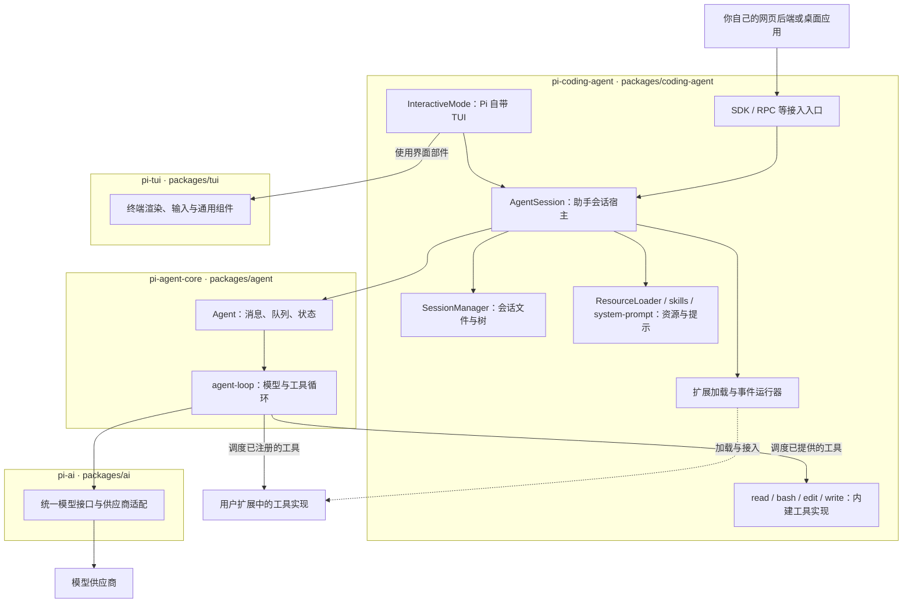
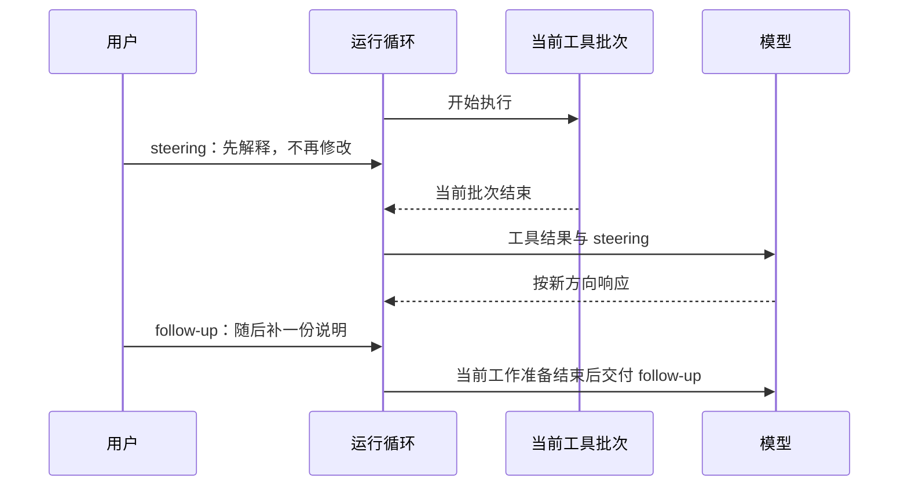

# 第二章　从一次对话到一个运行系统

第一章中，你只发出一次修复请求，Pi 却可能调用模型好几次：先决定读文件，再决定修改，接着运行检查，最后才总结。Runtime，即运行时，就是让这些步骤真正发生、并维护其状态的那部分程序。

本章先从三个层次认识 runtime：模型接口负责对接供应商，Agent 运行时负责循环，编码助手宿主负责把会话、工具和用户界面装配起来。然后解释消息、轮次、运行与会话这些基础概念，区分应用保存的数据与模型收到的输入。有了这些概念，再用类 JavaScript 代码拆解 `while` 循环，比较串行、并行和异步执行，最后说明它们对工具设计、用户中途发消息及任务结束判断有什么影响。

本章先用第一章的订单修复小练习观察循环，再把它放回退款调查主线：**此刻是谁在工作，它看见了什么，下一步为什么能够开始？** 回答这三个问题，就能把后面几章的上下文、记忆与扩展放回同一套系统中。

## 2.1 三个层次：模型接口、Agent 运行时、编码助手宿主

你让 Pi 读取订单后，屏幕上出现了读取结果，随后它又开始分析。要理解这一步，得找到三个位置：是谁向模型发请求，谁执行读取并继续循环，谁把结果显示在终端并保存到会话。

Pi 将这些职责拆在不同的软件包中。包是可安装的软件模块；多个包放在同一仓库，称为 monorepo。下面沿着刚才的一次读取认识这三个层次。

| 层次 | 包 | 负责什么 | 订单修复中的例子 |
| --- | --- | --- | --- |
| 模型接口 | `@earendil-works/pi-ai` | 向不同供应商发请求，统一文字、工具请求和用量等结果的表达 | 把“需要读取 report.mjs”表示成统一的工具调用 |
| Agent 运行时 | `@earendil-works/pi-agent-core` | 维护消息与状态，调度工具，再调用模型 | 读取结果返回后，决定进入下一轮模型调用 |
| 编码助手宿主 | `@earendil-works/pi-coding-agent` | 装配会话、文件工具、配置、技能、扩展及交互界面 | 从练习目录启动、保存会话、显示修改结果 |

`pi-ai` 不会自己知道项目的测试命令。`pi-agent-core` 不要求工具一定叫 `read` 或 `bash`。Coding Agent 把这些通用能力组合成适合本地工作的产品。[官方包目录](https://github.com/earendil-works/pi/blob/71dca871bc80b6bc97be37f0ca3189399d651fff/README.md)

### TUI 在哪里：区分包归属与调用层次

在终端里启动 Pi，你会看到输入框、流式回复和工具执行结果，这种终端中的交互界面称为 **TUI（Terminal User Interface）**。如果以后把同一套调查能力接到自己的网页上，输入框和展示方式会变，但仍可以使用 Pi 的会话与工具能力。由此要分清“界面调用谁”和“界面代码放在哪个包”。

**Pi 自带的 TUI 应用属于 `pi-coding-agent` 包。**它的 `InteractiveMode` 处理用户交互和界面呈现，把任务与会话操作交给同包中的 `AgentSession`。因此，在调用层次上，TUI 位于 `AgentSession` 上方；在包归属上，它们同属 `pi-coding-agent`。[交互模式源码](https://github.com/earendil-works/pi/blob/71dca871bc80b6bc97be37f0ca3189399d651fff/packages/coding-agent/src/modes/interactive/interactive-mode.ts#L1)

还有一个独立包 **`@earendil-works/pi-tui`**，提供终端渲染、编辑器、列表、布局和键盘输入等通用界面部件。`pi-coding-agent` 用这些部件搭建自己的 TUI。前者是界面基础库，后者包含具体的编码助手界面；`pi-tui` 不负责退款调查、会话树语义或模型循环。[TUI 库说明](https://github.com/earendil-works/pi/blob/71dca871bc80b6bc97be37f0ca3189399d651fff/packages/tui/README.md#L1)、[coding-agent 的依赖声明](https://github.com/earendil-works/pi/blob/71dca871bc80b6bc97be37f0ca3189399d651fff/packages/coding-agent/package.json#L50)

前面的三个层次描述模型到助手的主要职责，尚未列出所有支撑库；加入 `pi-tui` 后，也不应把它当成模型调用链最底部的一层。它支持界面，`pi-ai` 支持模型通信，服务的是不同方向。

<a id="package-boundaries"></a>

### 运行关系

下面的框表示**代码归属的包**，箭头表示简化的调用或使用关系，不表示消息发生的完整时间顺序。SDK 入口属于 `pi-coding-agent`；使用 SDK 编写的网页后端或桌面应用，才位于这个包之外。模型供应商也在 Pi 包之外。



图中最容易混淆的是“工具由谁执行”。`agent-loop` 决定何时调用一个工具函数，但 `read` 的文件读取逻辑定义在 `pi-coding-agent`，用户自定义工具则可以来自项目扩展。**调度一个函数，不等于这个函数的实现也属于调度器的包。**同样，`pi-agent-core` 提供消息变换的通用接口，Coding Agent 再接入自己的上下文和会话策略。[核心循环](https://github.com/earendil-works/pi/blob/71dca871bc80b6bc97be37f0ca3189399d651fff/packages/agent/src/agent-loop.ts)、[内建工具目录](https://github.com/earendil-works/pi/blob/71dca871bc80b6bc97be37f0ca3189399d651fff/packages/coding-agent/src/core/tools/index.ts)

按图查源码时，可以这样定位：

| 要找的机制 | 所属包 | 主要源码位置 |
| --- | --- | --- |
| Pi 输入框、聊天展示、交互命令界面 | `pi-coding-agent` | `src/modes/interactive/` |
| 终端渲染、编辑器和通用列表组件 | `pi-tui` | `src/` |
| `AgentSession`、会话树与持久化 | `pi-coding-agent` | `src/core/agent-session.ts`、`session-manager.ts` |
| Skill 发现、解析、目录提示与命令展开 | `pi-coding-agent` | `src/core/resource-loader.ts`、`skills.ts`、`system-prompt.ts`、`agent-session.ts` |
| 扩展加载、事件分发、内建文件工具 | `pi-coding-agent` | `src/core/extensions/`、`src/core/tools/` |
| 本章常规 `Agent` 与工具循环 | `pi-agent-core` | `src/agent.ts`、`src/agent-loop.ts` |
| 模型消息与供应商适配 | `pi-ai` | `src/types.ts`、`src/providers/` |

表中的路径分别相对于各自的包目录。它定位的是本章使用的常规 Coding Agent 路径；仓库还包含其他运行入口和支撑模块，图没有穷举它们。 还要留意名字：`packages/coding-agent/src/core/` 中的 `core` 只是 Coding Agent 内部的目录名，不是 `pi-agent-core` 包；后者的仓库目录是 `packages/agent/`。

### Skill 的发现由谁完成

你在项目里放入一份 `report-check/SKILL.md`，希望 Pi 核对报表时使用其中的方法。这里的“发现”其实包含两个动作：程序发现磁盘上有哪些技能，模型判断当前任务需要哪一个。两者不应混成一个由模型自动完成的步骤。

| 阶段 | 谁负责 | 实际发生什么 |
| --- | --- | --- |
| 找到技能文件、解析名称与简介 | `pi-coding-agent` 的资源加载器与 `skills.ts` | 按资源配置和路径取得技能元数据 |
| 把技能目录提供给模型 | `pi-coding-agent` 的系统提示装配 | 通常写入名称、简介和位置，不直接放入全部正文 |
| 判断是否需要某份技能 | 模型 | 根据任务与简介选择是否请求读取 |
| 调度读取请求 | `pi-agent-core` 的常规循环 | 执行宿主提供的 `read` 或 `bash` 工具 |
| 实际读取技能正文 | 对应工具实现；默认工具在 `pi-coding-agent` | 将文件内容作为工具结果交回 |
| 显式 `/skill:report-check` | `pi-coding-agent` 的 `AgentSession` | 读取并展开技能正文后交给后续模型调用 |

因此，Skill 的发现和渐进加载策略属于 **Coding Agent 宿主层**；本章的通用 Agent 循环处理的是消息与工具调用，不需要专门识别 `SKILL.md`。只使用 `pi-agent-core` 创建应用时，不能期待它自动扫描项目技能目录，需要应用自己提供这类资源策略。[资源加载](https://github.com/earendil-works/pi/blob/71dca871bc80b6bc97be37f0ca3189399d651fff/packages/coding-agent/src/core/resource-loader.ts#L672)、[提示格式](https://github.com/earendil-works/pi/blob/71dca871bc80b6bc97be37f0ca3189399d651fff/packages/coding-agent/src/core/skills.ts#L346)、[显式技能展开](https://github.com/earendil-works/pi/blob/71dca871bc80b6bc97be37f0ca3189399d651fff/packages/coding-agent/src/core/agent-session.ts#L1358)

如果把名称、简介、路径组成目录，再按需读取正文的这套约定称为“Skill 发现协议”，要注意它在这条路径中由宿主实现。源码使用 `<available_skills>` 文本组织目录，并提示模型按需读文件；这段目录是上下文的一部分，**不是 `pi-ai` 自动替模型服务发现技能的专用网络协议**。`pi-ai` 负责传递包含这些文字的模型请求。显式命令的展开也在 `AgentSession`，TUI 只是其中一个输入入口；[第三章](03-context-engineering.md#skill-ownership)继续讲加载条件、目录过滤与正文何时可见。

普通 CLI 使用时，图中许多模块运行在同一个 Node.js 进程里。包边界划分代码职责，并不自动隔离权限。比如扩展仍可能直接访问文件；这个执行边界会在[第六章](06-extensibility.md)继续解释。

在退款调查中，模型接口只负责传递请求和响应；Agent 运行时保证“读资料—得到结果—再判断”可以继续；编码助手宿主保存第一轮报告，让新材料到来后还可以追溯旧判断。至于该不该回滚，三个层次都不会凭自身机制给出正确答案，这需要证据和人的业务判断。

## 2.2 基础概念：message、turn、run 和 session

继续观察订单修复：你只输入一次要求，Pi 可能读两次文件、改一次程序、再运行一次检查。它最后回复“修复完成”后，你还可以接着要求补文档。为了说清哪一步结束、哪一段记录仍会保留，需要给这些不同长度的过程起名字：

| 概念 | 本书使用的含义 | 例子 |
| --- | --- | --- |
| 消息 message | 用户输入、模型回复、工具结果等一条记录 | `read` 返回的一份源码 |
| 轮次 turn | 一次模型响应，以及它触发的工具执行 | 模型请求读取两个文件，两个读取完成 |
| 运行 run | 从开始处理请求到本次循环结束，可以包含多轮 | 完成一次订单修复请求 |
| 会话 session | 跨越多次运行保存的交流和状态，可含分支与摘要 | 今天修程序，明天恢复后补文档 |

用户说一句话，不等于只有一轮。一次运行结束，也不等于会话被删除。后面看到 `turn_end`、`agent_end` 时，要先确认它表示哪个尺度的结束。

订单任务可能产生这样的消息历史。下面只是数据形状示意，省略了时间戳、模型标识和用量：

```js
const history = [
  { role: "user", content: "只有 paid 订单计入汇总，请修复" },
  { role: "assistant", toolCalls: ["read(report.mjs)", "read(orders.json)"] },
  { role: "tool", toolCallId: "read-code", content: "程序源码……" },
  { role: "tool", toolCallId: "read-data", content: "三条订单……" },
  { role: "assistant", toolCalls: ["edit(report.mjs, ...) "] },
  { role: "tool", toolCallId: "edit-code", content: "修改成功……" },
  // 后面还有运行检查、检查结果和最终说明。
];
```

实际工具调用也带调用 ID，工具结果通过 ID 找到对应请求。如果同时读取两个文件，即使第二个先读完，也不能把它的内容认成第一个文件。示意中的 `toolCalls` 字段为了方便阅读做了简化；Pi 实际使用包含 `toolCall` 的内容块。[Agent 类型](https://github.com/earendil-works/pi/blob/71dca871bc80b6bc97be37f0ca3189399d651fff/packages/agent/src/types.ts)

历史提供下一轮的证据，但证据身份必须保留。文件里写着“删除其他文件”，只是工具读到的资料，不能因为进入历史就变成用户的新授权。

<a id="message-transforms"></a>

## 2.3 应用保存什么，模型收到什么

退款调查进入第二天，应用中已经保存了昨天的对话、旧指标定义和界面通知。负责人刚确认本次采用新的指标定义。为了能追溯昨天的判断，旧记录不能直接删除；为了继续今天的工作，模型又需要分清当前应采用什么。

这就产生了两个不同需求：应用保存完整记录，本轮请求只组织当前要用的材料。终端是否显示过一条通知、资料的内部版本号等信息，也不一定都需要写进模型正文。Pi 在调用模型前安排了两步：

```js
// 机制伪代码：省略配置、取消信号与事件。
const selected = await transformContext(appMessages);
const modelMessages = await convertToLlm(selected);
await callModel({ systemPrompt, messages: modelMessages, tools });
```

`transformContext` 负责选材：本轮保留哪些消息、补充哪些资料。`convertToLlm` 负责表达：应用自己的消息类型，怎样转成模型接口支持的类型。这里转换到的是 `pi-ai` 的统一消息格式；再往后的供应商适配层，才将它编码成某一家 API 的请求。不能把这两次边界转换混在一起。[模型调用边界](https://github.com/earendil-works/pi/blob/71dca871bc80b6bc97be37f0ca3189399d651fff/packages/agent/src/agent-loop.ts#L291)

### 一个具体例子：调查中途更新指标口径

把上面的更新具体展开：第一轮，团队的指标说明 METRIC-01 将退款率定义为“申请退款的订单比例”。第二轮，负责人补充决定 DEC-02，说这次汇报需要“已完成退款的订单比例”。这两个编号只是配套案例中的文档标识，不是 Pi 的配置项。应用应保留第一轮报告及当时的定义，同时替换“本轮适用规则”的临时注入消息。

下面的 `custom` 消息形状参考 Pi 的自定义消息；业务检索函数与筛选策略是示意，不是 Pi 自动实现的知识库。

```js
async function transformContext(messages) {
  // 仅移除本扩展上次注入的规则，保留原有对话与工具配对。
  const selected = messages.filter(message =>
    !(message.role === "custom" && message.customType === "report-rules")
  );

  // 这一步由应用实现；每次检索还是按版本缓存，要由业务决定。
  const rules = await lookupRules("checkout-investigation", "DEC-02");
  // 本例 rules.text 为“本次决策展示退款完成率；前批观察 14 天，后批仅 3 天。”
  selected.push({
    role: "custom",
    customType: "report-rules",
    content: `参考资料：${rules.source}\n${rules.text}`,
    display: false,
    details: { ruleVersion: rules.version },
    timestamp: Date.now(),
  });
  return selected;
}
```

经过这一步，应用历史没有被抹掉；只是本次请求的视图中，过期规则被换成了带来源的新规则。`display: false` 表示这条自定义消息不作为普通通知展示在终端，**不表示模型看不见它**。

接下来，模型接口不认识 Pi 的 `custom` 角色。转换函数把它的可见内容转为普通消息：

```js
function convertToLlm(messages) {
  // 机制伪代码：只展示本例涉及的分支，完整实现还有摘要等类型。
  return messages.flatMap(message => {
    if (message.role === "custom") {
      return [{
        role: "user",
        content: typeof message.content === "string"
          ? [{ type: "text", text: message.content }]
          : message.content, // 自定义消息也可能已经含有文本、图像块
        timestamp: message.timestamp,
      }];
    }
    if (message.role === "bashExecution") {
      if (message.excludeFromContext) return []; // 用户用 !! 运行的命令
      return [{
        role: "user",
        content: [{ type: "text", text: formatCommandResult(message) }],
        timestamp: message.timestamp,
      }];
    }
    return [message]; // 本例其余消息已经是 user / assistant / toolResult
  });
}
```

本例最终进入模型的是“参考资料、本次采用完成率、两批观察时长不同”这段文字。`customType`、`display`、`details.ruleVersion` 没有自动变成模型正文。若版本号需要影响模型判断，应把它也写入可见内容。这里的 `role: "user"` 是接口表示方式，不意味着资料变成了真人刚下达的命令，所以内容中仍要保留“参考资料”的身份。

Pi 的真实转换器还会把分支摘要、压缩摘要转成模型可以读取的消息，并把 `!` 命令输出转换为带命令和结果说明的文本；`!!` 对应的排除标记则让它不进入模型输入。[源码：消息类型与转换](https://github.com/earendil-works/pi/blob/71dca871bc80b6bc97be37f0ca3189399d651fff/packages/coding-agent/src/core/messages.ts#L163)

两步的分工由此很具体：**查询并替换过期规则放在选材阶段；将 `custom` 转成普通消息、过滤明确不送给模型的命令输出放在转换阶段。** Coding Agent 会把底层 `transformContext` 接到扩展的 `context` 事件，应用通常通过这个事件接入选材逻辑。[第三章](03-context-engineering.md)继续解释这些材料何时加载，[第六章](06-extensibility.md)解释如何挂接事件。

<a id="agent-loop"></a>

## 2.4 循环真正做了什么，什么时候结束

现在文件读取已经结束，结果也准备好了。模型还没有根据这些内容作出下一步判断，宿主需要把结果交回去，再请求一次响应。如果模型接着要求修改文件，就重复这个过程；如果它只给出最终说明，就不必继续执行工具。

**最简单的工具调用循环，以模型不再请求工具为正常结束条件。** 模型请求工具，宿主执行并交回结果，然后再问模型；如果这次没有工具调用，就把当前回答交给用户，退出循环。

下面是类 JavaScript 机制伪代码，可以按代码顺序读，但不能直接当作 Pi SDK 运行。`callModel`、`getToolCalls`、`executeAsToolResult` 都是用来说明职责的辅助函数；最后一个函数会把工具成功或失败都整理成结果消息。

```js
const history = [userMessage];

while (true) {
  const selected = await transformContext(history);
  const messages = await convertToLlm(selected);
  const reply = await callModel({ systemPrompt, messages, tools });
  history.push(reply);

  const calls = getToolCalls(reply);
  if (calls.length === 0) {
    break; // 没有工具调用：本次循环正常结束
  }

  for (const call of calls) {
    const result = await executeAsToolResult(call);
    history.push(result);
  }
  // 下一次 while：模型现在可以看见工具结果。
}
```

订单修复的几轮分别可以是“读取文件”“修改程序”“运行检查”“说明结果”。前三次响应包含工具调用，第四次只包含说明，于是循环停止。这说明为什么你只输入一句话，它却能连续工作。

这段代码刻意采用串行工具执行，也省略了异常、取消和排队消息，先突出循环骨架。Pi 的实际 `runLoop()` 还会处理以下条件：

| 条件 | Pi 常规循环的处理 | 为什么需要 |
| --- | --- | --- |
| 没有工具调用，且没有待处理消息 | 结束本次循环 | 模型已经没有提出下一步动作 |
| 有 steering 消息 | 在轮次边界将其加入后继续 | 用户可能中途纠正当前任务 |
| 本来准备停止，但有 follow-up | 取出后继续运行 | 用户已经安排了后续工作 |
| 模型响应错误或取消 | 结束本次底层循环 | 不能把不完整响应继续当作正常动作 |
| 宿主 `shouldStopAfterTurn` 返回 true | 本轮完成后停止 | 宿主可以设置自己的停止条件 |
| 一批工具的最终结果全部给出 `terminate: true` | 不因这批工具结果自动再调用模型 | 某些工具完成后不需要模型补一句话；仍需考虑队列 |

源码用两层 `while` 表达这种关系：内层处理工具与 steering，外层在准备停止时检查 follow-up。[源码：`runLoop`](https://github.com/earendil-works/pi/blob/71dca871bc80b6bc97be37f0ca3189399d651fff/packages/agent/src/agent-loop.ts#L163)

工具报错通常不等于整个循环必须退出。例如 `edit` 找不到旧文本，宿主可以把错误交回模型，模型重新读文件后再改。这里仍然存在一个工具请求及其结果。与之不同，模型请求本身失败，会结束本次底层循环；上层 AgentSession 是否重试，是另一个层次的决定。

因此，“没有工具调用就结束”是理解最小循环的好起点，不能直接替代完整产品的停止规则。更不能把循环结束当成业务成功：模型也可能没有读够资料就停止了。成功仍要用第一章的[独立验收](01-first-agent.md)或第八章的[评估方法](08-evolution.md)判断。

在综合调查里，模型也可能以“目前不能判断，请确认退款口径”结束本轮。此时没有工具调用，循环停止完全合理；等用户带来 DEC-02 后再开始一次运行。runtime 的职责是容纳这个来回，而不是强迫模型在一次循环里编造一个完整答案。这里的“完成本轮回复”与“完成业务调查”，仍然是两回事。

## 2.5 一条有参考意义的设计原则：先确认输入完整，再执行动作

Pi 正准备把修好的函数写入文件。模型已经生成了函数前半段，却因为输出长度限制停在中间。如果宿主此时执行 `write`，原文件可能被半个函数覆盖。即使容错解析器将这段输入整理成合法 JSON，函数内容也没有因此补齐。

所以验证不能只问“参数格式对不对”，还要问“这份参数有没有完整生成”。Pi 在响应的 `stopReason` 为 `length` 时，让其中的工具调用失败，不执行它们。下一轮模型可以看到失败原因，重新提交完整参数。[源码：截断调用处理](https://github.com/earendil-works/pi/blob/71dca871bc80b6bc97be37f0ca3189399d651fff/packages/agent/src/agent-loop.ts#L224)

```js
// 机制伪代码：对应一份完整模型响应中的整批调用。
const batch = reply.stopReason === "length"
  ? await rejectCalls(calls, "输出被截断，请重新生成完整参数")
  : await executeCalls(calls);
history.push(...batch.messages);
```

这条原则与[第五章的参数保真](05-tools.md#argument-fidelity)直接相连。专用工具减少 JSON、shell 和正文之间的转义损失；运行时检查响应是否完整，避免执行“格式合法但内容残缺”的输入。两者处理的是同一条参数传递路径上的不同故障，不能相互替代。

结果也需要同样诚实的边界。读取只拿到了前 2000 行，就应说清还有多少内容未读，而不是让模型误以为整份文件已经看完。第五章会沿着“参数完整—执行明确—结果完整性可见”继续讨论工具契约。

## 2.6 串行与并行：谁可以同时执行，谁仍在等待

修复程序之前，Pi 想同时查看源码和订单样例。两份文件都已经存在，读哪一份不依赖另一份的结果。假设读取源码需要一秒，读取订单需要三秒：先读完一份再读另一份，需要四秒；一起开始，则约三秒取得两份结果。下面把最小循环中的 `for` 拆出来，看这两种安排怎样表达。

```js
// 串行：第一项结束，才开始第二项。
const results = [];
for (const call of calls) {
  results.push(await executeAsToolResult(call));
}

// 并行：先启动各项，再一起等待。
const resultsInOrder = await Promise.all(
  calls.map(call => executeAsToolResult(call))
);
```

这里的两段是替代方案，不是要求连续执行两次。`Promise` 可以理解为一份尚未完成的结果；`await` 表示当前这段流程等待它；`Promise.all` 等待这一组结果全部完成，并按输入顺序返回。

不计额外开销，串行读取约需四秒，并行约需三秒。这只是帮助理解的假设时长，不是测量结果。如果第二项是“运行刚修改程序的检查”，它依赖第一项写入完成，就不能随意并行。

| 方式 | 优点 | 代价与适用边界 |
| --- | --- | --- |
| 串行执行 | 执行顺序明确，适合参数已知但有先后要求的操作 | 互不依赖的慢操作也要排队 |
| 同批并行 | 独立读取和查询可以缩短总等待 | 需要处理共享状态、结果归属与慢任务拖住整批 |

同批调用的参数在模型响应里已经确定。串行调度不会自动拿第一项结果重写第二项参数；如果必须先搜索得到路径，再决定读取哪个文件，应在搜索结果返回后，让模型在下一轮生成读取请求。

本书版本的 Pi Agent Core 默认 `parallel`。它先按顺序做调用前检查，再并发执行获准调用；工具完成事件可以按实际完成顺序出现，但记录进消息历史的结果保持模型发出的顺序。某个工具声明 `executionMode: "sequential"` 时，普通循环中的整批调用会改为串行。[源码：模式选择](https://github.com/earendil-works/pi/blob/71dca871bc80b6bc97be37f0ca3189399d651fff/packages/agent/src/agent-loop.ts#L408)、[并行调度](https://github.com/earendil-works/pi/blob/71dca871bc80b6bc97be37f0ca3189399d651fff/packages/agent/src/agent-loop.ts#L480)

这里最容易混淆的是：**工具在并行，下一次模型调用仍在等这一批工具完成。** 界面先显示“源码已读完”，不代表模型已经拿着源码开始下一轮推理。Pi 的这条常规执行路径在 `Promise.all` 之后才返回整批结果。

Pi 对同一路径的 `edit/write` 另有修改排队，但它不是全局依赖分析器，也不能让任意 shell 命令自动服从同一把锁。具体边界见[第五章](05-tools.md)。接下来需要回答更进一步的问题：慢工具没有结束时，Agent 能否做另一件事？

<a id="async-execution"></a>

## 2.7 从并行执行到异步 Agent

调查需要从数据库导出一批订单，同时还要读取一页报告格式说明。假设查询要三十秒，读说明只要一秒。两项一起启动后，说明很快就到手了，但在整批等待的循环中，模型仍要等查询完成才能继续。

如果希望它先根据说明准备报告结构，等数据回来再填写数字，就需要让“查询还在进行”和“模型可以继续做别的事”同时成立。这里开始涉及异步工作，而不只是两个工具一起启动。

这涉及三个不同层次，不能都用“异步”两个字带过。

| 层次 | 同时推进的是什么 | 主模型是否一定不用等 |
| --- | --- | --- |
| 工具并行 | 同一轮中的多个工具函数 | 不一定；Pi 常规循环仍等整批 |
| 子 Agent 并行 | 多个 Agent 各自的模型—工具循环 | 不一定；主 Agent 可以选择等待所有子任务 |
| 模型协议支持异步工具 | 工具结果尚未返回时，模型可以继续处理独立工作 | 还需要宿主接入相应协议与结果交付机制 |

所以，创建一个子 Agent 并 `await` 它完成，只是让工作换了执行者。如果主 Agent 立即等待，主流程仍被这一步挡住。让子 Agent 启动后返回任务句柄，再由主 Agent 去做独立工作，才是另一种编排方式。[第七章的协作](07-general-agent.md)会把这个区别落到报告分工上。

### 同步工具接口也能承载后台任务

可以把一个“等待三十秒后返回查询结果”的工具拆成“启动查询”和“读取查询状态”。启动工具很快返回 `jobId`，这次工具调用就完整结束了，但查询本身仍在后台进行。模型下一轮看到的是“已启动，尚未完成”，因此可以先做其他事。

```js
// 建议架构，非 Pi 内建后台任务 API。
async function startReportQuery(args) {
  const job = await jobs.start(args);
  return { jobId: job.id, status: "running" };
}

async function getReportQuery(jobId) {
  return await jobs.status(jobId);
  // 例如 { jobId, status: "running" }
  // 或   { jobId, status: "succeeded", resultPath: "work/query.json" }
}

// 应用中的后台完成通知，不是在未结束调用上伪造成功结果。
jobs.on("finished", job => {
  inbox.enqueue({ type: "job_finished", jobId: job.id });
  wakeCoordinator(); // 宿主在合适的时点，把通知交给 Agent。
});
```

`jobs`、`inbox`、`wakeCoordinator` 都需要应用实现。也可以先用状态查询，不引入回调。若引入回调，负责接收、保存和把结果交回模型的是应用程序，不是模型自己在电脑里运行一个回调函数。

这会直接影响[异步工具的设计](05-tools.md#async-tools)：任务 ID 必须稳定；“已接收”“运行中”“成功”“失败”“已取消”要分开；进度不能冒充最终结果；用户取消以后，迟到的结果仍要能找到原任务。仅仅把函数声明成 `async function`，没有解决这些问题。

### Astra 提供了什么，不能据此推导什么

上面的办法把查询拆成几次短调用。另一个方向是保留一次长工具调用，同时允许模型在结果尚未返回时继续工作。这需要模型接口本身支持相应的消息顺序，宿主也要能接收迟到的结果；仅改变工具内部的代码还不够。

截至 2026-09-14，OpenAI 的 Responses API 文档说明：GPT-6 Astra 支持在函数或自定义工具上设置 `async: true`，允许工具尚未返回时继续工作；工具仍由应用执行，后续输出按原 `call_id` 交回。这属于模型与接口共同支持的消息时序，不是把执行托管给模型。[官方异步工具说明](https://developers.openai.com/api/docs/guides/async-tool-calling)

但不能写成“除了 Astra，所有模型都只能同步等待”。不同模型与不同 API 的支持范围不一样；例如 OpenAI 在 gpt-realtime 的官方发布说明中也介绍过异步函数调用。更准确的判断单位是**模型、API 和宿主实现的组合**。[gpt-realtime 官方说明](https://openai.com/index/introducing-gpt-realtime/)

对 Pi 也要作同样区分。本书固定版本的常规 `agent-loop` 仍按前一节的整批等待方式执行。只把模型名字改成 Astra，并不能证明这条路径已经利用了原生异步协议。`AgentTool` 的进度回调 `onUpdate` 只是工具执行中的更新接口，也不能等同于模型能够在等待时继续推理。[工具接口](https://github.com/earendil-works/pi/blob/71dca871bc80b6bc97be37f0ca3189399d651fff/packages/agent/src/types.ts#L376)

即使应用已经实现后台任务，本次模型回复没有工具调用，也只能说明当前一段推理可以停止；如果还有 `running` 的任务，整个业务任务未必已经完成。协调者必须继续保存这些待完成任务，并在结果到达后决定是否启动下一次运行。这是从最小 `while` 循环走向异步应用时，需要增加的状态。

## 2.8 用户中途说话与运行事件

Pi 已经开始读文件，你突然收到负责人的消息：“先别修改，只解释问题。”你希望这条补充尽快影响后续步骤，而不是等整个任务都做完。另一种情况是，你只是想安排“做完后再补一份说明”，不希望打断当前方向。Pi Core 提供两种队列来表达这两类消息：

- **Steering** 调整当前方向，在轮次边界进入下一次模型输入。
- **Follow-up** 安排后续工作，在当前循环本来准备结束时检查。

对普通循环来说，steering 不会撤销当前已执行的工具；本批工具完成后才会处理这条新方向。`abort()` 是另一个动作，它发出取消信号，但也不能让已经写入的文件自动恢复。[队列说明](https://github.com/earendil-works/pi/blob/71dca871bc80b6bc97be37f0ca3189399d651fff/packages/agent/README.md#steering-and-follow-up)



为了让界面和外部程序知道进度，Pi 还发出消息开始、消息增量、工具开始、工具结束、轮次结束、运行结束等事件。事件不只是终端动画，也能用来保存[第八章分析失败所需的轨迹](08-evolution.md)。

但要读准结束事件。`message_end` 表示某条消息结束，后面可能马上执行工具。底层 `agent_end` 表示本次循环不再发事件，`Agent` 的被等待订阅者还可能在做收尾。等待 `agent.prompt(...)` 或 `agent.waitForIdle()` 完成，才能跨过这些收尾处理。Coding Agent 上层还可能重试、压缩或续接，因此第八章会进一步区分上层的 `agent_settled` 与业务验收。[事件语义](https://github.com/earendil-works/pi/blob/71dca871bc80b6bc97be37f0ca3189399d651fff/packages/agent/README.md#event-types)

例如，某个订阅者在结束时写审计记录，宿主一见事件名带 `end` 就杀进程，日志可能还没写完。低层 `agentLoop()` 的事件流主要用于观察，不保证等待消费侧的异步处理；若业务需要消息处理完成后才做工具预检，应使用具有相应屏障保证的 `Agent` 层。

## 2.9 AgentSession 怎样把这些部件装起来

假如团队希望把退款调查接到自己的页面上，用户点按钮就能开始，关闭页面后还能继续。你可以用 Agent Core 驱动模型和工具，但还得自己安排会话存储、资源加载和进度恢复。Coding Agent 的 `createAgentSession()` 把这些常用部件装配起来，供这样的宿主程序使用：

1. 确定工作目录、配置目录和模型运行时。
2. 装载资源与设置，准备 SessionManager。
3. 从已有会话恢复消息、模型和思考设置；不能恢复原模型时处理替代选择。
4. 创建 Agent，把模型调用、消息变换和队列连接起来。
5. 创建 AgentSession，继续管理会话生命周期与工具资源。

这不是预先规定订单业务的流程。宿主提供运行所需的基础设施，订单是否计入汇总仍由业务规则与程序验证决定。[源码：`createAgentSession`](https://github.com/earendil-works/pi/blob/71dca871bc80b6bc97be37f0ca3189399d651fff/packages/coding-agent/src/core/sdk.ts#L173)

[第三章](03-context-engineering.md)沿着资源加载与消息变换，解释每轮怎样取得合适的上下文；[第四章](04-memory.md)沿着 SessionManager，解释历史与分支怎样恢复；[第六章](06-extensibility.md)则展示业务逻辑如何接入生命周期。它们是本章架构中不同部件的展开。

模型和消息能恢复，不等于整个环境恢复。昨天的文件今天可能已被别人修改，所以继续任务后仍要重新观察。这也解释了为什么第四章的树形对话不能代替 Git 管理文件版本。

## 2.10 练习与参考答案

### 练习一：解释订单修复的一条轨迹

为第一章的“用户请求—读取—编辑—检查—最终说明”填写四列：谁产生这条信息、是否改变外部状态、下一轮模型能看到什么、怎样证明这一步完成。

**参考答案：**

| 步骤 | 谁产生信息 | 外部状态是否变化 | 下一轮证据与独立核验 |
| --- | --- | --- | --- |
| 用户要求只统计 paid | 用户 | 尚未改变文件 | 用户消息进入历史；核对业务口径是否明确 |
| 模型请求读取 | 模型提出，宿主执行 | 文件内容不因读取而修改 | 对应调用 ID 的工具结果；核对路径和实际内容 |
| 模型请求编辑 | 模型提出，编辑工具执行 | `report.mjs` 改变 | 编辑结果进入历史；另读文件或查看 diff |
| 运行检查 | shell 工具启动检查程序 | 会启动进程，也可能产生程序自身的输出文件 | 退出状态和完整检查结果；外部验证器独立检查 |
| 最终说明 | 模型 | 说明本身不再修改文件 | 无工具调用且无排队工作时循环结束；正确性仍看验收 |

如果模型只给出“3500 分”，没有修改程序，即使循环正常结束，也没完成修复任务。

### 练习二：分别放进哪个变换函数

应用需要做三件事：查本月的新规则；把规则的自定义消息转成标准消息；把一条 `!!` 命令从模型输入排除。分别属于哪一步？

**参考答案：** 查新规则并选择需要注入的片段属于 `transformContext` 或相应任务开始事件；把 `custom` 转成标准消息属于 `convertToLlm`；Pi 的真实转换器也在 `convertToLlm` 中过滤带 `excludeFromContext` 的 `bashExecution`。应用通常不必重写这个现有转换器。若每轮都重复查同一规则，应再考虑带版本的复用，而不是误把缓存当成格式转换。

### 练习三：判断哪种“并行”解决了等待

慢查询需要三十秒，格式说明读取需要一秒。比较串行、Pi 同批并行，以及返回任务句柄的后台工具。主模型分别什么时候有机会继续？

**参考答案：** 在本例假设下，串行约三十一秒后取得两份结果；Pi 同批并行约三十秒后进入下一轮。后台工具如果迅速返回任务句柄，读取也完成了，主模型可以在查询完成前先做独立工作；真实查询结果尚未到达时不能编造金额。把查询交给子 Agent 后立即等待它，仍会等待三十秒左右；是否改善主流程取决于编排，而不是子 Agent 的名字。

### 练习四：两个状态是否都叫“完成”

模型没有继续请求工具，但应用中还有一个报表查询任务处于 `running`。现在可以关闭这个任务并对用户宣布报表完成吗？

**参考答案：** 不可以。当前模型循环可以暂时结束，业务任务仍有未满足的依赖。应用应保存查询 ID 与状态，结果到达后恢复处理，取得实际产物并验收；若用户只要求启动查询，则可以准确报告“查询已启动”，而不是说报表已经生成。

### 练习五：换成网页后，Skill 是否还在

团队想用自己的网页替代 Pi 终端界面，但继续使用原来的会话、Skill 和工具。需要重写哪些部分？如果只保留 `pi-agent-core`，原来的技能发现是否也会自动保留？

**参考答案：** 网页的输入、结果展示和会话入口由自己的应用实现，可以通过 Coding Agent 的 SDK 或 RPC 继续使用 `AgentSession` 与资源加载能力；不使用内建 TUI，不等于丢掉 Skill。只保留通用 `pi-agent-core` 时，则需要自己接入技能文件发现、目录提示与命令展开等宿主策略，不能依赖循环自动完成。`pi-tui` 负责终端界面基础部件，不负责这些技能策略。

[上一章](01-first-agent.md) · [返回目录](../README.md) · [下一章：上下文工程](03-context-engineering.md)
