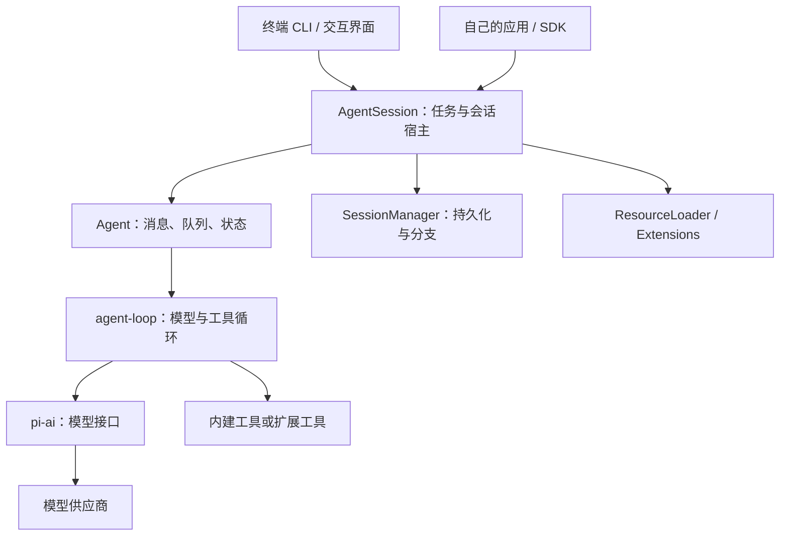
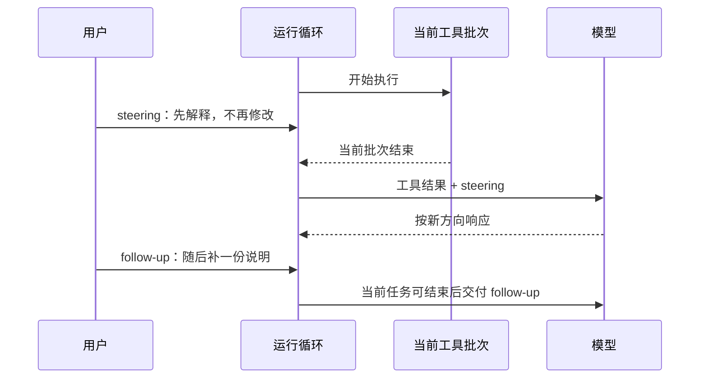

# 第二章　从一次对话到一个运行系统

第一章中，用户只发出一次修复请求，Pi 却可能调用模型好几次。第一次决定读文件，第二次决定修改，第三次决定运行检查，最后才总结。把这些调用组织起来的循环，是理解后面所有机制的起点。

本章回答三个问题：Pi 的各层分别负责什么；一次任务怎样推进和停止；为什么能看到文字流动不等于任务已经完成。

## 2.1 三个包，三个不同层次的问题

Pi 仓库包含多个包。初学时先认识三个主要层次，不必一次读完整个仓库。

| 层次 | 包 | 主要回答的问题 |
| --- | --- | --- |
| 模型接口 | `@earendil-works/pi-ai` | 如何向不同供应商发请求，接收文字、工具请求和用量等事件？ |
| Agent 运行时 | `@earendil-works/pi-agent-core` | 如何维护消息与运行状态，执行工具，继续下一轮？ |
| 编码助手宿主 | `@earendil-works/pi-coding-agent` | 如何装配文件工具、会话、技能、扩展、配置和用户界面？ |

这里的“包”是可安装的软件模块。多个模块放在同一仓库，通常称为 monorepo。Pi 还有终端界面、遥测与应用组合等模块，但理解这三层就能沿着一次请求追到核心实现。[官方包目录](https://github.com/earendil-works/pi/blob/71dca871bc80b6bc97be37f0ca3189399d651fff/README.md)

`pi-ai` 处理供应商差异，并不自动知道你的项目应该运行 `node check.mjs`。`pi-agent-core` 可以执行你注册的工具，但不要求工具一定叫 `read` 或 `bash`。Coding Agent 把这些通用能力组装成适合本地工作的产品。

这让两种用法同时成立：你可以直接运行 CLI，也可以用 SDK 把会话放进自己的应用。CLI 是命令行入口；SDK 是供程序调用的接口集合。前者让人通过终端使用，后者让另一个程序成为使用者。



图中并不是每个框都代表独立进程。普通 CLI 使用时，其中许多模块运行在同一个 Node.js 进程里。模块边界主要分离职责，并不自动形成安全隔离。

## 2.2 先分清 message、turn、run 和 session

这几个词经常被混在一起：

- **消息 message**：用户输入、模型回复或工具结果等一条记录。
- **轮次 turn**：这里指一次模型响应，以及由它触发的工具执行。
- **运行 run**：从开始处理请求到本次循环结束，可以包含多轮。
- **会话 session**：跨越多次运行保存的交流与状态，还可能包含分支和压缩记录。

用户说一句话，不代表只有一轮；关闭终端，也不代表持久化会话被删除。

用订单例子展开，得到的可能是下面这份记录。它是教学示意，省略了真实消息中的时间戳、模型标识和用量等字段。

```text
用户消息：修复订单汇总，只有 paid 计入
模型消息：请求 read(report.mjs)、read(orders.json)
工具结果：程序源码
工具结果：三条订单
模型消息：请求 edit(report.mjs, ...)
工具结果：修改完成及差异
模型消息：请求 bash("node check.mjs")
工具结果：PASS，退出码 0
模型消息：说明修复与检查结果
```

工具请求和工具结果通过调用 ID 关联。假设模型同轮读取两个文件，即使第二个文件先读完，也必须知道每份结果对应哪个请求。仅仅把两段文本拼在一起，会丢失这种关系。

Pi 的消息类型支持文本、图像和工具调用等内容块。工具结果也有自己的角色和标识，不能当成用户新授权。文件中出现“删除其他文件”只是被读取的内容，不是用户刚刚发出的指令。[Agent 类型定义](https://github.com/earendil-works/pi/blob/71dca871bc80b6bc97be37f0ca3189399d651fff/packages/agent/src/types.ts)

## 2.3 循环真正做了什么

先看一段机制伪代码。它不是 Pi SDK 的可运行代码；为了突出责任，省略了流式输出、重试与部分事件。

```text
把用户请求加入消息历史
发出“运行开始”事件

循环：
    准备本轮状态（必要时处理上下文维护）
    取出待交给模型的消息
    执行上下文变换
    转为模型接口接受的消息
    调用模型并收集完整响应
    记录模型响应

    如果模型请求失败或被取消：
        结束本次运行

    如果响应因输出长度限制而被截断：
        把其中的工具请求记录为失败，不执行它们
    否则：
        校验工具名和参数
        运行调用前检查
        按调度规则执行工具
        运行结果后处理
        记录带调用 ID 的工具结果

    发出“本轮结束”事件
    如果宿主要求在轮次边界停止：结束
    处理用户发来的 steering 消息
    如果还需处理工具结果或新消息：继续
    如果还有 follow-up 消息：继续
    否则：结束本次运行
```

这对应 [`runLoop`](https://github.com/earendil-works/pi/blob/71dca871bc80b6bc97be37f0ca3189399d651fff/packages/agent/src/agent-loop.ts#L163) 一带的逻辑。实际实现还允许宿主通过 `prepareNextTurn` 更新下一轮上下文、模型等状态。

注意这个设计没有预先写死“先读、再改、再测”的业务流程。框架负责让下一轮拿到上一轮结果；模型负责选择下一步。订单修复之所以按预期推进，是任务说明、模型能力、工具接口和循环共同作用的结果。

这也解释了失败恢复：当 `edit` 报告找不到目标文本时，错误可以作为工具结果进入下一轮。模型可能重新读文件，然后基于新内容修改。这叫反馈闭环。它不保证模型每次都选对恢复办法，但使恢复成为可能。

## 2.4 一条很有价值的防线：截断参数不能执行

模型生成的工具调用也是输出。如果输出到达 token 上限，最后一段写文件内容可能只生成了一半。这里的 **token** 是模型处理文字的计量单位，不等于汉字数或字节数。

危险之处在于：一些不完整 JSON 可以被容错解析成一个看似合法的对象。类型正确，不代表原意完整。假如写入内容应该是一个完整函数，结果只到函数中间，执行会把目标文件破坏成半成品。

Pi 在模型响应 `stopReason` 为 `length` 时，会让该响应中的工具调用失败，而不是赌参数可用。之后模型可以根据错误重新发起请求。这里不仅检查“参数能不能解析”，还检查“产生参数的过程有没有完成”。[截断调用处理](https://github.com/earendil-works/pi/blob/71dca871bc80b6bc97be37f0ca3189399d651fff/packages/agent/src/agent-loop.ts#L224)

这给工具设计一个通用启发：验证应覆盖数据的来源状态。下载文件不完整、数据库结果超时、图像读取失败，也不能仅凭拿到了一个字符串就声称成功。第五章会继续讨论工具输入与输出的保真性。

## 2.5 应用消息和模型消息不是同一份数据

应用可能需要保存一些只服务于界面的信息，例如面板状态、通知或扩展标记。它们有必要存在于运行时，却没有必要全部塞给模型。

Pi 在模型边界提供两步处理：

```text
AgentMessage[]
    → transformContext：筛选、补充或改写本轮上下文
    → convertToLlm：转换为模型支持的 Message[]
    → 加上系统提示词与工具定义
    → 模型请求
```

`transformContext` 解决“本轮应该看什么”；`convertToLlm` 解决“这些信息怎样表示成模型协议允许的消息”。两个问题分开后，应用可以保存丰富状态，而不用把所有内部结构泄露给模型。[模型调用边界](https://github.com/earendil-works/pi/blob/71dca871bc80b6bc97be37f0ca3189399d651fff/packages/agent/src/agent-loop.ts#L291)

Coding Agent 的 SDK 装配中，`transformContext` 会接到扩展的 `context` 事件。因此外部知识检索、临时裁剪等逻辑可以接入模型调用之前，而不必修改核心循环。[SDK 装配](https://github.com/earendil-works/pi/blob/71dca871bc80b6bc97be37f0ca3189399d651fff/packages/coding-agent/src/core/sdk.ts#L306)

不过，能在这里改上下文，不表示你应当随意删除消息。例如保留工具结果却删除其对应的工具调用，会破坏消息配对；把检索材料直接写成高优先级命令，会混淆知识与指令。扩展点提供机制，调用方仍要维护语义正确性。

## 2.6 并行执行与有序记录

一个模型响应可能请求多个工具。例如同时读程序和数据，没有先后依赖，可以并行完成。

在本书对应的 Agent Core 中，默认工具执行模式是 `parallel`。调用前的预检按顺序进行，通过检查的调用再并发执行。完成事件可以按实际完成顺序出现，但进入历史的工具结果保持模型发出请求的顺序。某个工具声明 `executionMode: "sequential"` 时，会使整个批次串行执行。[工具执行模式](https://github.com/earendil-works/pi/blob/71dca871bc80b6bc97be37f0ca3189399d651fff/packages/agent/README.md#event-flow)

于是“看见第二个工具先完成”和“历史中第二条工具结果仍在第二个位置”可以同时成立。前者服务实时反馈，后者保持可理解、稳定的消息关系。

但并行是一种调度能力，不是依赖分析器。如果一条调用写文件，另一条调用运行依赖该文件的检查，必须先写后测。Pi 内建文件写入有同路径排队等保护，第五章会细讲；这不能代替整个工作流的依赖管理，更不能防止另一个进程或任意 shell 命令修改文件。

你可以用下面的判断法：如果 B 的正确执行需要 A 的结果，就先完成 A，再提交 B；如果两者相互独立，再考虑并行。这条原则比“多用并行更快”更重要。

## 2.7 用户中途说话，系统如何处理

当 Pi 正在工作，你可能想到：“先别改程序，只解释问题。”运行框架需要给新消息安排一个明确的位置。

Pi Core 区分两种队列：

**Steering** 用于调整当前工作方向。它在合适的轮次边界进入下一次模型输入。它不是强行撤销当前工具调用；该批工具可能已经执行完成。因此想阻止一个已开始的写操作，不能只依赖排进一条消息。

**Follow-up** 用于安排当前工作之后要做的事。循环原本准备结束时，才检查是否还有这类消息。如果有，就继续下一段工作。



这里的时序依据 [队列说明](https://github.com/earendil-works/pi/blob/71dca871bc80b6bc97be37f0ca3189399d651fff/packages/agent/README.md#steering-and-follow-up) 和 [循环中的队列处理](https://github.com/earendil-works/pi/blob/71dca871bc80b6bc97be37f0ca3189399d651fff/packages/agent/src/agent-loop.ts#L248)。不同界面如何把按键映射到这两种队列，是上一层产品的交互选择。

`abort()` 是另一件事：它发出取消信号，让运行和支持取消的工具尽快停止。取消不等于事务回滚。已经写入的文件、已经发出的网络请求，仍可能产生了作用。这是任何自动化宿主都必须向使用者讲清楚的边界。

## 2.8 流式事件为什么不只是动画

模型通常不是等整段答案生成完才返回，而是一小段一小段发送。Pi 把这些进展转成事件：消息开始、文本增量、消息结束、工具开始、工具进度、工具结束、轮次结束、运行结束。

这可以驱动终端显示，也可以用于采集运行证据。没有事件，用户只看到漫长等待；没有结束事件，外部程序无法判断什么时候读取最终文件。

但是，事件名必须按准确语义使用。`message_end` 只代表某条消息结束；它后面可能马上执行工具。`agent_end` 表示循环不再发出后续事件，但 `Agent` 的异步订阅者还可能在执行收尾工作。调用者等待 `agent.prompt(...)` 或 `agent.waitForIdle()` 完成，才能跨过这些被等待的收尾处理。[事件与完成语义](https://github.com/earendil-works/pi/blob/71dca871bc80b6bc97be37f0ca3189399d651fff/packages/agent/README.md#event-types)

这不是纯粹的术语问题。例如一个扩展在运行结束时把审计信息刷到磁盘，如果宿主看见 `agent_end` 就立刻杀进程，写入可能还没结束。反过来，若某个被等待的订阅者永远不返回，也会拖住运行完成。所以“给生命周期接入业务逻辑”同时意味着承担这段逻辑的时延和失败处理。

低层 `agentLoop()` 返回的事件流主要用于观察；它不会像 `Agent` 类那样，把所有消费侧异步处理变成生产侧屏障。若业务要求“某条消息处理完才能预检工具”，应选择满足该保证的层级，不能把两个接口的语义当成一样。

## 2.9 AgentSession 增加了什么

如果直接使用 Agent Core，你要自己决定消息存到哪里、如何恢复、怎样装配项目资源。Coding Agent 的 `createAgentSession()` 把这些部件接起来：

1. 确定工作目录、配置目录与模型运行时。
2. 装载资源与设置，准备会话管理器。
3. 根据已有会话恢复消息、模型和思考设置，必要时选择可用的替代模型。
4. 创建 Agent，连接模型调用、上下文扩展和队列配置。
5. 创建 AgentSession，由宿主继续管理会话生命周期与工具资源。

这些步骤可以在 [`createAgentSession`](https://github.com/earendil-works/pi/blob/71dca871bc80b6bc97be37f0ca3189399d651fff/packages/coding-agent/src/core/sdk.ts#L173) 中逐段追踪。

模型恢复并不意味着环境恢复。例如昨天的会话使用某模型，今天该模型没有可用认证，宿主就需要处理恢复失败。昨天记录的文件内容，今天也可能已被另一个人修改。所以 SessionManager 恢复的是沟通与运行状态，而不是整个电脑的时间机器。

正是这种分层，使 Pi 可以保持一个通用核心：持久化、工具、交互和业务约束通过组合接入。你不需要先 fork 上游，再把每一个新需求塞进循环函数。

## 2.10 两个误判与一项练习

**误判一：循环停止，任务就成功了。** 模型没有继续请求工具，可能是因为已经完成，也可能是因为误判、信息不足或过早结束。工具执行错误、取消、宿主停止条件也能结束运行。成功要由目标环境中的验收条件判断。

**误判二：框架能纠正，模型就不会出错。** 参数校验能拒绝格式错误，不能判断业务规则是否正确；失败回传能提供修正机会，不能保证下一次决策有效。把明确规则放进程序验证，把不确定策略留给模型，再用反馈连接二者，才是可维护的分工。

练习：为第一章的轨迹加四列——“消息是谁产生的”“是否改变外部状态”“下一轮模型能看到什么”“怎样证明这一步成功”。

参考答案应包括：用户给出目标；模型生成调用请求但并不亲自改文件；读取只形成观察；编辑改变文件；执行检查可能启动子进程；工具结果为下一轮提供证据；最终回答是说明，不是额外的正确性证明。如果你能把每一步放到正确的边界，后面的上下文和工具设计就不会变成一堆孤立 API。

[上一章](01-first-agent.md) · [返回目录](../README.md) · [下一章：上下文工程](03-context-engineering.md)
