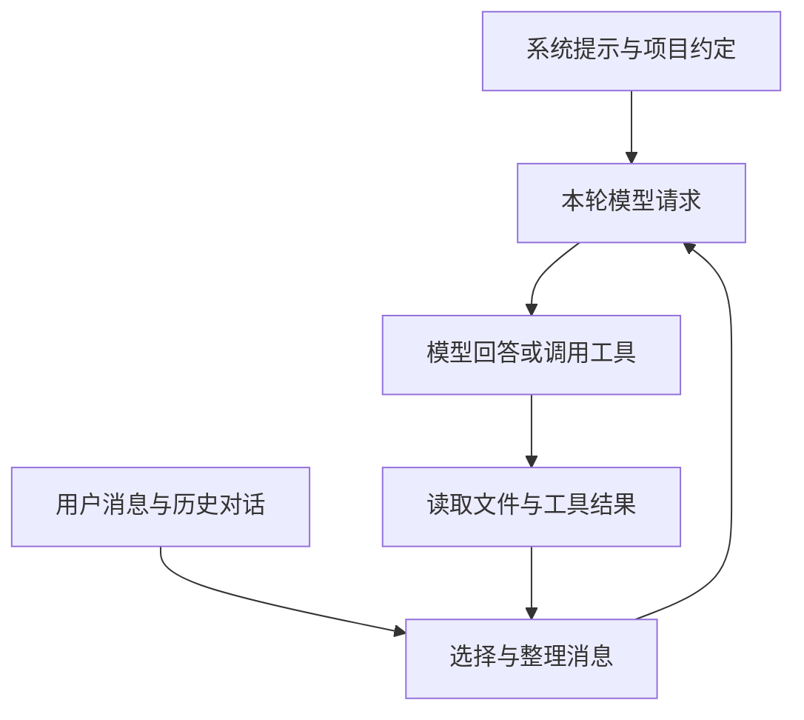

# 第三章　上下文工程：让模型看到此刻真正需要的信息

假设你请 Pi 修复一个报表程序：金额合计不对。第一轮，它只知道这句话；读过代码后，它知道金额以字符串保存；运行测试后，它发现问题出在四舍五入；你补充“旧报表格式不能变”，这又成为新的约束。接下来的修改是否可靠，既取决于模型的能力，也取决于这些信息有没有完整、清楚地出现在下一次请求里。

**上下文是模型这一次作答能使用的输入材料。**它包括系统提示、当前问题、对话消息、工具定义和工具结果。终端上出现过的内容、磁盘上保存的文件，以及模型当前真正收到的内容，是三个不同的集合。Pi 的上下文工程，就是不断把前两者中有用的部分组织成第三者。

[第二章](02-runtime.md)解释了循环何时再次请求模型，本章接着回答每次请求带上什么：先认识上下文窗口，再装配系统提示和 `AGENTS.md`；接着区分提示模板与 Skill，说明如何按需补充资料；最后跟踪发送前的消息加工与压缩，并用一次练习检查信息究竟在哪一步进入或离开模型视野。文中机制以 Pi `0.85.1`、提交 `71dca871bc80b6bc97be37f0ca3189399d651fff` 为准；标为伪代码的片段用于解释流程，不是可直接运行的插件。

回到退款调查，模型开始时可以先读任务、指标说明和资料索引；发现运费线索后，再查看相关反馈。负责人随后改变指标定义，模型就需要同时理解第一轮为什么这样计算、本轮又要改成什么。第二章的[消息转换示例](02-runtime.md#message-transforms)已经展示这次更新，本章接着说明材料如何加载，以及越积越多以后怎样整理。

## 3.1 上下文窗口不是整个项目的内存

为了让 Pi 查清问题，你可能想把订单系统的整个仓库、全部客服记录和几天的日志一次性交给它。但模型每次能接收的输入有限；即使容量足够，下一步要找的约束也可能埋在大量无关内容中。先理解这个容量限制，才能决定哪些材料现在读、哪些留到需要时再读。

模型按 token 处理输入。Token 是模型使用的文本或多模态编码单位，不能简单等同于一个汉字或一个单词。上下文窗口是一次请求能够容纳的信息范围；具体如何计算输入、输出和缓存用量，还与模型供应商有关。

Pi 不会自动把仓库全文装进窗口。它提供 `read` 等工具，让模型先决定读什么，宿主执行后再交回结果。比如当前只需确认金额字段，就先读字段定义和调用它的代码；证据不足时，再继续找关联文件。这样可以把有限输入留给当前判断需要的内容。

可以把每轮请求想成一份交接材料：开头交代工作方式，中间说明用户要求，后面保留最近的行动和观察。每次工具执行都会增加材料，模型随后据此重新判断。上下文工程关心的不是“提示写得够不够长”，而是“下一步所需证据是否在场，证据之间的关系是否清楚”。



例如，“保留旧报表格式”应成为稳定约束；本次失败的测试输出应保留到问题解决；一百次成功安装依赖的日志通常不值得每轮携带。这是不同信息在生命周期上的区别。

## 3.2 系统提示如何装配

你第一次在订单项目中启动 Pi，只输入“检查退款统计”。此时你还没告诉模型它有哪些工具，也没有逐一解释怎样查看文件。宿主需要在这条请求之外准备一份基本工作说明，让模型知道自己处于怎样的工作环境。

系统提示是宿主给模型的工作说明。Pi 的默认提示把自身定位为编码助手，介绍可用工具及使用建议，还给出 Pi 文档的位置。它会依据当前工具集合调整部分建议：如果有 shell 工具而没有专用搜索工具，就提示模型用 shell 探索文件。工具在提示中的简短介绍，与实际传给模型的工具参数定义，是相互配合的两部分。[源码：`buildSystemPrompt`](https://github.com/earendil-works/pi/blob/71dca871bc80b6bc97be37f0ca3189399d651fff/packages/coding-agent/src/core/system-prompt.ts#L28)。

这解决了一个容易忽略的问题：提示不能承诺宿主没有提供的能力。写上“请访问数据库”不会生成数据库连接；模型必须拥有相应工具，工具还必须具备实际访问条件。

团队开始定制助手后，可能只想补充一句“报告要附来源”，也可能要替换整份工作说明。这两种改法对应不同入口：Pi 支持 `SYSTEM.md` 替换默认提示，支持 `APPEND_SYSTEM.md` 追加说明。资源发现时，受信任项目的 `.pi/SYSTEM.md` 优先于用户目录的 `~/.pi/agent/SYSTEM.md`；追加文件采用相同的项目优先选择方式。这里的“选择”不等于把全局和项目两个同名文件全部拼接。[源码：系统提示文件发现](https://github.com/earendil-works/pi/blob/71dca871bc80b6bc97be37f0ca3189399d651fff/packages/coding-agent/src/core/resource-loader.ts#L1023)。

另一个细节是：替换默认提示后，构建函数仍会追加已加载的项目上下文、符合条件的技能目录和工作目录。`SYSTEM.md` 的“替换”针对默认提示正文，不代表请求只剩这个文件。

对初学者，通常先用项目约定或追加提示就够了。以报表任务为例，一份有用的约定可以是：

```markdown
# 项目约定

金额在接口中使用十进制字符串，不转换为二进制浮点数后计算。
修改报表逻辑后，运行项目文档规定的报表测试命令。
输出字段名称属于兼容性约定，修改前先确认调用方。
报告结果时，区分已经运行的检查与尚未运行的检查。
```

这些要求分别对应数据约束、验证动作、变更边界和汇报证据。相比“做一个优秀、严谨的工程师”，它们更容易落实，也更容易验收。提示表达的是工作要求；能否强制执行，还要看工具和宿主是否设置了对应检查。

## 3.3 `AGENTS.md`：把项目知识放在项目旁边

订单项目约定金额使用整数分，另一个报表子项目却在接口中使用十进制字符串。你从不同目录启动 Pi 时，希望它读到对应约定，也不想每次重打测试命令。第一章用过的 `AGENTS.md` 就承担这种项目说明。Pi 在启动或资源重载时加载它们，接下来需要弄清加载器会选哪些文件，以及目录层级怎样影响结果。

在本书版本中，单个目录里的候选顺序是 `AGENTS.override.md`、`AGENTS.md`、`AGENTS.MD`、`CLAUDE.md`、`CLAUDE.MD`，采用第一个可读的普通文件。然后，加载器先加入用户配置目录中的上下文文件，再从文件系统根目录到当前工作目录，按祖先顺序加入相应文件，并处理重复路径及特定嵌套 worktree 的遮蔽情况。[源码：上下文文件发现与汇总](https://github.com/earendil-works/pi/blob/71dca871bc80b6bc97be37f0ca3189399d651fff/packages/coding-agent/src/core/resource-loader.ts#L71)。

这意味着，同目录的 override 文件会替代普通文件，但子目录文件并不会在加载器里按“同名规则键”自动覆盖父目录规则：这里主要是文本拼接。若父目录说“使用 A”，子目录说“使用 B”，最好明确写出 B 的适用范围，避免把语义冲突留给模型猜测。

还要留意当前工作目录。上述函数沿当前目录向上查找，**不会因为模型后来读了某个深层文件，就自动递归加载那一层的所有指令文件**。需要特殊子项目约定时，可以从对应目录启动，或在现有说明里明确要求先读取该子项目的约定。

项目上下文文件与可执行扩展也不能混为一谈。本版本的项目信任流程会控制项目设置、技能和扩展等资源的加载，但上下文文件在信任决定前即可加载。不要把“未信任项目扩展”理解为“所有项目文字都完全不可见”。[官方说明：项目信任](https://github.com/earendil-works/pi/blob/71dca871bc80b6bc97be37f0ca3189399d651fff/packages/coding-agent/README.md#L298)。

实践中，`AGENTS.md` 适合放少量稳定约定。详细业务手册可以放在另一个文件，并说明何时读取。上下文文件每次都要承担输入成本，把完整操作手册不断追加进去，最终会伤害本来想改善的可用性。

## 3.4 Prompt Template 与 Skill：重复表达和按需能力

你每次提交报告都要输入“先列结论，再附来源和未决问题”，这段话适合保存下来，调用时填入本次报告名称。另一方面，团队还有一份很长的核对手册，包含字段含义、金额检查和异常处理；只有真正核对报表时才需要读它。

前者是重复输入，后者是按任务查阅详细方法。Pi 分别提供提示模板和 Skill 来帮助组织它们。

Pi 的 Prompt Template 是 Markdown 提示模板。放在提示目录后，可通过 `/模板名` 展开，支持 `$1`、`$ARGUMENTS` 等参数占位符。展开是在模板字符串上进行的替换，不是执行 shell，也不会把参数里的占位符反复递归展开。[源码：参数替换](https://github.com/earendil-works/pi/blob/71dca871bc80b6bc97be37f0ca3189399d651fff/packages/coding-agent/src/core/prompt-templates.ts#L62)。

Skill 则是一份带有名称、简介和正文的能力说明。它可以关联脚本、参考资料、样例。Pi 加载技能时会读取文件、解析元数据，但通常只把名称、简介和文件位置放进系统提示；**宿主已经读取技能文件，不等于模型已经看到技能正文**。模型判断任务匹配后，再通过 `read` 或 `bash` 读取全文。这就是渐进披露。[源码：技能元数据与提示格式](https://github.com/earendil-works/pi/blob/71dca871bc80b6bc97be37f0ca3189399d651fff/packages/coding-agent/src/core/skills.ts#L276)。


下面是可以在练习项目中创建的技能文件，路径为 `.pi/skills/report-check/SKILL.md`：

```markdown
---
name: report-check
description: 当用户核对报表金额、汇总口径或输出字段兼容性时使用。
---

先确认报表名称和统计时间范围。
读取输入样例与生成报表的代码，标记金额单位。
选择一份小样本，独立计算期望值后再比较输出。
把差异分成计算错误、数据缺失和口径差异。
没有执行验证时，明确写“尚未验证”。
```

这份技能提供的是方法，真正观察数据仍靠工具，作出判断仍靠模型。它既不是一个新模型，也不是已经注册好的新工具。描述写得太宽，模型可能在无关任务中加载它；描述缺少适用条件，则可能一直不被发现。

`disable-model-invocation: true` 会让技能退出提供给模型的技能目录，仍可显式用 `/skill:名称` 调用。这控制的是自动发现，不是文件访问权限。如果模型本来就有读取文件的能力，该字段不会把文件变成秘密。系统提示只有在提供 `read` 或 `bash` 之一时才加入这种技能目录；不能把“技能文件在磁盘上”当成“模型一定能使用”。[源码：目录过滤](https://github.com/earendil-works/pi/blob/71dca871bc80b6bc97be37f0ca3189399d651fff/packages/coding-agent/src/core/skills.ts#L346)、[提示中的工具条件](https://github.com/earendil-works/pi/blob/71dca871bc80b6bc97be37f0ca3189399d651fff/packages/coding-agent/src/core/system-prompt.ts#L45)。

## 3.5 发送前加工：保留历史，改变本轮视图

调查正在进行，负责人补发了本次适用的指标说明。你不想删除旧对话，却希望下一轮模型用新定义继续分析。单靠启动时读取的静态文件，无法表达每一轮都可能变化的材料选择。Pi 因此提供 `context` 扩展事件：每次准备模型请求时，扩展可以返回新的消息数组。

在 Coding Agent 的 SDK 组装代码中，底层 `transformContext` 被接到扩展运行器的 `emitContext`。后者先深拷贝消息，再按顺序运行已注册的处理函数；前一个函数的输出会成为下一个函数的输入。随后，消息先转换为 `pi-ai` 的统一格式，再由供应商适配层编码为实际请求。[源码：SDK 接线](https://github.com/earendil-works/pi/blob/71dca871bc80b6bc97be37f0ca3189399d651fff/packages/coding-agent/src/core/sdk.ts#L362)、[事件执行顺序](https://github.com/earendil-works/pi/blob/71dca871bc80b6bc97be37f0ca3189399d651fff/packages/coding-agent/src/core/extensions/runner.ts#L1034)、[模型请求前的转换](https://github.com/earendil-works/pi/blob/71dca871bc80b6bc97be37f0ca3189399d651fff/packages/agent/src/agent-loop.ts#L285)。

下面的类 JavaScript 伪代码省略类型和错误处理，展示先选材料、再转换消息的顺序：

```js
let messages = deepClone(sessionMessages);
for (const handler of contextHandlers) {
  const result = await handler({ messages });
  messages = result?.messages ?? messages;
}
const llmMessages = await convertToLlm(messages);
await requestModel({ systemPrompt, messages: llmMessages, tools });
```

例如核对本月报表时，`transformContext` 可以选择本月有效的汇率记录，排除上个月失效的记录；`convertToLlm` 再把应用自定义的汇率消息转换成模型能接受的消息类型和文本块。前者决定记录是否相关，后者决定已经选中的记录如何表示。不要把“汇率过期了，所以删掉它”混进协议转换，也不要以为转成 `user` 消息就证明资料可信。完整的输入、输出示例见[第二章：两次消息转换](02-runtime.md#message-transforms)。

这里的好处是分离“保存什么”和“发送什么”。请求级检索结果可以只存在于本轮视图中，不必每轮重复追加到会话文件。不过，如果希望以后追溯这次决定用了哪份资料，扩展仍需另行保存来源信息。

`before_agent_start` 是另一处接口，可在一次用户请求开始前注入消息或调整系统提示；`context` 则更接近每次模型调用。一次用户请求可能包含多次“模型—工具—模型”循环，把耗时检索无条件放进 `context`，可能导致同一问题重复查询多次。可以由扩展在任务开始时检索一次，后续复用已筛选的结果，但要明确失效条件。[源码：用户请求前事件](https://github.com/earendil-works/pi/blob/71dca871bc80b6bc97be37f0ca3189399d651fff/packages/coding-agent/src/core/agent-session.ts#L1285)。

裁剪也有结构约束。工具结果要与对应的工具调用保持关系，不能只保留“执行成功”而删掉执行了什么。外部资料应保留来源并作为资料处理，不能因为被插入上下文，就获得修改系统规则的资格。文本分隔与提示可以帮助识别边界；真正的权限限制必须在宿主或工具层实现，具体见[第五章的执行边界](05-tools.md#59-最小权限应落到执行边界)。工具返回多少材料、有没有说明截断，也直接影响这里的裁剪质量；[第五章的分段读取](05-tools.md#55-读取大文件必须让模型知道自己没看完)会沿着这条线继续讨论。

## 3.6 压缩：把旧过程整理成可继续工作的交接

报表问题已经排查了很久。历史里有几版源码、失败测试和大量日志，而你现在只需要 Pi 继续修正最后一个差异。把旧消息全部带上，很快会占满输入空间；全部丢掉，又会失去“不能改旧格式”等约束。

Pi 的 compaction，也就是上下文压缩，会总结较旧的消息、保留近期消息，再用“摘要加保留段”继续工作。下面先看它何时启动，再看怎样切割和保留材料。

这里要分别安排两份预算：接近窗口上限之前留出多少空间，以及压缩时尽量保留多少近期消息。前者决定什么时候启动，后者影响从哪里切开历史。默认开启压缩，`reserveTokens = 16384`，`keepRecentTokens = 20000`；判断阈值的核心条件是：

```js
// 伪代码：仅表示阈值判断，tokenCount 可能是估算值。
const shouldCompact = compactionEnabled
  && tokenCount > contextWindow - reserveTokens;
```

例如窗口为 128000，保留预算为 16384，则阈值是 111616；严格大于这个值才满足判断。`keepRecentTokens` 则指导切割时保留多大近段，它不是压缩摘要的长度。[源码：默认值](https://github.com/earendil-works/pi/blob/71dca871bc80b6bc97be37f0ca3189399d651fff/packages/coding-agent/src/core/compaction/compaction.ts#L126)、[阈值条件](https://github.com/earendil-works/pi/blob/71dca871bc80b6bc97be37f0ca3189399d651fff/packages/coding-agent/src/core/compaction/compaction.ts#L235)。

当前 token 数也不是每次都能精确取得。Pi 会尽量利用最近一次助手响应的 usage，加上其后消息的估算；缺少可用 usage 时则估算消息。工具返回、图片、供应商编码方式都可能影响实际占用，所以预留空间只能降低溢出的概率，不能保证绝不溢出。[源码：估算流程](https://github.com/earendil-works/pi/blob/71dca871bc80b6bc97be37f0ca3189399d651fff/packages/coding-agent/src/core/compaction/compaction.ts#L199)。

本版本不仅在一次底层 Agent 循环结束后检查，也会在工具结果加入后、下一次助手响应前检查阈值。如果工具批次已经终止运行，并且无需继续回答，就不必再做这个中间检查。自动处理还包含上下文溢出、可恢复的长度终止等路径；特定溢出恢复允许一次压缩后重试，避免无限循环。[源码：下一轮前检查](https://github.com/earendil-works/pi/blob/71dca871bc80b6bc97be37f0ca3189399d651fff/packages/coding-agent/src/core/agent-session.ts#L538)、[自动恢复分支](https://github.com/earendil-works/pi/blob/71dca871bc80b6bc97be37f0ca3189399d651fff/packages/coding-agent/src/core/agent-session.ts#L2136)。

切割时，Pi 从最近的消息向前累计估算大小，寻找合法边界。它不会在工具结果处直接切开，以免留下没有对应调用的结果。如果一次用户请求太长，边界可能落在该请求内部；系统会为前半段生成交接摘要。近期保留量因此是近似目标，不是精确到 token 的硬切片。[源码：`findCutPoint`](https://github.com/earendil-works/pi/blob/71dca871bc80b6bc97be37f0ca3189399d651fff/packages/coding-agent/src/core/compaction/compaction.ts#L388)。

```js
// 伪代码：辅助函数名称用于解释，不是可复制调用的 SDK 接口。
const path = getRootToLeafPath(session);
const cut = findLegalCut(path, { keepRecentTokens });
const oldMessages = messagesMovingOutOfWindow(path, cut);
const summary = await summarize({
  previousSummary,
  messages: oldMessages,
  include: ["目标", "约束", "进展", "决定", "下一步"],
});
appendCompaction({ summary, firstKeptEntryId: cut.entryId });
// 以后构造请求时，用摘要接上保留段及压缩后新增的消息。
const nextMessages = [asSummaryMessage(summary), ...keptMessages, ...newMessages];
```

这里的活动路径来自会话树。比如你在两种修复方案之间切换，只应总结当前方案的历史，不能把另一分支的失败假设混进来。[第四章](04-memory.md)会用实际分支操作说明如何选择这条路径。

摘要提示要求记录目标、约束、进展、决定和下一步等内容，避免只留下“双方讨论了一个报表问题”这样的泛泛概括。重复压缩时还要把此前保留、现在需要移出窗口的消息纳入新摘要，不能只从上一条压缩记录之后开始数。[源码：摘要提示](https://github.com/earendil-works/pi/blob/71dca871bc80b6bc97be37f0ca3189399d651fff/packages/coding-agent/src/core/compaction/compaction.ts#L467)、[压缩准备](https://github.com/earendil-works/pi/blob/71dca871bc80b6bc97be37f0ca3189399d651fff/packages/coding-agent/src/core/compaction/compaction.ts#L750)。

压缩是有损的。一个失败命令的完整输出，可能被缩成一句“测试失败”；一个临时猜测，也可能在不够准确的摘要中变成确定结论。Pi 保留会话文件中的原记录，但后续模型不会自动看到这些被移出的细节。重要约束应写清楚，精确值应保留原始文件或来源链接，必要时重新读取。不要依赖摘要记住每个字符。

扩展可以通过 `session_before_compact` 改写压缩行为；官方也有自定义压缩示例。这意味着更换摘要模型、补充结构化字段属于可扩展能力，并非所有策略都默认开启。判断示例行为时，要看返回的 `summary` 和 `firstKeptEntryId`，不能只看文件开头的介绍。[源码：压缩前事件](https://github.com/earendil-works/pi/blob/71dca871bc80b6bc97be37f0ca3189399d651fff/packages/coding-agent/src/core/agent-session.ts#L1996)。

## 3.7 练习：观察一次信息从文件进入上下文

现在验证三个实际问题：项目约定是否被加载，技能正文是否被读取，较早的约束在压缩后是否仍有依据。为了方便查验，我们用一个虚构项目代号和很小的报表样例；这些标记帮助你追踪信息来自哪里。

在一个没有重要文件的练习目录完成下面步骤。若已有相同文件，请编辑合并，保留原内容。

1. 创建 `AGENTS.md`，写入“项目代号是 Paper Kite；所有金额样例使用人民币元”。启动 Pi，查看启动信息中的已加载上下文文件，再询问项目代号和金额单位。
2. 创建本章的 `report-check` 技能文件，执行 `/reload`。输入“帮我核对一个报表的金额汇总”，观察它是否先读取技能。再显式输入 `/skill:report-check`，比较两种入口。
3. 给 Pi 一份十行左右的虚构报表样例，要求它逐步解释核对过程。在对话中加一条约束：“只核对，不改文件。”
4. 输入 `/compact 请保留项目代号、金额单位、只核对不改文件的约束和未完成事项`。短会话可能没有值得压缩的历史，不必为了触发阈值制造巨量日志；可以在较长的练习会话中再做。
5. 压缩后询问当前目标与约束；用 `/session` 定位会话文件，检查是否出现 `compaction` 条目及保留边界。

### 参考答案与观察方法

以下给出各步骤应核对的答案，实际模型轨迹可能不同；没有执行实验时，不应把预期写成观察结果。

1. 项目代号应是 **Paper Kite**，金额单位应是**人民币元**，来源是练习目录的 `AGENTS.md`。启动信息能确认文件已加载，回答能检查模型是否使用了它；只答对却说不出来源，还不能说明加载路径已经核对清楚。若同一目录有 `AGENTS.override.md`，要先检查是否选中了它。
2. 自然语言请求是否触发读取取决于简介匹配与模型选择，并不保证每次自动读取。自动路径的直接证据是工具轨迹出现技能文件读取；显式 `/skill:report-check` 则由宿主展开技能内容，不要求模型再发出同样的 `read` 调用。若显式入口也不可用，应先检查文件格式、资源发现、项目信任和 `/reload`，而不是只归因于模型没选中。
3. 一份可核对的样例可以包含两项金额：人民币 12 元和 23 元，期望合计 **35 元**。回答应列出计算过程并保留“只核对，不改文件”，工具轨迹中不应出现写入动作。即使算对了，修改原文件也违背本步约束；本步骤中的虚构元数据不要与第一章以整数分存储的订单样例混用。
4. 有足够历史且压缩成功时，新增摘要应保留 Paper Kite、人民币元、只核对不改文件及未完成事项。若提示没有可压缩内容，本次操作并没有生成压缩证据，应记录为“未触发”，不能继续假定摘要已产生。
5. 若第 4 步确实压缩成功，回答应重述核对报表目标、金额单位及只读约束；会话中应能找到新增的 `compaction` 条目，其中 `summary` 是交接摘要，`firstKeptEntryId` 指向保留段起点。项目代号也可能由仍在请求中的 `AGENTS.md` 提供，因此答对本身不能证明摘要保存了它，必须对照条目。找不到新增条目，就不能认定本次压缩已完成。

若压缩后遗漏约束，逐层比较原消息、摘要和本轮请求：先确认是否记录过，再看摘要是否保留，最后检查发送前处理是否又删掉了它。

当你能够沿这条路径解释一个错误，就能把“模型怎么又忘了”转化为可处理的问题：是未加载、未检索、被裁剪、被压缩，还是虽然看到了却没有遵守。下一章将把这条路径延伸到会话之外，讨论哪些信息值得长期保存，以及保存以后如何可靠地取回来。

有模型账户后，可运行[真实模型配套实验](../examples/live-model/README.md)，保留轨迹并比较实际观察与本章机制。

[上一章](02-runtime.md) · [返回目录](../README.md) · [下一章](04-memory.md)
