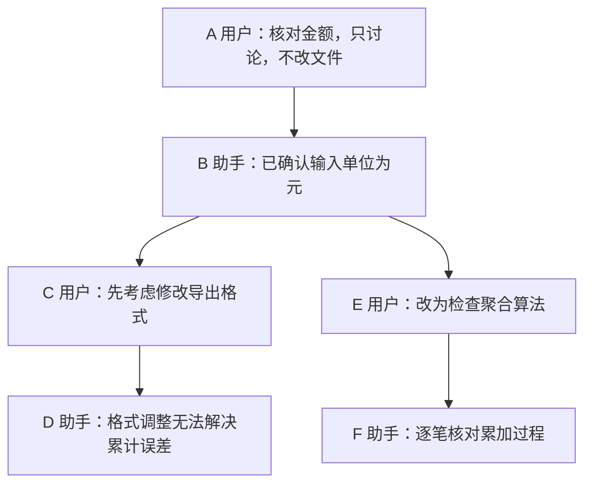

# 第四章　记忆与知识库：保存以后，还要找得对

本章先区分本轮上下文、会话历史、长期说明和外部知识库，回答“信息保存在哪里”。然后用一次报表排错演示恢复、回退和分叉，说明如何在 `/tree` 中选对消息，以及它为什么不会恢复磁盘文件。接着拆解活动路径、压缩记录与扩展状态，最后设计能查来源、处理过期信息的外部记忆接口。

[第三章](03-context-engineering.md)讨论“这一轮应该看什么”；本章继续追问“下次还去哪里找”。到[第五章](05-tools.md)，我们会把这里的检索与读取做成边界清楚的工具。

昨天，你和 Pi 查清了报表误差的原因，今天关闭终端后重新开始。你希望它记住三个不同的东西：昨天做到了哪一步，这个项目的金额约定，以及你习惯先看结果再看解释。它们看起来都叫“记忆”，需要的保存与读取方式却不同。

昨天的过程属于会话历史；金额约定属于项目知识；表达偏好属于用户层面的长期信息。把三者全部写进同一份摘要，容易在新任务中带入无关历史；只保存原始聊天，又很难快速找出真正重要的决定。

Pi 内建了会话持久化、恢复、树形分支和摘要机制，也能加载跨会话的说明文件。**本书核验版本没有默认启用的、自动提取用户画像并跨会话语义检索的长期记忆流水线。**外部记忆可以通过文件、工具和扩展接入，但存储结构、提取规则、用户隔离和更新策略需要应用自己负责。理解这条边界，才能把 Pi 已有的部件用好，而不是等它自动完成尚未配置的工作。

## 4.1 先分清四种保存范围

“记住”至少包含两个动作：把信息放到某处，以及在需要的时候把它带回模型的输入。前者成功，不代表后者已经发生。

| 范围 | 解决的问题 | Pi 中的对应方式 | 主要限制 |
| --- | --- | --- | --- |
| 本轮工作上下文 | 下一步该怎么做 | 当前消息、工具结果、请求转换 | 有窗口限制，会被裁剪或压缩 |
| 会话历史 | 这次工作发生了什么 | JSONL 会话文件、活动分支、摘要 | 新会话不会自动检索所有旧会话 |
| 用户与项目的长期说明 | 每次都应遵守什么 | 全局或项目 `AGENTS.md`、Skills 等文件 | 人或扩展维护，内容可能过期 |
| 外部记忆与知识库 | 从大量历史和资料中找什么 | 自定义工具、扩展事件、外部服务 | 检索、权限、冲突处理属于集成责任 |

全局 `AGENTS.md` 能跨项目提供偏好，因此它具有一种很朴素的长期记忆作用。但它没有自动判断哪些聊天内容值得记住，也没有自动把“我这次想看英文报告”改成或排除于“长期语言偏好”。加载器只负责寻找和读取文件。[源码：全局与项目上下文加载](https://github.com/earendil-works/pi/blob/71dca871bc80b6bc97be37f0ca3189399d651fff/packages/coding-agent/src/core/resource-loader.ts#L119)。

信息还可以按内容区分：一次修复经过是事件，金额单位是事实，报表核对步骤是方法。这个分类与保存范围并不相同。同一套核对方法可以写在项目 Skill 中，也可以由外部知识库保存；一条事实可以暂时只存在于当前会话，也可以经过确认成为长期说明。先明确“它是什么、适用于谁、需要保留多久”，再选择文件还是数据库。

## 4.2 会话文件：可恢复的工作记录

Pi 默认把会话保存在 `~/.pi/agent/sessions/` 下，并按工作目录组织；配置目录可以改变，因此这不是不可变的绝对路径。常见操作包括 `pi -c` 继续最近会话、`pi -r` 选择历史会话、`pi --session <路径或ID>` 打开指定会话。`--no-session` 则用于不落盘的临时会话。[官方操作说明](https://github.com/earendil-works/pi/blob/71dca871bc80b6bc97be37f0ca3189399d651fff/packages/coding-agent/README.md#L239)、[目录生成代码](https://github.com/earendil-works/pi/blob/71dca871bc80b6bc97be37f0ca3189399d651fff/packages/coding-agent/src/core/session-manager.ts#L477)。

保存格式是 JSONL：每行是一个 JSON 对象。JSON 用键和值描述结构，JSONL 则把这样的对象一行一条排列，方便顺序读取和追加。文件开头是会话头，包含会话 ID、时间和工作目录；后续条目记录消息、模型变化、压缩、分支摘要以及扩展状态等。

下面是用于理解结构的简化片段，省略了实际模型消息需要的字段，不应当作可导入的会话文件：

```json
{"type":"session","version":3,"id":"demo","timestamp":"2026-09-14T00:00:00Z","cwd":"/work/report-demo"}
{"type":"message","id":"a","parentId":null,"message":{"role":"user","content":"核对金额"}}
{"type":"message","id":"b","parentId":"a","message":{"role":"assistant","content":"先检查输入样例"}}
{"type":"message","id":"c","parentId":"b","message":{"role":"user","content":"先别改文件"}}
```

真正值得注意的是 `id` 与 `parentId`。前者标识这条记录，后者指出它接在哪条记录之后。文件虽然是一行接一行，逻辑关系却可以是一棵树。[源码：条目类型](https://github.com/earendil-works/pi/blob/71dca871bc80b6bc97be37f0ca3189399d651fff/packages/coding-agent/src/core/session-manager.ts#L33)。

为什么不直接只保存纯文本聊天？因为恢复时需要区分用户说了什么、模型调用了什么工具、工具返回什么，以及哪些消息属于当前选择的路线。纯文本可以给人阅读，结构化条目才能可靠地重建这些关系。

这里的持久化也不意味着数据库意义上的业务事务。Pi 会记录模型和工具消息，但外部文件写入、数据库提交是否已经成功，仍要依据真实工具结果与环境状态判断。会话记录可以保存“调用过某个动作”的证据，不能凭此替代对动作结果的检查。

<a id="session-tree"></a>

## 4.3 树形会话：什么时候回头，回到哪条消息

假设你正在核对报表金额。Pi 已经确认输入单位都是元，你让它先考虑方案 A：修改导出格式。讨论几轮后，你发现误差来自聚合过程，想改试方案 B。如果 A 的推导仍有用，直接在当前对话中说“现在检查聚合算法”就够了；如果你想从共同事实重新比较两个方案，避免新回答沿用 A 的假设，就适合分叉。

树形会话适合从同一背景比较两种方案、改写早先含糊的提问，或在长任务中返回一个阶段继续另一条路线。它保存旧尝试，同时让下一次模型请求只沿所选路线准备上下文。

下面用字母表示记录 ID。实际 ID 由 Pi 生成，图中省略模型设置和工具记录；本例只讨论方案，不修改文件。



### 从 D 返回 B，具体怎么操作

1. 等当前回复结束，输入 `/tree` 并回车。用上下键移动选择，Enter 确认；直接输入“输入单位”等词搜索消息。默认键位下，左右键翻页，Ctrl+← / Ctrl+→（或 Alt+← / Alt+→）折叠、展开或在分支之间导航。
2. 工具记录太多时，按 Ctrl+O 切换筛选：`default → no-tools → user-only → labeled-only → all`。本例要选助手消息 B，可使用 `no-tools`；`user-only` 会隐藏 B。筛选只改变列表展示，不删除消息，也不改变模型上下文。
3. 选中 B，即“已确认输入单位为元”这条助手消息，按 Enter。通常会出现 `Summarize branch?` 选择框。第一次实验选 `No summary`，便于观察纯粹的分叉；若设置了跳过此提示，则直接按不摘要处理。
4. 回到输入框，发送“改为检查聚合算法”。新消息 E 接到 B 后面，Pi 的回复成为 F。再开 `/tree`，可看到 B 后的 C→D 和 E→F 两条路线。
5. 要继续方案 A，再开 `/tree`，选 D，选择不摘要，再发下一条指令。你不需要手写 `parentId`；选择消息就是选择续接位置。

以上是固定版本的默认操作，自定义键位可能不同。有搜索词时按 Escape 会先清空搜索，再按才退出。模型尚在回复时也能打开树；真正确认导航后，交互宿主会先取消当前回复。正在压缩或进行另一次树导航时，需要等操作结束。[官方操作说明](https://github.com/earendil-works/pi/blob/71dca871bc80b6bc97be37f0ca3189399d651fff/packages/coding-agent/README.md#L258)、[按键处理](https://github.com/earendil-works/pi/blob/71dca871bc80b6bc97be37f0ca3189399d651fff/packages/coding-agent/src/modes/interactive/components/tree-selector.ts#L998)、[摘要选项与导航确认](https://github.com/earendil-works/pi/blob/71dca871bc80b6bc97be37f0ca3189399d651fff/packages/coding-agent/src/modes/interactive/interactive-mode.ts#L5205)。

**选用户消息和选助手消息，行为有一个关键区别。**选助手消息 B，续接位置就是 B；选用户消息 C，Pi 会回到 C 的父节点 B，并把 C 的原提问放回编辑器，供你改写后重新提交。想“保留 B 的结论，另问一个问题”，选 B；想“把当时的问题 C 换一种问法”，选 C。界面不会覆盖已有的非空编辑草稿；为了观察提示回填，先保持编辑器为空。选当前叶子不发生导航。`custom_message` 也采用回到父节点并回填文本的处理。[源码：按目标类型决定续接位置](https://github.com/earendil-works/pi/blob/71dca871bc80b6bc97be37f0ca3189399d651fff/packages/coding-agent/src/core/agent-session.ts#L3264)。

### “反转”只是把读到的路径摆正

从当前叶子 F 出发，程序找到父节点 E，再找到 B，最后到 A。收集到的临时数组是 `[F, E, B, A]`，模型需要按发生顺序看到 `[A, B, E, F]`，所以执行一次 `reverse()`。**这不是翻转整棵树，没有交换父子关系，也没有改写旧消息的 `parentId`。**

```js
// 机制伪代码：展示有效叶子的路径读取，省略索引建立等细节。
function getActivePath(entriesById, leafId) {
  const path = [];
  let current = entriesById.get(leafId);
  while (current) {
    path.push(current);                    // F、E、B、A
    current = entriesById.get(current.parentId);
  }
  return path.reverse();                  // A、B、E、F
}

const path = getActivePath(entriesById, "F");
const messages = buildContextFromPath(path); // 再处理压缩与消息转换
```

`reverse()` 发生在读取活动路径时。用户执行的是导航，不需要找一个“翻转树”的命令。模型输入来自活动路径经压缩和消息转换后的内容；C、D 不会因为仍在文件中就自动混入 F 的请求。[源码：`buildSessionPath`](https://github.com/earendil-works/pi/blob/71dca871bc80b6bc97be37f0ca3189399d651fff/packages/coding-agent/src/core/session-manager.ts#L334)。这与[第二章的消息转换](02-runtime.md#message-transforms)讨论的是同一条设计原则：保存的完整记录与本轮提供给模型的视图可以不同。

### 要不要把方案 A 的教训带过去

如果 A 已经得到有用证据，例如“金额格式变化不会影响累计误差”，导航时可选 `Summarize`；要限定摘要内容，则选 `Summarize with custom prompt`，要求只保留已验证事实、失败原因与未完成事项。默认摘要生成需要模型请求；没有模型账户时，可用 `No summary` 观察已有会话的导航。

Pi 找出旧叶子与目标节点的共同祖先，收集离开路线的条目，再生成摘要。摘要作为新的 `branch_summary` 记录接到目标续接位置；如果 B 后插入摘要 S，随后 E 的父节点就是 S，路径变为 A→B→S→E→F。带过去的是 A 的经验摘要，不是两条路线所有消息的并集。扩展能通过 `session_before_tree` 参与或取消导航。[源码：导航与摘要准备](https://github.com/earendil-works/pi/blob/71dca871bc80b6bc97be37f0ca3189399d651fff/packages/coding-agent/src/core/agent-session.ts#L3136)、[摘要接入新路线](https://github.com/earendil-works/pi/blob/71dca871bc80b6bc97be37f0ca3189399d651fff/packages/coding-agent/src/core/agent-session.ts#L3282)。

### `/tree`、`/fork`、`/clone` 该选哪个

| 操作 | 什么时候用 | 历史与输入框的结果 |
| --- | --- | --- |
| `/tree` | 在同一次任务内切换路线 | 保留同一个会话文件中的各分支；选用户消息可改写提问 |
| `/fork` | 从一条旧用户提问另开实验 | 创建新会话文件，复制通向该提问父节点的路径，把选中的提问放回编辑器 |
| `/clone` | 保留到当前位置的全部活动历史，另开后续任务 | 创建新会话文件，保留当前活动路径，输入框为空 |

固定版本有一处文档与实现的细节差异：README 把 `/fork` 描述为从活动分支选择旧提问，但选择器实际收集整个会话中的用户消息；复制时再沿选中消息的父链建立新会话。因此，应核对选中的是哪条路线的提问，不能只看文字相同就认为背景相同。[源码：收集分叉候选](https://github.com/earendil-works/pi/blob/71dca871bc80b6bc97be37f0ca3189399d651fff/packages/coding-agent/src/core/agent-session.ts#L3337)、[源码：分叉位置与路径复制](https://github.com/earendil-works/pi/blob/71dca871bc80b6bc97be37f0ca3189399d651fff/packages/coding-agent/src/core/agent-session-runtime.ts#L262)。

这里说的是交互命令。CLI 的 `--fork <路径或ID>` 是复制源会话到新文件的入口，不是交互 `/fork` 的消息选择器。[官方分支命令说明](https://github.com/earendil-works/pi/blob/71dca871bc80b6bc97be37f0ca3189399d651fff/packages/coding-agent/README.md#L267)。

“回到旧对话”与“回到旧文件”也要分开。如果方案 A 已经写入代码，选 B 只改变接下来的对话视图，磁盘上仍是 A 改过的文件。比较两套代码时，应在开始前建立 Git 提交或独立工作目录，并在切换后检查 `git diff` 和文件内容。删除的文件、数据库写入和已发送的消息不会被会话导航撤销。这正好引出[第五章的工具设计](05-tools.md)：有副作用的动作需要独立记录与验证，不能靠聊天记录的分叉实现事务回滚。

## 4.4 压缩记录与恢复：原始历史和当前视图并存

上一章讲过压缩怎样生成摘要。本章关注它保存之后如何恢复。

一条 `compaction` 记录除了摘要，还保存 `firstKeptEntryId`，指出从哪条旧消息开始保留原文。构建上下文时，Pi 先取得活动路径，找到该路径上最近的压缩记录，再组装三部分：这条压缩摘要、压缩前仍需保留的消息、压缩之后新增的消息。[源码：`buildContextEntries`](https://github.com/earendil-works/pi/blob/71dca871bc80b6bc97be37f0ca3189399d651fff/packages/coding-agent/src/core/session-manager.ts#L418)。

```js
// 机制伪代码：恢复已有合法压缩记录对应的上下文。
function restoreContext(path) {
  const compactAt = path.findLastIndex(entry => entry.type === "compaction");
  if (compactAt < 0) {
    return convertEntriesToMessages(path);
  }
  const compaction = path[compactAt];
  const before = path.slice(0, compactAt);
  const keepFrom = before.findIndex(entry => entry.id === compaction.firstKeptEntryId);
  const kept = keepFrom < 0 ? [] : before.slice(keepFrom);
  const after = path.slice(compactAt + 1);
  return convertEntriesToMessages([compaction, ...kept, ...after]);
}
```

因此，“摘要取代了旧历史”需要限定范围：它取代的是旧历史在当前模型输入中的位置，原始条目仍留在会话文件中。恢复一个已经压缩的会话，也不是把原始全文再次全部塞进窗口。SDK 会使用重建后的上下文恢复运行状态。[源码：上下文构建入口](https://github.com/earendil-works/pi/blob/71dca871bc80b6bc97be37f0ca3189399d651fff/packages/coding-agent/src/core/session-manager.ts#L461)、[SDK 恢复消息](https://github.com/earendil-works/pi/blob/71dca871bc80b6bc97be37f0ca3189399d651fff/packages/coding-agent/src/core/sdk.ts#L375)。

这也解释了“明明有历史，为什么回答不出一个旧数值”。旧数值可能只在被总结的原记录中，摘要没有保留。正确补救是查回原文，而不是要求模型更自信地猜。可恢复的历史是事实核验的后备材料；摘要则服务于继续工作，两者各有用途。

## 4.5 扩展状态：保存给程序，不一定展示给模型

开发一个记忆扩展时，一个常见错误是把数据写进会话，然后以为模型自然能看到。Pi 明确区分了两类条目：

- `custom`：扩展持久状态，用于恢复程序自己的状态，默认不进入模型上下文。
- `custom_message`：需要作为消息进入模型上下文的内容；其中 `display` 控制终端展示，而不是决定模型是否可见。

两类条目的 `details` 或数据字段可以承载应用信息，但只有约定的消息内容会按转换规则进入模型。[源码：自定义条目定义](https://github.com/earendil-works/pi/blob/71dca871bc80b6bc97be37f0ca3189399d651fff/packages/coding-agent/src/core/session-manager.ts#L95)、[条目到消息的转换](https://github.com/earendil-works/pi/blob/71dca871bc80b6bc97be37f0ca3189399d651fff/packages/coding-agent/src/core/session-manager.ts#L383)。

例如，扩展可以保存“上次索引到会话条目 c”，这有助于下次只处理新增记录，却没有必要每轮告诉模型。反过来，“用户已确认金额单位为元”若要影响决策，就需要作为可见资料、工具结果或上下文消息提供。

`pi.appendEntry()` 提供保存扩展条目的入口，`pi.sendMessage()` 提供发送自定义消息的入口。恢复逻辑由扩展设计，并应考虑新会话、会话切换、分支导航和资源重载，不能只在最初启动时读取一次。[源码：扩展 API](https://github.com/earendil-works/pi/blob/71dca871bc80b6bc97be37f0ca3189399d651fff/packages/coding-agent/src/core/extensions/types.ts#L1365)。

## 4.6 从文件记忆走向外部知识库

如果长期信息只有十条，先用可读文件就很好。可以在全局约定中记录确认过的表达偏好，在项目里用 `docs/decisions.md` 保存设计决定；需要时让 Pi 读取。后者只是我们选择的文件组织方式，Pi 不会因为文件叫这个名字就自动加载它。

内容增多以后，再考虑不同存储形式：

| 形式 | 适合保存 | 更新时的代价 |
| --- | --- | --- |
| 简短 Markdown 条目 | 少量偏好、约定 | 容易阅读，但要防重复和含糊范围 |
| 带上下文的记录段落 | 为什么作出某个决定 | 原因完整，但相同事实可能散落多处 |
| JSON 或数据库字段 | 用户、项目、时间、状态等可筛选属性 | 易于局部更新，但需要设计字段与迁移 |
| 带主体、关系与来源的记录卡片 | 多人、多项目中容易混淆的事实 | 更新时要维持身份关联和来源证据 |
| 原文加检索索引 | 大量会话、文档、变更记录 | 必须维护原文版本、权限和索引失效 |

同一条事实可以从短句逐步变成有来源的记录。比如“报告使用元”很省空间，却不知道是哪份报告；“采购部门的月报使用人民币元”保留了对象；结构化记录还能分别存储 `reportId`、`currency`、`unit`；再加入确认人、会话位置和生效日期，才能解释为什么采用这条规则。结构越丰富，提取、核对和更新的成本也越高，不能只按字段数量评价记忆质量。

主体身份尤其容易出错。采购部的“小林”和销售部的“小林”可能是两个人，不能把他们确认的两个口径合成一个用户偏好。应使用稳定的主体标识，把名称作为可变化属性，把人与项目的关系单独记录。关系复杂时可用图结构表达“谁负责哪份报告、哪条规则替代哪条旧规则”；Pi 不规定这样的知识图谱，也不会自动完成实体消歧。

结构化状态还可以交给程序查询。例如用确定性代码筛选“当前项目、本月生效、状态为 active 的规则”，再把结果交给模型解释。计算和约束不必都由模型读完所有文字后临时判断。这仍是应用层的存储与查询设计，不是 Pi 在后台自动执行的记忆任务。

向量检索常用于最后一类。它把文本映射成数值表示，用距离寻找语义接近的片段。这样，“报表合计有偏差”也可能找到“金额累计误差”的记录。但语义接近不等于事实正确，更不意味着记录属于当前用户或适用于当前版本。

RAG，即检索增强生成，是先查到资料，再把相关片段提供给模型作答。它不要求训练新模型，也不要求一定使用向量数据库。对代码错误码、订单号、文件路径，精确检索可能更有效；对不同措辞表达的同一问题，语义检索可能更有帮助。可以组合两者，但应先用实际查询验证收益。

索引也需要一条准备流水线。先提取文档文字，按章节或完整语义段分块，为每块保存文档 ID、标题路径、版本和原文位置；再建立关键词索引或向量索引。查询时先限定权限和版本，再搜索、合并候选，必要时重新排序，最后读取原文。对表格不要把表头和行拆得失去关联，对代码不要把关键定义切成无法理解的碎片。

块太小，会丢失条件；块太大，会把无关信息一起送入上下文。比如一条“金额单位为分”恰好被切到下一块，前一块的数字可能被误读为元。适量重叠与携带章节标题能减少这类问题，但会增加重复，需要在候选合并时去重。Pi 提供接入点，分块粒度、索引选择和检索质量评估都需要根据自己的文档验证。

下面是一种**设计建议，不是 Pi 内建服务**：注册 `memory_search` 工具返回少量候选，再注册 `memory_read` 读取选中记录。工具由宿主确定用户和项目范围，不能让模型随意填写另一个用户 ID 来突破权限。

```js
// 应用设计伪代码，不是 Pi 内建 API。
async function memorySearch({ query, cursor }) {
  const scope = authenticatedHost.memoryScope(); // 用户和项目由宿主决定
  const page = await knowledgeBase.search({ scope, query, cursor, limit: 5 });
  return { candidates: page.items, nextCursor: page.nextCursor };
  // 每条候选包含 ID、标题、时间、来源和简短摘要。
}

async function memoryRead({ id }) {
  const scope = authenticatedHost.memoryScope();
  const record = await knowledgeBase.read({ scope, id });
  checkVersionAndValidity(record);
  return { text: record.text, source: record.source };
}

// 模型先调用 memorySearch 浏览候选，再按 ID 调用 memoryRead 核对原文。
```

搜索先给候选、读取再给原文，这不是记忆系统的特殊规则；[第五章的搜索与读取原则](05-tools.md#search-and-read)会用文件搜索继续解释，包括分页、截断和来源位置。

另一种接入方式是在 `before_agent_start` 中检索，在 `context` 中为请求注入已选片段。自定义检索工具让模型显式决定何时查询；事件注入则让应用主动提供基础背景；可以按任务组合，但要避免同一资料重复注入。[源码：工具注册入口](https://github.com/earendil-works/pi/blob/71dca871bc80b6bc97be37f0ca3189399d651fff/packages/coding-agent/src/core/extensions/types.ts#L1308)、[上下文扩展执行](https://github.com/earendil-works/pi/blob/71dca871bc80b6bc97be37f0ca3189399d651fff/packages/coding-agent/src/core/extensions/runner.ts#L1034)。


## 4.7 写入、冲突与遗忘：长期记忆的质量来自维护

检索不是记忆系统的全部。如果持续写入未经确认的推测，检索越强，错误传播得越快。

报表项目中，用户说“这个临时脚本可以用美元”，不能直接提炼成“项目默认使用美元”。一条可长期复用的记录至少应说清楚对象、事实、适用范围、来源和时间。下面的结构是应用层示例，不是 Pi 规定的 schema：

```json
{
  "id": "report-currency-002",
  "subject": "monthly-sales-report",
  "fact": "正式报表金额单位为人民币元",
  "scope": "project:report-demo",
  "source": {"kind": "user-confirmation", "sessionId": "demo", "entryId": "c"},
  "recordedAt": "2026-09-14T00:00:00Z",
  "status": "active",
  "supersedes": "report-currency-001"
}
```

这里的 `supersedes` 表明新记录替代哪条旧记录，不必悄悄抹去过去。记录时间和事实生效时间也可能不同：今天得知“下月开始采用新口径”，不能今天就执行新口径。需要时增加 `validFrom`、`validUntil`，并在查询时筛选。

处理冲突时，先看是否真的属于同一对象和范围。个人偏好与某次任务要求可以同时成立；旧项目与新项目也可以使用不同工具。只有确认冲突之后，才决定替换、保留历史或请求澄清。比较时间必须建立在来源可信和适用范围一致的基础上，不能让一份刚抓取的陌生网页覆盖用户明确确认的事实。

知识库还需要失效机制。原文件更新时，旧片段的索引应更新或标记过期；原文删除或权限撤销时，不应继续从缓存返回原片段。删除一条用户记忆也不能只删搜索结果，还要明确关联原文、摘要、索引和缓存的保留策略。这些都不由 Pi 的会话压缩自动完成。

对初学者，最容易落地的维护原则是：保存少量明确、有来源的事实；对临时状态记录有效期；把“已验证”和“推测”分开；用到重要旧信息时查回出处。到了规模确实需要时，再引入自动提取和复杂索引。

## 4.8 练习：证明它保存了什么，而不是只问它记不记得

先做一个不接外部数据库的实验。与 Pi 真实对话需要已配置的模型账户或本地模型；会话文件与树结构检查在本机进行。以下答案是依据固定版本源码给出的预期，用于核对你的操作，不能当作本书已完成的真实模型测试。

### 练习 1

在练习目录启动 Pi，告诉它两个虚构事实：“报表代号 Paper Kite”“测试样例编号 731”。再明确说“这只是本次练习信息，不要写入全局偏好文件”。通过 `/session` 记录会话 ID。

**参考答案：**两个事实应出现在当前会话的用户消息中。会话 ID 标识本次记录；全局偏好文件不应因这次提问而自动改写。检查消息正文和全局文件，比模型说“记住了”更可靠。

### 练习 2

退出后使用 `pi --session <刚才的ID>` 恢复，再询问这两个事实。打开 `/session` 显示的会话文件，核对原用户消息是否存在。能够恢复说明会话历史有效，还不能证明跨会话检索能力存在。

**参考答案：**恢复相同会话后，只要事实仍在重建上下文中，预期能回答 Paper Kite 与 731。若已被压缩掉，应查会话原文；答不出不等于原始记录被删除。应看到会话 ID 一致、原用户条目仍在。

### 练习 3

用 `/new` 开始新会话，再问样例编号。若没有安装记忆扩展、没有把信息写入自动加载文件，就不应依赖新会话准确回答。若答对，也要让它说明来源，排除文件读取或其他已配置机制。

**参考答案：**新会话没有自动取得旧会话里的 731。合适的回答是说明当前没有依据，或用已配置的工具查来源。偶然答对不能证明跨会话记忆，需要检查实际加载文件、工具调用和检索结果。

### 练习 4

回到原会话，通过 `/tree` 在一次历史消息处分叉。让一条分支采用测试方案 A，另一条采用方案 B，检查活动路径与会话文件中保存的两条路线。实验中只讨论，不修改文件，以便单独观察会话语义。

**参考答案：**按 [4.3 节](#session-tree)选共同起点的助手消息，选 No summary，再发送方案 B。同一文件应保存两条路线，当前路径只沿 B；A 的条目仍能在树中找到。若选用户消息，续接位置是其父节点，原问题回填编辑器。

### 练习 5

手动创建 `docs/decisions.md`，记录一个带日期与适用范围的虚构决定。在新会话中明确要求读取它，再询问决定内容。比较“资料已保存”与“资料已读取”的差别。

**参考答案：**创建文件只证明保存成功。明确调用读取工具后，内容才通过工具结果进入本次上下文；应核对路径、日期、适用范围与回答引用。`docs/decisions.md` 这个名称本身不会触发自动加载。

### 练习 6：为外部记忆工具制定验收结果

若继续实现外部记忆工具，可用五个小用例验收：准确回忆编号；区分两个项目的同名报表；依据明确的新决定替代旧决定；对没有记录的问题承认不知道；对已撤销权限的记录不返回内容。每个用例都要检查检索结果和来源，不能只按回答是否流畅打分。

**参考答案：**五个用例的预期分别是：编号来自对应记录；项目 A 查询不能混入项目 B 的同名报表；新决定生效后返回新记录，并能追溯被替代记录；无记录时返回空候选或说明未知；撤权后搜索、读取与缓存都不能再提供内容。断言应检查候选 ID、项目范围、版本、来源与权限结果，模型措辞可以不同。这是集成验收要求，不代表 Pi 默认附带或已通过这五项外部记忆测试。

完成这些实验后，你应能回答四个问题：信息保存在哪里，什么动作让它进入当前上下文，凭什么认为它仍然有效，以及找错或过期时如何修正。Pi 提供可恢复的会话和可组合的接口；长期记忆是否可靠，取决于你如何把这些接口连接成一条可检查的信息路径。

有模型账户后，可运行[真实模型配套实验](../examples/live-model/README.md)，保留轨迹并比较实际观察与本章机制。

[上一章](03-context-engineering.md) · [返回目录](../README.md) · [下一章](05-tools.md)
