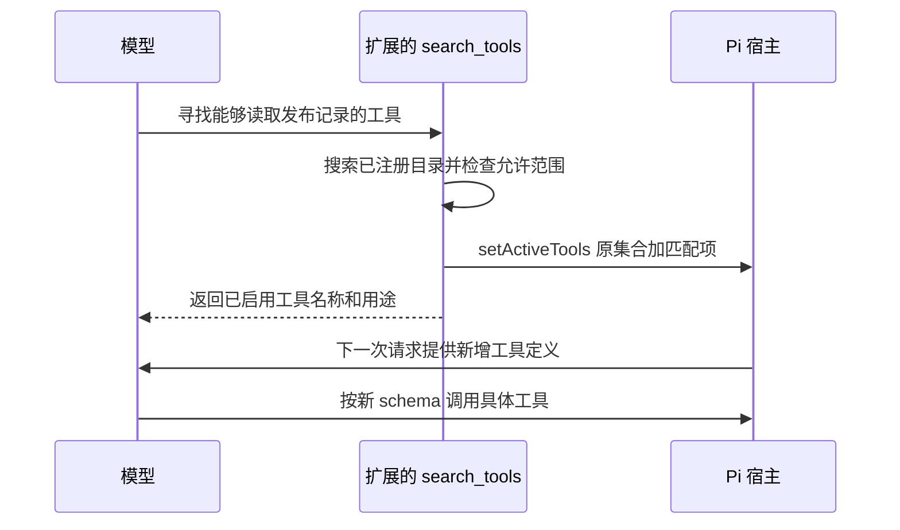

# 第五章　工具设计：让模型看清楚，也让动作可控制

模型可以写出“我已经修改文件”这句话，但一句话不会改变磁盘。只有当宿主收到工具调用、执行真实操作并把结果送回模型时，修改才可能发生。工具就是这条跨越语言与外部世界的通道。

假设我们要把项目的重试次数从三次改成五次。Agent 至少要知道配置在哪里、当前内容是什么、应该怎样修改、修改是否成功。这些问题分别需要搜索、读取、写入和验证。模型决定下一步，工具提供可观察的事实与可执行的动作。工具接口如果含糊、输出不完整，模型再聪明也可能在错误事实之上连续犯错。

本章先说明工具契约与感知、执行、协作三类用途，再用 `read/write/edit` 与 `bash` 的比较解释参数保真；随后讨论搜索、分段读取、并行与异步任务、多模态输出和按需工具发现；最后把这些原则用在一次配置修改中。它接着[第二章的执行循环](02-runtime.md)回答“被调度的工具应该长什么样”，也把[第三章的上下文选择](03-context-engineering.md)落实到具体返回值。

本章以 Pi 0.85.1、提交 `71dca871bc80b6bc97be37f0ca3189399d651fff` 为依据。文中的 **【内建】** 表示该版本直接提供的行为；**【扩展】** 表示可以利用 Pi 接口实现、但需要另写逻辑；**【建议】** 表示工程选择，不代表 Pi 已经替你完成。

## 5.1 工具是一份契约，不只是一个函数

初学者可以把工具理解为一个带说明书的函数。说明书告诉模型什么时候该用它、接受什么输入；函数真正执行；结果告诉模型发生了什么。完整契约还包括失败、截断、取消和副作用。

例如，`read` 的输入包含文件路径，可选的起始行与行数。模型无需学习某个操作系统的文本命令，就能表达“读取这个文件的第 201 行开始的 80 行”。宿主负责解析路径、访问文件、裁切结果、标记后续内容。


**【内建】** Pi 的工具定义包含 `name`、`description`、`parameters`、`execute` 等字段。`parameters` 是 schema：描述数据形状的规范。例如 `path` 必须是字符串，`offset` 是可选数字。TypeBox 让开发者在 TypeScript 中定义这套结构。执行返回的 `content` 可以有文本和图像；`details` 可以保存 diff、截断信息等供宿主使用。不要认为写进 `details` 的每个字段都会作为文字交给模型：模型需要据此决策的信息，应明确放入模型可见的内容。

这意味着“工具成功”也要定义准确。写入工具返回成功，证明文件操作完成，并不证明程序行为正确；搜索没返回匹配，证明当前条件下没有找到，并不证明整个项目不存在相关逻辑。清楚的契约让模型少做这种跨越证据的推断。参见 [工具类型](https://github.com/earendil-works/pi/blob/71dca871bc80b6bc97be37f0ca3189399d651fff/packages/agent/src/types.ts#L362) 与 [read 定义](https://github.com/earendil-works/pi/blob/71dca871bc80b6bc97be37f0ca3189399d651fff/packages/coding-agent/src/core/tools/read.ts#L64)。

## 5.2 少量基础工具怎样覆盖大量任务

**【内建】** `createCodingTools()` 默认组合四个工具：`read`、`bash`、`edit`、`write`。此外，Pi 提供可选的 `grep`、`find`、`ls`；此版本的完整工具集合还包含 `powershell`。所以“四工具”描述的是默认编程组合，并不是说整个项目只有四种工具。[默认与可选工具组合](https://github.com/earendil-works/pi/blob/71dca871bc80b6bc97be37f0ca3189399d651fff/packages/coding-agent/src/core/tools/index.ts#L195)

为了判断风险，我们可以按作用分成三类。这是分析方法，不是 Pi 强制实施的类型系统。

| 类别 | 要解决的问题 | Pi 中的例子或接入方式 |
| --- | --- | --- |
| 感知 | 外部世界现在是什么样 | `read`、`grep`、`find`、`ls` |
| 执行 | 怎样改变外部世界 | `edit`、`write`，以及执行修改命令的 `bash` |
| 协作 | 怎样请人或其他执行者参与 | 扩展实现提问、任务委派、消息发送等 |

`bash` 的类别取决于实际命令。运行查询可能只是观察；运行删除、上传或安装命令就带有副作用。不能给 `bash` 贴上永久的“只读”标签。同样，一个叫 `search` 的远端接口可能触发计费或记录审计日志。分类应依据业务效果，不能只看名字。

协作也不是“把另一个模型当搜索引擎”。委派工具需要交代目标、输入、允许的操作、交付格式和失败条件。另一个执行者能修改仓库时，它的调用已经涉及执行权限。Pi 的默认四工具不包含完整的多 Agent 协作产品；需要通过扩展或 SDK 在宿主中组织这件事。

这里还要区分工具粒度。把“读取整份资料并自动总结并发送报告”做成一个工具，参数可能很简单，但模型失去了中途检查资料与确认收件人的机会。拆成几十个只有机械动作的小工具，又会增加调用成本。**【建议】** 用一个工具包住需要共同保证的业务约束，把需要模型判断的分支留在工具之间。例如“校验参数后提交一笔带幂等标识的请求”适合作为整体；“搜索候选后决定读取哪篇文章”适合拆开。

少量基础能力的价值，是避免把每种业务流程都焊死进内核。读取、搜索、运行程序、修改文件可以组合成很多任务；对于权限、类型或返回值有特殊要求的业务，再提供专用工具。

## 5.3 为什么不把所有事情都交给 bash

从计算能力上看，shell 能读文件、写文件、搜索、调用网络服务，甚至启动其他 Agent。既然如此，为什么 Pi 仍然保留 `read/write/edit`？

因为“能完成”与“能稳定地交给模型完成”是两个要求。专用工具减少模型必须同时处理的细节。

<a id="argument-fidelity"></a>

### 参数经过的语言越多，失真机会越大

假设要写入下面这行文本，美元符号和反引号都必须保留：

```text
价格是 $5；示例表达式为 `name`。
```

用 `write` 时，它是 `content` 字符串的数据。用 shell 时，它可能先穿过 JSON 字符串，再进入 shell 引号规则；如果引号选择错误，美元符号可能被当作变量，反引号可能触发命令替换。嵌入正则、SQL 或脚本时，还会多一层语言解释。

**【内建】** Pi 的 `write` 将结构化参数里的 `content` 交给文件写入操作。它仍然需要正确的 JSON 编码，但不要求内容再通过 shell 解释。因此，正确序列化以后，正文中的特殊符号可以作为普通数据保留。[write 实现](https://github.com/earendil-works/pi/blob/71dca871bc80b6bc97be37f0ca3189399d651fff/packages/coding-agent/src/core/tools/write.ts#L44)

以下是**工具调用参数示意**，不是要粘贴进终端运行的命令：

```json
{
  "path": "notes/example.txt",
  "content": "价格是 $5；示例表达式为 `name`。\n下一行。\n"
}
```

JSON 文本中的 `\n` 被解码后是一枚换行符。如果本来要写入反斜杠和字母 n 两个字符，JSON 中应写 `\\n`。不要对整段输入做“发现反斜杠就再解码一次”的修复；这会损坏合法代码、路径或正则。

**【建议】** 需要将结构化参数传给程序时，优先使用参数数组与标准输入，避免拼接 shell 字符串。Pi 的 `grep` 就把 `pattern` 与路径作为 `spawn` 的参数，并用 `--` 分隔选项与搜索内容。这减少了 shell 插值问题，但正则本身仍有语义；按字面搜索要使用 `literal: true`。[grep 参数构造](https://github.com/earendil-works/pi/blob/71dca871bc80b6bc97be37f0ca3189399d651fff/packages/coding-agent/src/core/tools/grep.ts#L193)

### schema 校验解决形状，不解决业务正确性

**【内建】** Pi 在工具执行前准备参数，再进行验证；通用验证器还存在按 schema 转换某些值的逻辑。因此准确描述是“验证并可能转换”，不能承诺完全不触碰输入。`edit` 还专门兼容某些模型把 `edits` 数组输出为 JSON 字符串、输出为单个对象，以及旧式顶层 `oldText/newText` 的情况。这些修复发生在参数结构层。[执行前验证](https://github.com/earendil-works/pi/blob/71dca871bc80b6bc97be37f0ca3189399d651fff/packages/agent/src/agent-loop.ts#L593)；[参数验证器](https://github.com/earendil-works/pi/blob/71dca871bc80b6bc97be37f0ca3189399d651fff/packages/ai/src/utils/validation.ts#L309)；[edit 输入兼容](https://github.com/earendil-works/pi/blob/71dca871bc80b6bc97be37f0ca3189399d651fff/packages/coding-agent/src/core/tools/edit.ts#L100)

验证能发现“路径不是字符串”，不能证明“路径是用户想修改的文件”。schema、权限检查和修改后验证各有职责。把三者混为一谈，就会把格式正确的危险动作当成安全动作。

### 专用工具能提供稳定的失败与结果语义

`read` 知道自己返回的是文件片段，可以标出下一段从哪里开始。`edit` 知道自己在替换旧文本，可以拒绝歧义匹配。`write` 明确表示创建或覆盖。shell 的输出则由具体程序决定，同一句命令在不同平台上也可能有差异。

**【内建】** 这个版本的 `edit` 接受 `edits` 数组，每一项针对原始文件中的一个不重叠区域。它不是先执行第一项，再让第二项搜索第一项修改后的内容。工具会保留 BOM 和换行风格，并生成用于显示的 diff 与标准补丁。匹配实现包含有限的文本归一化与模糊回退，不能宣称它是逐字节替换；调用时仍应提供实际读到的唯一旧文本，不能依赖模糊匹配猜中目标。[edit 主流程](https://github.com/earendil-works/pi/blob/71dca871bc80b6bc97be37f0ca3189399d651fff/packages/coding-agent/src/core/tools/edit.ts#L148)；[匹配与重叠检查](https://github.com/earendil-works/pi/blob/71dca871bc80b6bc97be37f0ca3189399d651fff/packages/coding-agent/src/core/tools/edit-diff.ts#L295)

下面是**非可运行伪代码**，展示局部修改的约束：

```js
// 伪代码：队列负责在回调结束或抛错后让出执行位置。
return withFileMutationQueue(path, async () => {
  const original = await readFile(path);
  const ranges = [];
  for (const edit of edits) {
    const matches = findMatches(original, edit.oldText);
    if (matches.length !== 1) {
      throw new Error("旧文本不存在或不唯一，请重新读取后调整匹配片段");
    }
    ranges.push({ ...matches[0], newText: edit.newText });
  }
  if (hasOverlap(ranges)) throw new Error("替换区域重叠，尚未写入");
  const updated = applyAllToOriginal(original, ranges);
  await writeFile(path, updated);
  return { message: "写入完成", diff: makeDiff(original, updated) };
});
```

`bash` 仍然很重要：编译、测试、调用现成 CLI 都适合通过它完成。合理组合是把高频、易出错的基础动作做成稳定接口，再由 shell 承接开放的程序生态。

<a id="search-and-read"></a>

## 5.4 搜索给线索，读取给证据

搜索与读取处理的是两个尺度。搜索回答“哪里值得看”，读取回答“那里具体写了什么”。把所有搜索命中的全文塞给模型，会让上下文被大量无关材料占据，也会增加漏看关键结果的概率。

**【建议】** 面向知识库或网页的搜索工具，可以返回候选对象：标识、标题、位置、短摘要、版本，以及下一页游标。总数昂贵或无法准确计算时，要写 `total: null` 或说明未知，不能编造精确数字。游标应绑定查询与结果快照，避免翻页期间排序变化造成重复或漏项。

下面是**自定义工具的结果设计示意，不是 Pi 内建输出**：

```json
{
  "items": [
    {
      "id": "retry-policy",
      "title": "重试配置说明",
      "location": "docs/retry.md:18",
      "snippet": "网络失败时最多重试三次……",
      "version": "git:abc123"
    }
  ],
  "total": null,
  "next_cursor": "opaque-page-token"
}
```

**【内建】** Pi 的 `grep` 内部读取 ripgrep 的 JSON 事件，最终给模型的主要结果却是文本行，例如 `src/config.ts:8: retries: 3`。它携带路径、行号、片段，具备候选线索，但不是上述 JSON 对象数组。内部使用结构化协议，不等于外部返回结构化对象。

默认最多返回 100 个匹配，另有 50 KiB 字节上限；单条长行最多保留 500 个 JavaScript 字符单位，再标明截断。达到匹配上限时，会提示增大 `limit` 或细化搜索。它没有 `cursor`，也没有保证给出全部匹配总数。把 `limit` 从 100 改为 200 是扩大返回前缀，不是读取第二页。[grep schema](https://github.com/earendil-works/pi/blob/71dca871bc80b6bc97be37f0ca3189399d651fff/packages/coding-agent/src/core/tools/grep.ts#L23)；[结果与限制提示](https://github.com/earendil-works/pi/blob/71dca871bc80b6bc97be37f0ca3189399d651fff/packages/coding-agent/src/core/tools/grep.ts#L305)

`find` 按 glob 查找文件，默认上限 1000 条，返回相对搜索目录的路径；`ls` 列举目录，默认上限 500 项，按字母排序，目录带 `/`，包含点文件。这两者也有字节限制，不提供游标分页。使用时应先缩小目录或模式，再按需提高数量上限。[find](https://github.com/earendil-works/pi/blob/71dca871bc80b6bc97be37f0ca3189399d651fff/packages/coding-agent/src/core/tools/find.ts#L26)；[ls](https://github.com/earendil-works/pi/blob/71dca871bc80b6bc97be37f0ca3189399d651fff/packages/coding-agent/src/core/tools/ls.ts#L11)

这是一种针对本地代码工作的简洁取舍。如果扩展到百万文档知识库，稳定标识、版本、分页和结果排序会更重要，应在自定义搜索工具中补齐。理解设计原则，不需要把原则已经实现的程度夸大。

## 5.5 读取大文件：必须让模型知道自己没看完

**【内建】** `read` 的 `offset` 从 1 开始，单位是行；`limit` 是最多读取多少行。文本输出默认受 2000 行与 `50 * 1024` 字节两个阈值约束，先达到的限制生效。这里限制的是字节，不是 token，也不是汉字数。中文字节占用与英文不同，因此同样行数可能更早触达字节阈值。[read schema](https://github.com/earendil-works/pi/blob/71dca871bc80b6bc97be37f0ca3189399d651fff/packages/coding-agent/src/core/tools/read.ts#L14)；[截断常量](https://github.com/earendil-works/pi/blob/71dca871bc80b6bc97be37f0ca3189399d651fff/packages/coding-agent/src/core/tools/truncate.ts#L10)

处理顺序也值得注意：先按 `offset/limit` 选出候选片段，再套用系统的行数、字节限制。因此请求 4000 行不会绕过默认上限。默认文件操作会把文件读入内存再切片，这个接口控制的是交给模型的内容量，不是承诺只从磁盘读取那几十行。对超大远程文件，需要替换底层操作或另写流式读取工具。

如果因为行数或字节上限截断，结果会说明显示范围、文件总行数以及下一次的 `offset`。如果仅仅是用户的 `limit` 提前停止，会说明还剩多少行及继续位置。超出文件末尾的 offset 会报错。读取头部时通常保留完整行；第一行单独超过字节上限时，工具给出特殊提示与 shell 读取建议，而不会假装已经展示该行。[分片与提示实现](https://github.com/earendil-works/pi/blob/71dca871bc80b6bc97be37f0ca3189399d651fff/packages/coding-agent/src/core/tools/read.ts#L134)

**【建议】** 模型拿到下一段位置后，应按需要继续，而不是机械地读完整个文件。例如已经找到完整的配置块就可以停止；要审计所有配置项则不能停在被截断的前半段。若文件在分段之间变化，行号也可能移动；精确审查应固定 Git 提交或比较文件版本。

还要警惕复制工具提示里的 shell 片段。Pi 的超长行提示直接展示了路径；当路径含空格、引号或 shell 特殊字符时，需要重新安全构造命令。提示是线索，不是经过任意路径安全证明的程序。

## 5.6 只读、缓存与并行：三个概念不要混在一起

读取通常不会改变业务数据，所以多个相互独立的读取可以并发，重复查询也有缓存价值。但“只读”不等于“永远得到同一答案”。文件可能被编辑，数据库可能更新，网页可能变化，访问权限也可能改变。

**【建议】** 缓存键除了工具名与参数，至少要考虑资源版本和权限范围。Git 提交中的文件可以按提交哈希缓存；工作区文件可以通过内容哈希或可靠的版本机制判断有效性。修改发生后要使相关缓存失效。Pi 的默认 `read` 没有提供这样的通用跨调用结果缓存；`grep` 为生成上下文行所用的局部文件缓存，也不能等同于长期查询缓存。

**【内建】** 这个版本的 Agent 默认采用 `parallel` 工具执行模式。普通 Agent 循环先按顺序完成同一条模型消息中各工具的准备与执行前检查，再并发执行获准调用；最终工具结果消息仍按模型原始调用顺序加入对话。完成事件可能交错。因此不能根据最终记录的排列推断真实完成顺序。[默认设置](https://github.com/earendil-works/pi/blob/71dca871bc80b6bc97be37f0ca3189399d651fff/packages/agent/src/agent.ts#L237)；[并发调度](https://github.com/earendil-works/pi/blob/71dca871bc80b6bc97be37f0ca3189399d651fff/packages/agent/src/agent-loop.ts#L480)

普通 Agent 循环也支持全局顺序模式；同批调用中出现声明 `executionMode: "sequential"` 的工具，会让该批顺序执行。这是该循环的具体语义。仓库另有持久化 harness 运行路径，其调度入口根据运行设置选择顺序或并发，不能把某一路径的全部细节自动套给另一条路径。[普通循环模式选择](https://github.com/earendil-works/pi/blob/71dca871bc80b6bc97be37f0ca3189399d651fff/packages/agent/src/agent-loop.ts#L408)；[持久化路径](https://github.com/earendil-works/pi/blob/71dca871bc80b6bc97be37f0ca3189399d651fff/packages/agent/src/harness/runtime/drive/tools.ts#L656)

并行不是依赖分析器。“修改配置”和“运行依赖该配置的测试”不能因为一起发出就期待先改后测；“读取文件”和“覆盖同一文件”也可能产生竞态。需要结果依赖时，应把下一步放到后续轮次，或者在一个明确顺序的工具内部完成。

**【内建】** Pi 的 `edit` 与 `write` 会进入按文件组织的修改队列。同一文件的修改排队，不同文件仍可并发；队列会尝试用真实路径归一现有文件。但这个队列不是全系统事务锁，其他进程和任意 `bash` 命令不会自动加入，读取也没有因此获得一致性快照。两个连续的全文 `write` 仍可能由后者覆盖前者，排队不等于合并意图。[文件修改队列](https://github.com/earendil-works/pi/blob/71dca871bc80b6bc97be37f0ca3189399d651fff/packages/coding-agent/src/core/tools/file-mutation-queue.ts#L16)

**【建议】** 判断一组调用是否可并行，可以先问两个问题：它们是否读取同一份稳定快照；其中一个的结果是否决定另一个的参数。并发读取五个互不变化的说明文件通常没有顺序依赖；先搜索再读取搜索返回的路径则天然分成两步。对执行工具，即使目标文件不同，也可能共享数据库、锁文件或构建目录，不能只用文件名判断独立性。

取消也不等于回滚。工具可以在等待点检查取消信号，但已经写入的字节不会因为用户按下停止键自动恢复。生产工具应明确哪些动作已完成、哪些未开始，以及是否需要补偿。

<a id="async-tools"></a>

### 长任务怎样让出等待时间

假设构建需要十分钟，而你还想让 Agent 同时阅读发布说明。普通 Pi 循环中，一个一直等待构建结束的工具会占着这一批调用：即使另一个读取工具先完成，模型也要等整批结束才继续请求。这正是[第二章并行与异步执行](02-runtime.md#async-execution)区分的两个问题：工具能否同时运行，以及模型能否在其中一个工具未完成时继续行动。

**【建议，不是 Pi 内建任务平台】** 对需要后台运行的任务，可以把工具拆为 `start/status/cancel`。`start` 负责创建任务并快速返回 `jobId`；`status` 查询当前状态或最终结果；`cancel` 请求停止任务。这样，普通循环拿到的是已经完成的“启动任务”调用，随后可以读其他文件，再查询后台任务。后台进程和持久状态由扩展或外部服务负责。

```js
// 自定义工具的接口示意；jobs 是应用自己实现的后台任务服务。
async function startBuild({ project, requestId }) {
  const job = await jobs.enqueue({ project, requestId });
  return { jobId: job.id, state: "queued", next: "调用 statusBuild 查询" };
}

async function statusBuild({ jobId }) {
  const job = await jobs.get(jobId);
  if (job.state === "succeeded") {
    return { jobId, state: job.state, exitCode: 0, artifact: job.artifact };
  }
  if (job.state === "failed") {
    return { jobId, state: job.state, exitCode: job.exitCode, error: job.error };
  }
  if (job.state === "cancelled") {
    return { jobId, state: job.state, completedSteps: job.completedSteps };
  }
  return { jobId, state: job.state, progress: job.progress, retryAfterSeconds: 10 };
}

async function cancelBuild({ jobId }) {
  await jobs.requestCancel(jobId);
  return { jobId, cancellationRequested: true, next: "查询 statusBuild 确认终态" };
}
```

`jobId` 证明任务被登记，不证明构建完成。成功、失败和已取消必须是清楚的终态；排队、运行中和取消请求已接收都不是成功。百分比没有可靠来源时，可以返回“正在安装依赖”这样的阶段信息，不要编造进度。超时重试 `start` 还可能重复创建任务，所以示例中的 `requestId` 应由服务端按约定去重；查询和取消都应检查调用者是否有权访问该任务。

如果希望任务结束后主动通知 Agent，还需要应用订阅完成事件，再通过宿主的消息或续接入口安排下一轮。这个通知应包含 `jobId`、终态和结果来源，并处理重复通知、会话已经结束等情况。实现接入位置见[第六章的宿主扩展](06-extensibility.md)。这些都是需要编写的扩展逻辑，不能因为工具返回了一个 Promise，就声称已经实现后台任务恢复。

**【内建边界】** Pi 工具的 `onUpdate` 可以报告进度；普通循环不会因此自动在工具未完成时启动下一次模型请求。供应商协议允许工具结果未返回时模型继续输出，是另一种异步机制，也需要宿主配合。`start/status/cancel` 方案不要求这项协议能力；它通过拆分调用，把“等待长任务完成”变成应用显式管理的状态。

## 5.7 多模态：哪些信息必须以图像保留

假设任务是检查页面按钮是否遮挡正文。把截图识别成一段文字，往往会丢掉按钮与正文的位置关系。反过来，读取几页纯文字扫描件时，可靠的文字提取可能比整页图像更方便搜索与引用。

**【内建】** Pi 的 `read` 对支持的图片类型做 MIME 检测与图像处理，返回文本说明和图像内容块。默认启用自动缩放，选项说明以最大 2000×2000 为边界；处理失败时会返回原因。当前模型不支持图像时，工具会附上图像将从请求中省略的提示。这不等于自动执行 OCR，不能期待非视觉模型因此获得图片里的文字。[图像读取路径](https://github.com/earendil-works/pi/blob/71dca871bc80b6bc97be37f0ca3189399d651fff/packages/coding-agent/src/core/tools/read.ts#L49)

**【扩展】** 可以添加 OCR 或文档解析工具，把纯文字内容提取成文本，同时保存原始图片或页面引用。复杂表格应保留行列结构，不能只拼接所有文字；界面、设计稿和布局敏感图表通常需要保留图像。图像经缩放后，小字号也可能难以辨认，可进一步裁切局部或读取源数据。选择依据是任务需要什么证据，而不是把一种形态一律视为更先进。

## 5.8 工具越来越多时，按需发现比全部展示更合适

模型看到几百个相似工具时，需要花更多上下文辨认用途，还可能混淆名称与参数。把工具按领域组织成目录，再按需要加载，有助于保持初始上下文紧凑。

**【内建接口 + 扩展策略】** Pi 提供 `registerTool()`、`getAllTools()` 与 `setActiveTools()`。扩展可以注册许多工具，最初仅激活一个搜索入口；入口根据需求找到相关工具，并把名称追加到活动集合。Pi 识别纯新增的变化，在下一次模型请求前暴露新增定义。匹配算法、领域层级和访问策略仍由扩展编写。



下面是**非可运行伪代码**，省略注册与类型定义：

```js
// 伪代码：searchCatalog 和 allowedForUser 由扩展作者实现。
async function searchTools({ query }) {
  const candidates = await searchCatalog(pi.getAllTools(), query);
  const allowed = candidates.filter(tool => allowedForUser(tool));
  const names = allowed.map(tool => tool.name);
  pi.setActiveTools([...new Set([...pi.getActiveTools(), ...names])]);
  return allowed.map(tool => ({
    name: tool.name,
    description: tool.description,
    limits: tool.limits,
  }));
}
```

**【内建】** 支持原生延迟加载的模型与提供商可以使用相应协议；其他模型仍可动态激活，但下一次请求会发送完整的当前活动工具列表。移除工具或替换整个集合也会采用常规回退。未知名称不能凭空变出工具，必须先注册。工具新增的系统提示元数据还可能改变缓存前缀，所以“按需加载”不保证每种情况下都有同样的缓存收益。[动态工具加载机制](https://github.com/earendil-works/pi/blob/71dca871bc80b6bc97be37f0ca3189399d651fff/packages/coding-agent/docs/extensions.md#L2371)

[第三章的 Skills](03-context-engineering.md#34-prompt-template-与-skill重复表达和按需能力) 提供另一种按需查阅：先看能力说明，必要时读取具体流程，再调用现有工具或脚本。它与动态工具加载可以配合，但读到一份说明书本身不会注册新工具，更不会授予外部系统权限。

## 5.9 最小权限应落到执行边界

**【建议】** 审阅任务只需要观察能力时，可以只启用 `read/grep/find/ls`。Pi 恰好提供这一只读工具组合。但工具集合是模型可调用能力的约束，并非操作系统沙箱：文件路径解析不自动把访问范围锁在项目目录，扩展本身也运行在宿主进程中。

**【扩展】** 可以监听 `tool_call` 阻止不允许的动作，通过自定义 operations 把读写交给受限远端服务，或者把进程放入容器、受限账号与文件系统权限之内。仅靠正则拦截某几个 shell 命令，很难覆盖所有等效写法。真正需要限制外部能力时，应由操作系统或服务端权限执行边界。[执行前扩展事件](https://github.com/earendil-works/pi/blob/71dca871bc80b6bc97be37f0ca3189399d651fff/packages/coding-agent/docs/extensions.md#L778)

对于发送、扣款、发布等动作，工具还应支持可核对的目标、请求标识和明确结果。网络超时不代表动作未发生；自动重试前需要判断是否可能重复执行。这里的可靠性来自业务协议，而不是把提示词写得更严厉。

### 让失败变成下一步可以使用的信息

工具错误并不是一段随便展示的日志。它是下一轮决策的输入。只说“失败”会迫使模型猜测：是路径错误、权限不足、匹配不唯一，还是操作已经执行但回执丢失？相反，清楚的失败分类可以直接约束后续行为。

以局部编辑为例，“找不到旧文本”应引导重新读取当前文件；“出现多个匹配”应引导增加唯一上下文；“没有写权限”应引导检查授权范围。三者不能使用同一种自动重试策略。前两者需要新证据，后一种可能需要改变执行环境。

**【建议】** 自定义工具的失败结果可以包含稳定错误码、可读解释、是否已经产生副作用以及建议的恢复动作。底层堆栈通常留给宿主日志，模型看到的是足以调整计划的信息。若包含外部系统返回的文字，还应把它视为数据：网页或命令输出中的“忽略此前指令”不能升级为宿主授权。

长时间执行的工具还需要区分进度与最终结果。一次“正在编译”的更新只是观察，不能作为编译通过的证据。**【内建】** Pi 工具可以通过更新回调发送进度；`bash` 用输出累积器生成更新，并为截断结果提供完整输出路径等详情。最终仍需要等待执行完成和结果判定。模型看到一段成功日志时，还要确认后面是否存在失败。[bash 输出更新](https://github.com/earendil-works/pi/blob/71dca871bc80b6bc97be37f0ca3189399d651fff/packages/coding-agent/src/core/tools/bash.ts#L255)

这个边界也解释了为什么工具设计属于上下文工程。返回值不是越多越好，而是应该保留决定下一步所需的状态、证据与不确定性。搜索候选、截断通知、唯一匹配错误、最终退出结果，都是在帮助模型建立更准确的世界状态。

## 5.10 动手：从搜索到修改，再到验证

若暂时没有模型账户，可先运行配套的[真实工具契约实验](../examples/tool-contract/README.md)。它直接调用 Pi 工具函数，核验特殊字符写入、行片段读取、批量编辑接口和截断通知；下面的练习则观察模型怎样组合这些工具。

先在自己的临时目录创建 `settings.json`，内容如下。这个练习只涉及本地文件：

```json
{
  "service": "demo",
  "retries": 3,
  "timeoutSeconds": 10
}
```

启动 Pi 时可以显式开启搜索工具：

```bash
pi --tools read,bash,edit,write,grep,find,ls
```

输入：“找到 demo 服务的重试次数，将其从 3 改为 5，保留其他字段，并读取结果验证。”下面是一条合理轨迹，参数展示不代表模型必定采用完全相同的调用次序。

第一步用 `grep` 找线索：

```json
{"pattern":"\"retries\"","path":".","literal":true,"limit":20}
```

第二步读取文件，确认字段所在的完整对象：

```json
{"path":"settings.json","offset":1,"limit":40}
```

第三步使用本版本的数组形式修改：

```json
{
  "path": "settings.json",
  "edits": [
    {"oldText":"\"retries\": 3,","newText":"\"retries\": 5,"}
  ]
}
```

第四步再读取文件，检查只有目标值变化。如果项目有实际配置加载器，应再通过它验证；本练习的读取只能验证文本结果，不能证明真实服务会按预期重试。

继续做三个小实验，观察边界是否与理解一致：

1. 制作超过 2000 行的文本，请 Pi 先读取，再继续读取剩余部分。预期看到截断提示与下一次 offset；若长行提前触达字节上限，第一次返回会少于 2000 行。
2. 让同一文件出现两个完全相同的目标片段，再请求仅替换其中一个。预期歧义匹配被拒绝，随后需要读取更多上下文、扩大唯一匹配片段，而不是盲目重试相同参数。
3. 只启用 `read,grep,find,ls`，请求修改文件。预期当前工具集合无法直接完成写入；如果仍然发生修改，应检查是否加载了其他扩展或宿主入口，不能因此认定只读文件工具本身会写入。

### 参考答案

配置修改的最终内容应如下。只有 `retries` 从 3 变成 5；`service` 与 `timeoutSeconds` 保持原值。

```json
{
  "service": "demo",
  "retries": 5,
  "timeoutSeconds": 10
}
```

这份答案对应文本验收。如果要证明服务实际会重试五次，还需配置加载与故障重试测试，单看 JSON 不够。

1. 例如文件有 2500 行、每行都很短，第一次不传 `limit` 时通常显示第 1–2000 行，提示下一次使用 `offset: 2001`；随后 `read({ path, offset: 2001, limit: 500 })` 读取余下 500 行。若字节限制更早触发，应使用实际提示中的下一位置，不能硬编码 2001。正确结果包括内容和“没看完”的通知，两者缺一不可。
2. 使用同一个 `oldText` 匹配两处时，应得到不唯一错误且不写入。下一步读取周围内容，把目标旁边独有的字段或段落一起包含进 `oldText/newText`，使旧片段只匹配一处。例如两个段落都有 `retries: 3`，但一处上方写 `service: demo`，就把这一行一并纳入匹配。加大匹配范围不是允许改更多内容，`newText` 中应原样保留这些定位文字。
3. 只有这四个只读工具且没有其他执行入口时，Agent 无法完成修改，应说明能力不足并保持文件不变。它可以描述需要怎样修改，但不能宣称已经改好。工具集合限制和操作系统隔离的区别见[5.9 节](#59-最小权限应落到执行边界)。

以上是预期行为与参考答案，不是某次真实模型实验的运行记录。每次练习都保留工具参数、实际返回与文件差异。你要验证的是一条完整证据链：模型提出了什么，工具真正执行了什么，环境发生了什么变化。能读懂这条链，才开始真正掌握 Agent 工具工程。

[上一章](04-memory.md) · [返回目录](../README.md) · [下一章](06-extensibility.md)
