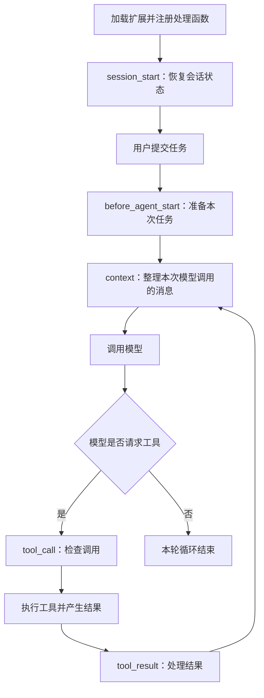

# 第六章　扩展：把自己的规则接入 Pi 的运行过程

你已经能让 Pi 读取表格、运行脚本并生成一份报告。现在团队想把这套用法固定下来：每个月先拿到当月的字段说明，查询客户资料时只走允许的只读接口；一份报告检查到一半退出，重新打开后还能接着做。每次手动贴说明、记进度，很容易遗漏。

本章围绕这项需求展开：先判断该用模板、Skill 还是扩展，再看自己的代码应该在什么时候运行；接着设计查询工具与权限检查，最后处理退出、切换分支和接入自建界面的情况。前几章介绍过的模型循环、上下文和会话记录，会成为这里可以直接使用的部件。

这些要求包含三类不同的改变。数据字典，也就是字段名称与含义的说明，影响模型看到什么；只读查询决定模型可以做什么；进度恢复决定应用怎样延续工作。只写一段“请遵守规则”的提示词，很难同时解决它们。直接修改 Pi 内核又会让维护者承担合并上游更新的成本。

Pi 给出的入口是 **Extension，扩展**：由宿主加载的一段 TypeScript 程序。它可以注册工具、订阅运行事件、保存自定义状态，也可以提供命令和界面。扩展不是另一个独立 Agent。它通常不负责重新实现模型循环，而是在已有循环的具体位置接入应用逻辑。

这些接入也能用于退款调查：扩展提供指标查询和资料读取，模型根据结果选择继续查客服还是发布记录，负责人依据证据决定是否继续扩大新版的使用范围。第七章的[调查案例](07-general-agent.md#changing-task)会把这些分工放回完整任务。

## 6.1 先选择最小的改变位置

假设你希望 Pi 输出报告时采用公司的排版规范。如果只是固定章节和语气，提示模板就够了；如果还需要说明数据来源、计算口径和检查步骤，可以写成 Skill；如果必须调用专用数据库、检查每一次工具调用，或者维护跨轮次的程序状态，就需要扩展。

[第三章的模板与 Skill](03-context-engineering.md)已经说明如何向模型提供操作知识；这里进一步区分哪些条件必须由程序执行。三者解决的问题不同。模板是可复用的输入文本；Skill 是按需读取的操作知识；扩展是宿主真正执行的代码。把一个校验条件写进 Skill，模型可能理解并遵守；把同一条件写进工具执行函数，可以在条件不满足时直接拒绝执行。这解释了为什么可靠应用往往同时使用自然语言与程序，而不要求某一种机制包办所有事情。

Pi 的工具注册接口包括名称、说明、参数模式和执行函数，也允许指定呈现方式与执行模式。模型主要需要知道工具的用途、参数及结果；终端用户还需要进度和可读的展示。两类需求被放在同一个工具定义的不同字段中。[源码：ToolDefinition](https://github.com/earendil-works/pi/blob/71dca871bc80b6bc97be37f0ca3189399d651fff/packages/coding-agent/src/core/extensions/types.ts#L449)

这里的设计价值在于：扩展作者可以拥有领域决策，Pi 继续负责运行这些决策所需的公共设施。对报告应用而言，“怎样计算收入”属于业务，“怎样把工具结果送回模型”属于宿主。

## 6.2 事件是生命周期中的插座

团队已经写好一个查询数据字典的函数。接下来要决定何时调用：每次 Pi 启动时、每次用户提交报告任务时，还是每次模型继续推理时？放错位置，可能读到旧说明，也可能一项任务重复下载几十次。

宿主在运行到这些位置时会发出**事件**，扩展可以注册函数接收通知。有些通知只供观察，有些允许补充消息或阻止动作。先看这些位置在一次任务中怎样排列。



这是一张省略重试、压缩和排队消息的机制图，不是完整事件时序规范。它首先帮助我们区分两个常被混淆的时点：`before_agent_start` 位于用户任务进入循环之前；`context` 位于每次模型调用之前。一个用户任务可能调用模型很多次，因此也可能触发很多次 `context`。[源码：事件定义](https://github.com/earendil-works/pi/blob/71dca871bc80b6bc97be37f0ca3189399d651fff/packages/coding-agent/src/core/extensions/types.ts#L687)

例如，本月数据字典可以在任务开始时检索一次，再由后续上下文处理选择必要内容。若每次 `context` 都重新下载整份字典，工具往返越多，网络开销越大。事件位置会直接影响成本，不能只看名字是否顺眼。

下面是机制伪代码，`retrieveDictionary` 等函数需要应用自己实现：

```js
// 机制伪代码，不可直接运行；以下 helper 均由应用实现。
let taskDictionary;

onTaskStart(async (task) => {
  const fullDictionary = await retrieveDictionary(task.month);
  taskDictionary = keepFieldsAndSource(fullDictionary);
});

onBuildContext((currentMessages) => {
  const messages = removeOurOldReferenceBlocks([...currentMessages]);
  return insertReferenceBlock(messages, taskDictionary);
});
```

先去重再插入，是为了防止上下文在循环中不断膨胀。保留资料身份，是为了让数据字典中的文字继续作为资料，而不是升级成能够覆盖用户要求的指令。实际实现还必须使用合法的消息类型，并维持工具调用与工具结果的对应关系。

Pi 的 `emitContext` 会先复制消息，再依次调用扩展处理函数；后一个处理函数接收前一个处理函数处理后的消息。因此两个扩展的修改会组合，也可能冲突。这种修改作用于发送给模型的消息视图，不等同于删除磁盘上的历史记录。[源码：emitContext](https://github.com/earendil-works/pi/blob/71dca871bc80b6bc97be37f0ca3189399d651fff/packages/coding-agent/src/core/extensions/runner.ts#L1034)

## 6.3 注册工具：把业务接口交给模型

报告所需的指标定义由团队的一个服务维护，每个月可能调整，不能一直靠手动复制文件。模型需要在核对某个月的报告时，查询当月有效的定义并取得来源。

可以把已有服务接成 `lookup_metric` 工具：输入指标名称和月份，返回定义、来源和生效日期。模型只需使用这个明确入口，服务仍负责检查访问范围。

下面故意使用伪代码，以突出接口责任，而不是让读者直接复制一个并不存在的数据库客户端：

```js
// 机制伪代码，不可直接运行；schema、校验和查询 helper 由应用提供。
pi.registerTool({
    name: "lookup_metric",
    description: "查询指定月份生效的指标定义，不修改数据",
    parameters: {
        metric: requiredString(),
        month: monthStringSchema()
    },
    async execute(callId, params, signal, onUpdate, context) {
        validateMonthAndScope(params, context);
        const result = await queryMetricService(params, { signal });
        return {
            content: [{ type: "text", text: describeWithSource(result) }],
            details: { schemaVersion: 1, metric: result }
        };
    }
});
```

真实 API 使用参数模式描述输入，执行函数还接收工具调用标识、取消信号、进度回调及扩展上下文。调用标识适合关联日志；取消信号需要继续传给网络客户端，才能让用户取消真正停止底层工作；进度回调可以报告“正在查询”，但不能把进度描述冒充最终结果。[源码：工具接口及执行参数](https://github.com/earendil-works/pi/blob/71dca871bc80b6bc97be37f0ca3189399d651fff/packages/coding-agent/src/core/extensions/types.ts#L449)

`content` 和 `details` 也不要混为一谈。前者承载工具交给模型的内容，后者适合存放扩展恢复状态或界面展示需要的结构化数据。不能以为把来源只放在 `details` 里，模型就一定会引用它；模型需要据此判断的字段，应出现在可见内容中。敏感字段则应在查询服务端就限制返回，不应仅靠界面隐藏。

在本书固定版本中，`registerTool()` 不只可在扩展初始化时调用，也可在启动之后注册；工具列表会在当前会话更新。它提供动态扩展的基础，也支持第五章介绍的追加式工具加载；“先展示哪个工具组，再发现哪些工具”的业务发现流程仍需应用设计。[官方说明：动态注册](https://github.com/earendil-works/pi/blob/71dca871bc80b6bc97be37f0ca3189399d651fff/packages/coding-agent/docs/extensions.md#L1375)

## 6.4 检查工具调用，不等于获得沙盒

团队约定报告核对通过后才能发布。假如模型在检查完成前就请求发布，单靠事先写一段提示无法保证拦住这次动作。应用可以在执行前的 `tool_call` 事件中检查验收状态，未通过时返回 `{ block: true, reason: "尚未通过核对" }`。Pi 按顺序执行相关处理函数，遇到阻止结果便返回。[源码：emitToolCall](https://github.com/earendil-works/pi/blob/71dca871bc80b6bc97be37f0ca3189399d651fff/packages/coding-agent/src/core/extensions/runner.ts#L982)

这与[第五章的最小权限原则](05-tools.md)有关：可检查的工具接口让业务条件容易表达，但实际权限必须由执行入口保证。策略是否完整，取决于它覆盖了哪些行动入口。你只拦截 `write`，模型仍可能通过 `bash` 写文件；你拦截某个发布工具，另一个扩展可能直接调用发布接口。一个字符串黑名单也难以可靠理解 shell 的全部语义。因此，事件钩子适合表达业务策略，操作系统、容器、独立服务的权限才适合承担强隔离。

还有一个细节：`tool_call` 允许原地修改输入，后续处理函数会看到修改后的参数；源码明确写明，修改之后不会再执行一次参数模式校验。如果扩展把月份改成不存在的格式，不能期待宿主自动替它兜底。能避免改参时尽量避免；确需修改时，由修改者重新验证。[源码：ToolCallEvent 注释](https://github.com/earendil-works/pi/blob/71dca871bc80b6bc97be37f0ca3189399d651fff/packages/coding-agent/src/core/extensions/types.ts#L939)

Pi 本身没有内建沙盒，扩展与内置工具以启动 Pi 的用户权限运行。项目可信设置控制的是是否加载项目中的配置、资源和扩展，不是运行后的文件或网络访问边界。项目获得信任，也不意味着项目中的每段文字和每条构建命令都安全。[官方安全边界](https://github.com/earendil-works/pi/blob/71dca871bc80b6bc97be37f0ca3189399d651fff/packages/coding-agent/docs/security.md#L1)

对月报应用，一个较稳妥的分工是：查询服务使用只读凭据；生成报告在工作目录进行；发布服务单独验证目标位置、审核状态和请求身份。Pi 扩展负责连接这些入口，每个服务仍然检查自己负责的权限和业务条件。

### 当多个工具同时行动时

报告包含订单表和退款表，模型在同一次响应中请求分别检查两张表的字段。若两项检查只依赖各自的文件，就可以独立执行。但扩展如果在第二项开始前读取“已完成表数”，不能假定第一项已经结束。

在本书版本的默认并行工具执行模式下，同一响应的工具调用先依次进行预检，然后才并发执行。这意味着第二项的 `tool_call` 检查不一定能看到第一项的结果。处理函数访问的会话状态会同步到当前助手调用消息，但不保证包含同批兄弟调用的结果。[官方说明：工具预检与并行](https://github.com/earendil-works/pi/blob/71dca871bc80b6bc97be37f0ca3189399d651fff/packages/coding-agent/docs/extensions.md#L778)

如果两个检查只读不同文件，这通常没有问题；如果它们共同修改一个“已完成数量”，就需要程序级同步或顺序执行。更危险的情况是模型同时请求“检查报告”和“发布报告”：发布检查不能把“另一项检查已经排队”当成“检查已经通过”。应让发布服务验证已经存在的验收记录，或把依赖关系拆成两轮。工具定义提供 `executionMode` 选择，但业务依赖仍需应用明确表达。

这也解释了为什么进度计数器不是可靠的发布凭据。“完成了三项”不能证明是哪三项、对应哪个输入、由哪个版本的校验器生成。更可靠的记录应带上检查项标识和输入摘要，发布时逐项核对。

### 错误处理也是扩展契约

数据字典服务临时断开，负责补充上下文的扩展抛出了错误。如果应用仍继续生成报告，就要知道模型是否缺少必需定义，不能把“注入函数通常能成功”当作保证。

不同事件的抛错处理不一定相同。例如 `emitContext` 会记录处理函数错误并继续处理，而工具调用检查承担阻止动作的责任。对关键业务条件，应返回可解释的失败，并配合工具或服务端约束。

日志同样需要区分“注册成功”“开始执行”“执行成功”和“验收通过”。一个网络查询开始的通知只能证明代码走到了那一步；一条结束事件也可能携带错误。为每次调用保留调用标识、简短状态及证据位置，有助于查清中断、重复执行和部分完成的问题。完整客户资料和系统提示词不应为了方便调试就全部复制进日志。

## 6.5 状态恢复：不要只保存一个内存变量

一份报告有三张表。Pi 已检查完前两张，开始第三张时你退出了程序。明天打开后，应用需要知道哪些检查已完成、结果保存在哪里、原数据有没有变化，才能决定哪些步骤可继续使用。若进度只在 `let completedTables = []` 这个内存变量里，进程退出后就会消失。

Pi 提供 `appendEntry(customType, data)` 保存自定义条目。这些条目不会自动成为模型上下文。需要模型知道进度时，扩展应另行构造简短消息；需要程序恢复时，则读取条目重建状态。[源码：自定义条目的语义](https://github.com/earendil-works/pi/blob/71dca871bc80b6bc97be37f0ca3189399d651fff/packages/coding-agent/src/core/session-manager.ts#L101)

[第四章的树形会话](04-memory.md)会影响这里的恢复范围。恢复时还有“读哪个历史”的问题。假设你在时间点甲完成了表一，随后完成表二，又从甲创建另一条分支重新计算。如果扫描整个会话文件并取最后一条进度，就可能把另一分支的表二状态带过来。与对话分支相关的数据，应沿当前分支恢复。

```js
// 机制伪代码，不可直接运行；emptyState、decodeState 由应用实现。
function restore(context) {
  let state = emptyState();
  for (const entry of context.sessionManager.getBranch()) {
    if (entry.type === "custom" && entry.customType === "report-state") {
      state = decodeState(entry.data); // 按 schemaVersion 解析完整快照
    }
  }
  return state;
}

pi.on("session_start", (_event, context) => { state = restore(context); });
pi.on("session_tree", (_event, context) => { state = restore(context); });

// 检查成功且证据写好之后，保存新的完整状态快照。
pi.appendEntry("report-state", state);
```

Pi 官方的待办扩展示例采用另一种相近方式：把结构化状态放在工具结果的 `details` 中，在 `session_start` 和 `session_tree` 时扫描当前分支恢复。它展示了“从历史重建状态”如何与分支配合。[源码：待办状态恢复](https://github.com/earendil-works/pi/blob/71dca871bc80b6bc97be37f0ca3189399d651fff/packages/coding-agent/examples/extensions/todo.ts#L108)

恢复会话状态不等于撤销外部副作用。若某个报告已经发送，切换到发送前的分支不会把邮件收回。状态中应保留外部操作标识，重试时向服务确认是否执行过。涉及发布、付款或写数据库的流程，还需要服务端幂等性：相同业务请求重复提交，不会重复产生效果。

本书版本的会话替换生命周期也值得牢记：新建、恢复或 fork 会结束旧扩展实例，再为替换后的会话加载扩展，并通过 `session_start` 的 `reason` 告知原因。清理连接放在 `session_shutdown`，恢复放在 `session_start`；不要持有旧会话的上下文继续写入。[官方说明：会话替换](https://github.com/earendil-works/pi/blob/71dca871bc80b6bc97be37f0ca3189399d651fff/packages/coding-agent/docs/extensions.md#L432)

## 6.6 从个人扩展到应用宿主

你在自己的 Pi 中试好了查询工具和恢复逻辑，同事也想使用。最初可以共享项目资源；等业务人员希望从网页上传表格、查看进度时，就需要自己的界面来启动并跟踪 Pi。下面从资源分发讲到应用集成，这两步解决的是不同使用需求。

个人扩展可以放在 `~/.pi/agent/extensions/`，项目扩展可以放在 `.pi/extensions/`。当你想把扩展、Skill、模板与主题一起分享时，可将它们组织成 Pi Package，通过 npm 或 Git 分发。包只是资源组合与分发方式，并不会自动增加隔离层。固定包版本或 Git 提交，才能知道某次运行究竟用了哪一套行为。[官方说明：包管理](https://github.com/earendil-works/pi/blob/71dca871bc80b6bc97be37f0ca3189399d651fff/packages/coding-agent/docs/packages.md#L5)

如果终端不适合最终用户，Pi 还有两个应用集成入口。**SDK** 是进程内的程序接口，Node.js 应用通过 `createAgentSession()` 创建会话、订阅事件并调用 `session.prompt()`。它可以提供工具、资源加载器和会话管理器。**RPC** 则启动 `pi --mode rpc` 子进程，经标准输入输出交换 JSON 消息，适合用其他语言编写宿主界面。[源码：SDK 入口](https://github.com/earendil-works/pi/blob/71dca871bc80b6bc97be37f0ca3189399d651fff/packages/coding-agent/src/core/sdk.ts#L39)

例如，你用 Python 编写上传报告的页面，可以启动 Pi 子进程，把用户请求写入它的标准输入，再从标准输出接收响应。每条 JSON 记录以 LF 换行符结尾，让接收方知道一条消息在哪里结束。下面是一条请求的基本形状：

```json
{"id":"report-1","type":"prompt","message":"检查本月报告的汇总口径"}
```

宿主可能先收到命令接受响应，然后继续收到 Agent 事件。`success: true` 表示这条输入已被接受、排队或处理，不代表报告正确完成。应用应跟踪后续事件、实际产物及验收结果，不能一收到接受响应便把界面变成“任务成功”。协议使用严格的 LF 分帧，不能随意把 JSON 字符串中的其他 Unicode 分隔字符当作消息边界。[官方协议：prompt 与分帧](https://github.com/earendil-works/pi/blob/71dca871bc80b6bc97be37f0ca3189399d651fff/packages/coding-agent/docs/rpc.md#L25)

## 6.7 练习：设计一个可恢复的报告检查器

团队每月收到订单表、退款表和汇总表，希望 Pi 检查完三张表后再交付报告。检查可能中断，数据也可能在中断期间更新。请为这个流程写一份扩展设计，不需要接真实数据库。

工具输入应有表名和检查项，结果分别包含模型可读的结论及结构化证据；扩展状态应记录数据版本、已完成检查和外部任务标识。

验收时走四条路径：正常检查三张表；第二张表失败后重试；退出后恢复；回到检查第一张表后的分支。四条路径都必须能解释“目前认为完成了什么，证据在哪里”。再加一条对抗性情况：历史里记录检查通过，但原始数据已经更新。合理行为是重新核对或明确提示证据过期，不能仅凭旧进度宣布通过。

最后检查你的设计是否把业务判断、状态持久化、模型可见信息和系统权限分开。能够指出每项责任落在哪一层，比堆出很多事件处理函数更接近掌握 Pi 的扩展能力。

### 参考答案

可以把三张表叫作订单表、退款表、汇总表。每张表都执行 `schema`（字段检查）和 `totals`（数值核对）两项检查。输入为 `{ table, check, dataHash, ruleVersion }`，只有表名与检查项在允许列表内才执行。下面是一条状态快照的示例；字段名和内容由报告应用定义，不是 Pi 的内置格式。

```js
// 示例状态，不可直接作为扩展运行；摘要字符串仅为占位示例。
const state = {
  schemaVersion: 1,
  dataHash: "sha256:input-v1",
  ruleVersion: "report-rules-v1",
  checks: {
    "orders/schema": {
      status: "passed", evidencePath: "work/orders-schema.json",
      inputHash: "sha256:orders-v1", validatorVersion: "1.0"
    }
  },
  externalTasks: {} // 外部操作发生后，记录业务请求键与服务端任务 ID
};
```

工具的模型可见结果应直接写明“订单表字段检查通过；输入版本 orders-v1；证据 work/orders-schema.json”。`details` 保存同样结论的结构化字段，便于界面和程序读取；完整检查集合另用 `appendEntry("report-state", state)` 保存。成功条件是六项检查都通过，且每项证据的输入摘要与规则版本仍匹配；不能只数出六条成功记录。

| 题目中的路径 | 应恢复的状态与下一步 | 可以检查的证据 |
| --- | --- | --- |
| 正常检查三张表 | 六项分别成功后，标记整份报告可交付 | 六条检查证据，输入摘要及规则版本一致 |
| 第二张表失败后重试 | 保留第一张表的有效结果；第二张表失败项保持 failed，修复原因后重做，不能先计入完成数 | 失败原因、重试记录和新的通过证据；失败历史仍可追溯 |
| 退出后恢复 | `session_start` 扫描活动分支，取本扩展最后一份快照，再核对证据文件是否存在及版本是否匹配 | 恢复前后的有效检查集合一致，不重复执行已确认的外部操作 |
| 回到第一张表后的分支 | 在 `/tree` 选择当时的节点；`session_tree` 后只恢复当前路径上的记录，第二、三张表重新视为待检查 | 当前分支可见的快照只包含第一张表；其他分支的结果不能混入 |

最后一行假定所选节点位于第一张表状态快照之后；若选在快照之前，第一张表也不能凭后续记录算作已完成。如何选择节点，可回看[第四章的分支操作](04-memory.md)。外部系统已经执行过的操作则必须另查服务端，切分支不会撤销它。

数据更新时，先重新计算摘要。最简单的实现是整份输入摘要变化便让六项检查全部过期并重跑；更细的实现可以只使受影响表和依赖它的汇总检查过期。例如退款表变化，订单表字段检查可能仍有效，但退款合计和最终汇总都要重新核对。两种实现都合理，前者容易做对，后者需要维护准确的依赖关系。若历史证据文件已被删除，也应标为缺少证据，而不是仅凭 `passed` 字段放行。

[上一章](05-tools.md) · [返回目录](../README.md) · [下一章](07-general-agent.md)
