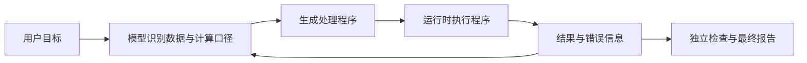

# 第七章　从编码助手到通用 Agent

本章先解释代码为什么能充当临时工具，再完成一项资料有冲突、目标会变化的退款调查：先解释为什么固定汇总不能回答业务问题，再跟随两轮新证据调整计划。可手算的 CSV 只作为其中的程序子练习；随后把同一思路迁移到知识检索，最后讨论权限边界与多 Agent 协作。读完后，你可以判断一个任务该用临时脚本、专用工具，还是需要多个独立任务。

一个能够读取文件、修改文件和执行命令的 Agent，为什么可以帮助不写代码的人？答案藏在工作对象里。销售表格是文件，采访记录是文件，产品说明也是文件；把它们整理成月报，需要读取、转换、计算、检查和输出。许多原本在办公软件中手工完成的操作，也可以由程序表达。

因此，Coding Agent 的“编程”能力不限于交付软件。它还可以临时编写处理脚本，把一次模糊请求转换成可执行步骤。Pi 的默认工具只有 `read`、`write`、`edit` 和 `bash`，但当运行环境提供合适的程序、数据与权限时，这些基础操作可以组合成广泛的工作能力。[官方说明：默认工具](https://github.com/earendil-works/pi/blob/71dca871bc80b6bc97be37f0ca3189399d651fff/packages/coding-agent/README.md#L91)

本章讨论的是这种组合潜力。它不意味着 Pi 默认配好了联网搜索、浏览器、办公连接器或数据分析软件，也不意味着所有业务都应该允许 Agent 任意写代码。

## 7.1 程序为什么能成为临时工具

假设有 600 份门店日报，用户要求：“计算每家门店本月的退款率，并找出异常变化。”如果把所有文件全文塞进上下文，让模型在自然语言中完成加总，既浪费上下文，也很难保证算术一致。

另一条路径是让模型先检查文件结构，再编写程序处理。模型负责决定计算方案，程序负责反复执行同一规则。例如，对每家门店累加订单数和退款订单数，再计算比率。原始数据留在文件中，模型只读取样本、规则、异常和汇总结果。



这张图里有两个反馈层。程序语法错误，运行时会报错；程序正常结束，但业务口径可能依然错误。前者可以从执行反馈发现，后者需要任务定义和独立检查。因此，“代码跑通”只证明它能在当前输入上执行，不证明问题已经正确解决。

Pi 的 `bash` 工具通过子进程执行命令，工作目录、环境和取消信号都是执行的一部分。它并不在内核中预装一个万能解释器；你调用 `python3`，系统就必须实际存在 Python；调用某个库，那个库也必须能够导入。[源码：本地 shell 执行](https://github.com/earendil-works/pi/blob/71dca871bc80b6bc97be37f0ca3189399d651fff/packages/coding-agent/src/core/tools/bash.ts#L79)

这种方式把能力边界从“预先注册了多少工具”扩展到“环境中能安全运行哪些程序”。代价是环境管理成为应用的一部分：依赖版本、编码、权限、路径和网络状态都会影响结果。工具少，不代表工程责任少。

## 7.2 文件系统承担什么角色

文件系统可以让一个长期任务不必完全依赖聊天记录。为了看清这一点，可以把工作目录组织成下面的样子。这是本书建议的任务布局，Pi 不会自动创建：

```text
monthly-report/
  input/             原始数据与导出说明
  rules/             指标定义、业务规则、报告要求
  scripts/           数据转换与校验程序
  work/              临时计算结果与异常清单
  output/            最终报告、图表及来源说明
  checks/            用于验收的已知样例
```

这些目录的作用不是让结构显得专业，而是保留不同信息的身份。原始输入应能重新读取；临时结果可以丢弃重算；规则需要明确版本；最终报告需要能追溯到输入和程序。若把三者混在一个文件里，模型修正报告时可能顺手改掉“原始数据”，下次就无法解释差异从哪里来。

文件还承担了上下文索引的作用。用户说“继续昨天的月报”，模型不需要重新阅读每一条聊天，只要先检查任务说明、已保存的中间结果和待处理异常，再决定深入读取什么。当然，文件存在不代表模型已经读过，也不代表文件内容一定可靠。应用仍需告诉 Agent 去哪里找，并验证文件的新旧关系。

一个实用的原则是：**大体量事实保留在环境中，任务推进所需的小体量证据进入上下文。** 对报表而言，明细行保存在 CSV，模型看到字段说明、检查统计和异常样本；对知识助理而言，全文保存在资料库，模型看到候选位置和相关段落。这与[第三章的上下文工程](03-context-engineering.md)相接：文件系统提供容量，检索与读取策略提供选择。

<a id="changing-task"></a>

## 7.3 综合案例：退款变多了，是否应该回滚新版？

### 为什么这次需要重新选择步骤

用户最初只说：“新版结账上线后，退款好像变多了，明早要不要回滚？”这句话包含一个现象、一项因果猜测和一个业务决定，三者不能直接连成结论。

“退款”可能是申请，也可能是完成；“上线后”不代表每位用户都看过新版；“回滚”可能降低页面风险，也可能对物流造成的退款毫无帮助。更重要的是，用户并没有预先列出这些歧义。任务推进的第一步，就是识别哪些可以从文件确认，哪些会影响决策而需要追问。

普通程序当然也可以完成其中许多步骤，甚至可以为这一套材料写出完整决策树。本例选择 Agent 的理由是：输入会以不同的自然语言和文件形态出现，相关证据与合适步骤没有全部预先确定；我们希望同一套工具能够支持不同调查。它是否比固定流程更划算，还需要比较错误、成本和维护时间，不能仅凭故事作证明。

### 第一轮：先区分现象、线索与结论

[配套资料](../examples/investigation/README.md)提供两批各 20 笔订单、旧指标说明、发布记录和客服摘录。下面是可接受的参考路径，模型不必严格按此顺序工作：

1. 读任务与指标说明，确认现有字段表示退款申请，而不是完成。
2. 编写小程序检查字段并算出申请率：从 3/20 的 15% 变为 8/20 的 40%。程序负责计算，模型负责解释这个数还不能说明什么。
3. 发布记录同时提到拉新活动。按新老客户重新看数据：新客占比从 20% 到 80%，新客申请率前后都是 50%；老客申请率从 6.25% 到 0%。整体数字与分组观察并不支持直接归因。
4. 客服资料提到运费提示，但两条反馈属于同一订单；还有物流、填错地址和购买犹豫。把这些作为待验证线索，不能用人工挑选的片段估计投诉率。
5. 保存初步报告与未决项，询问实际决策、指标定义以及是否有版本暴露数据。

这不是“用更多工具把简单加总包装复杂”。如果任务只是计算已经定义好的 15% 和 40%，脚本已经足够。调查需要回答的是：这两个数是否在比较同一种东西，它们支撑哪一级结论，下一项值得取得的证据是什么。

### 第二轮：新材料改变指标，也改变目标

负责人随后补充：“管理层看的是退款完成率。我真正担心的是运费展示误解，先决定要不要暂停扩大灰度。当前拿不到更多埋点。”新事件表说明完成率暂为 15% 与 25%，而且前一批已观察 14 天，后一批只有 3 天。

一个能够适应变化的 Agent 应修改四个地方：计算从订单上的申请标记转向完成事件与订单关联；报告保留旧申请率但更正其用途；因果判断加入观察窗口与版本暴露缺失；交付从完整分析报告改为一页决策备忘录与最小验证方案。第一轮产物应保留，读者才能看见它改变了什么、为什么改变。

```js
// 调查策略示意，不是 Pi 内建流程，也不是完整实现。
let goal = readUserRequest();
let evidence = [];
let questions = [];

while (!readyToDeliver(goal, evidence)) {
  const next = chooseNextStep(goal, evidence, questions); // 模型选择
  if (next.kind === "clarify") {
    saveFindingsAndQuestions(evidence, next.questions);
    break; // 本次运行等待用户，不把缺失信息编造成结论
  }
  const observation = await executeTool(next.tool, next.args);
  evidence.push(withSourceAndDefinition(observation));
  questions = reconsiderWhatIsUnknown(goal, evidence);
}

// 下一次用户输入开始新的运行；不是在模型内部凭空收到未来材料。
const update = await receiveUserUpdate(); // 宿主接收
const changes = compareGoalAndDefinitions(goal, update); // 模型识别变化
await savePreviousReport();
goal = reviseGoal(goal, changes);
// 随后再次进入模型—工具循环，按新口径重算，保留旧依据。
```

这里的 `chooseNextStep`、`compareGoalAndDefinitions` 表示要由模型完成的判断职责，其他辅助函数也是示意。第二章的[底层循环](02-runtime.md#agent-loop)负责让调用和结果来回流动，本段描述循环里推进的业务任务。两者不是同一个 `while`，Pi 不会预装退款调查的停止规则。

### 没有唯一结论，仍然可以严格验收

合格交付可以建议短暂暂停扩大灰度，先用相同任务比较新旧页面的运费可见性；也可以在解释风险与停止标准后建议维持小范围观察。材料不足以算出唯一最优决策，但有些陈述可以明确判错：把申请说成完成、重复计数同一订单、声称有并不存在的随机对照、无视 14 天与 3 天的差别、把建议说成已经执行。

因此，验收分成两部分：程序检查关联、去重和数值；人工结合轨迹检查证据是否支撑论断、关键未知是否保留、用户变更是否影响行动。任务模糊不等于没有标准，只是标准不能缩成“最终文本与标准答案一致”。完整的两轮操作、数值答案、备忘录示例和评估表见[综合实验](../examples/investigation/README.md)。

这个案例把前几章连在一起：第三章选择本轮证据，第四章保存旧定义与调查分支，第五章要求工具保留来源与粒度，第六章接入业务服务，第八章则用改变问题结构的保留任务检查泛化。若换成物流退款，Agent 还机械重复运费方案，就没有通过这种检查。

### 数值子练习：从 CSV 到一张可核验的表

先从综合任务中取出一个可以亲手验证的计算环节。它不代表完整调查，也不要求用 LLM 才能完成。新建练习目录，在 `input/orders.csv` 放入以下虚构数据。`amount` 表示原订单金额，单位为元；退款订单用 `status=refunded` 标记。

```csv
order_id,store,amount,status
A001,东店,100.00,paid
A002,东店,50.00,refunded
A003,西店,80.00,paid
A004,西店,20.00,paid
```

给 Pi 的第一条任务可以这样写：

> 读取 input/orders.csv，按门店统计订单数、退款订单数和保留收入。保留收入只累加 paid 订单金额；退款率按退款订单数除以全部订单数计算。先检查重复 order_id、未知 status 和非法金额，发现问题时输出异常清单，不静默跳过。用 Python 标准库实现，原始文件保持不变，输出到 output/。最终报告附上运行命令和验收结果。

这段输入把“帮我分析一下”变成了明确的执行契约。它说明字段含义、计算方法、异常行为和产物位置，也避免 Agent 自己发明“退款率”的口径。没有这些条件，同一句业务术语可能被解释为退款金额占比、退款订单占比或扣除取消单后的比率。

合理的执行过程应当先读取样本和文件，再写程序。计算机制可以写成：

```js
// 机制伪代码，不可直接运行；readCsv、parseDecimal、writeErrors 等由应用实现。
// 此处 decimal helper 表示精确十进制运算，不是 JS 的普通浮点加法。
const seen = new Set();
const totals = new Map();
const errors = [];

for (const row of readCsv("input/orders.csv")) {
  const problems = validateRow(row, seen); // 必需字段、重复 ID、状态与金额
  if (problems.length > 0) {
    errors.push({ line: row.line, problems });
    continue;
  }
  seen.add(row.order_id);
  const amount = parseDecimal(row.amount);
  const store = getOrCreateTotals(totals, row.store);
  store.orders += 1;
  if (row.status === "refunded") { store.refunds += 1; }
  if (row.status === "paid") { store.income = decimalAdd(store.income, amount); }
}

if (errors.length > 0) {
  writeErrors(errors);
  markRunFailed(); // 不把不完整汇总写成正式报告
} else {
  writeReport(sortStoresAndComputeRates(totals));
}
```

为什么要使用十进制金额类型？因为常见二进制浮点数不能精确表示很多十进制小数，重复加总时可能出现微小误差。模型无需在脑中模拟这些数值运算，它应选择合适的运行时类型，并让程序统一执行。金额校验还要排除无穷值等特殊值；“能被解析成数字”不是完整业务校验。

这份小样本的验收标准可以手算：东店两单、一单退款，退款率 50%，保留收入 100 元；西店两单、零退款，退款率 0%，保留收入 100 元。两店保留收入合计 200 元。

然后复制数据，加入一条重复订单。预期结果是报告明确失败并指出重复标识，而不是把收入变成 300 元还宣布完成。再加入一个未知状态，检查它是否被错误地当作已支付。**失败样本决定了“检查”是不是真的发生过。** 只有正常输入跑通，很难发现程序偷偷丢弃数据的问题。

Pi 在这里提供文件操作和运行循环，业务验收规则由我们提供。它没有专门内建“门店月报”工作流，也不会因为输出文件叫 `validated-report.md` 就自动获得可信度。可信度来自输入、规则、程序、运行结果和检查之间可核对的关系。

## 7.4 知识助理：检索到答案之前还有几步

第二个场景是帮助新人理解团队文档。用户问：“我们为什么把账单处理从实时改成批量？”模型可能知道一般系统的理由，但它不知道这个团队实际作出的决定。必须先找项目证据。

如果资料就是本地 Markdown，Pi 可以利用文件读取和 shell 中可用的搜索命令完成调查。若资料位于外部知识平台，则需要已配置的命令行接口或自定义扩展。文件操作不会自动产生任何平台的访问权限。

可以将过程拆成四步：先搜索“账单”“批量”“决策”相关候选，再阅读最相关文档的具体段落；比较文档日期和状态，找出最终生效的决定；最后回答原因并给出来源位置。候选搜索解决“可能在哪里”，深入阅读解决“究竟说了什么”，版本判断解决“现在还适不适用”。

```js
// 机制伪代码，不可直接运行；所有检索和判定 helper 均由应用实现。
const question = "为什么改成批量处理？";
const candidates = await searchDocuments(question); // 标题、位置、短片段
const selected = selectRelevantAndRecent(candidates);
const passages = await readSelectedPassages(selected);
const facts = separateProposalsDecisionsAndRevocations(passages);

if (facts.hasFinalDecision) {
  return answerWithSources(question, facts);
}
return describeMissingEvidence(question, facts);
```

这里复用了[第五章“先搜索候选，再读取证据”的工具设计](05-tools.md)，而资料版本与生效状态属于[第四章的知识维护问题](04-memory.md)。知识助理容易出现的错误，是把“曾经有人提出过”写成“团队目前决定了”。因此，有用的工具输出除了正文，还应提供文档版本、日期和身份。会议记录中的猜测、批准后的设计文档和已废弃说明，不能只按关键词相似度排序后等价使用。

如果这个流程被反复使用，可以把“先判断决策状态，再形成结论”的步骤写成 Skill；把外部平台检索封装成有范围限制的工具；把用户明确确认的偏好交给专门的记忆机制。它们分别沉淀过程、连接能力与个体信息，不应把整个聊天转录统统塞入全局提示词。

## 7.5 代码能力的边界

Coding Agent 特别适合任务形态开放、但能获得明确证据的工作。例如文件批处理、数据清洗、格式转换、生成图表或维护文档。因为输入种类很多，很难预先给每个操作注册专用工具；临时程序可以补上缺口。

相反，对于边界严格的业务，专用工具往往更合适。一个库存系统可以提供 `query_stock` 和 `reserve_stock`，在服务端检查仓库范围、库存版本和请求幂等性。如果让模型自由编写 SQL 修改生产表，虽然灵活，却把本可由服务保证的业务约束转移给了临时程序。通用能力应帮助编排业务接口，而不是取消业务边界。

还有一些任务没有简单的确定性验收。程序能检查文章字数和链接，却很难仅凭检查器证明论证有洞见；可以生成图表，却不能自动证明指标选得合理。这里应分别报告机器可验证的部分和需要人的判断，而不是把可计算指标当成全部质量。

Pi 的系统权限也不会因任务变成“办公”而缩小。`bash` 执行生成代码时，通常拥有 Pi 进程的权限。让 Pi 分析陌生来源的文件或无人值守地运行代码时，环境隔离、挂载范围与凭据范围需要由宿主安排。[官方说明：无内建沙盒](https://github.com/earendil-works/pi/blob/71dca871bc80b6bc97be37f0ca3189399d651fff/packages/coding-agent/docs/security.md#L30)

例如，上面的 CSV 练习只需要一个工作目录和 Python，不需要邮箱凭据，也不需要家庭目录中的私人文件。最小环境可以让错误影响限制在练习范围内。把整个主机目录读写挂入容器，则仍然允许容器改写对应的宿主文件，不能仅凭“用了容器”判断安全。

### 自动生成与正式交付之间

通用助手往往同时面对两种“完成”：文件已经生成，以及业务已经接受。月报可以先生成在 `output/` 中供用户核对，之后再通过发布系统交付。两步分开后，即使排版或口径需要修改，也不会反复向收件人发送半成品。若用户已经明确授权某一范围内的自动发布，应用可以按该授权执行，但仍应核对本次产物是否满足约定条件。

对无人值守任务，还需要把“等待什么”保存下来。缺少某个月的数据时，可以输出缺口清单并结束本次运行，等待数据到齐后重试；不能凭空补齐数据，也不能让进程无限等待一个没有交互界面的确认框。Pi 的程序接口能够承载这种应用，但等待队列、业务通知和完成状态仍需宿主设计。

这些安排使通用性具有实际意义：同一套读取、计算和生成能力可以服务多个业务，而每个业务仍有自己的输入契约和交付条件。我们复用的是基础能力，不必把所有任务变成完全相同的自动流程。

## 7.6 协作为什么不是多开几个模型就够了

长报告可能适合分工：一个 Agent 检查数据，另一个阅读规则，第三个撰写说明。但多 Agent 是一个编排问题，需要定义输入、输出、共享资源、失败处理和验收归属。

Pi 没有把子 Agent 作为内建核心功能。官方给出的方向包括运行多个 Pi 实例、通过扩展实现，或安装相应包。原生没有固定的子 Agent 调度器，也不意味着无法构建协作。[官方说明：能力取舍](https://github.com/earendil-works/pi/blob/71dca871bc80b6bc97be37f0ca3189399d651fff/packages/coding-agent/README.md#L497)

对月报案例，更清楚的分工是让检查者只输出 `checks.json`，分析者只输出 `analysis.json`，撰写者读取两者生成报告。原始数据由同一版本标识锁定，各个 Agent 不同时改写同一个汇总文件。协调者比较产物中的数据版本，发现不一致就拒绝汇总。

```js
// 架构伪代码，不可直接运行；runWorker 等 helper 由宿主实现，并非 Pi API。
const input = { inputHash: hashInputs(), ruleVersion: "v1" };
const [checks, analysis] = await Promise.all([
  runWorker("check", input, "work/checker/"),
  runWorker("analyze", input, "work/analyst/")
]);
assertSameInputAndRuleVersion(checks, analysis, input);
assertChecksPassed(checks);
assertRequiredMetricsPresent(analysis);
const report = await runWriter({ checks, analysis }, "output/");
verifyReportAgainstAnalysis(report, analysis);
```

这是应用架构伪代码，不是 Pi 自带的工作流语法。若通过 RPC 构建协调者，还应区分“子进程接受任务”和“任务通过验收”，处理取消、超时和预算上限。这里的 `Promise.all` 表示宿主并发启动两个工作者，再等待两个结果；它不表示某一个模型能在工具未返回时自动继续推理。运行时如何等待工具可回看[第二章](02-runtime.md)，哪些操作适合并发可回看[第五章](05-tools.md)。并行能减少等待，但也会增加重复读取、模型费用以及对结果冲突的处理成本。一个四行 CSV 的报告根本不值得拆成三个 Agent；三个互不依赖的大资料包才可能受益。

## 7.7 练习：把一次任务做成可重复流程

用本章四行 CSV 完成报告后，不要立刻把脚本升级成永久工具。先换一份门店名称不同、行顺序打乱的数据，检查结果是否保持正确；再试空文件、缺少字段、重复订单和未知状态。

验收时应交付五样东西：原始输入、明确口径、处理程序、异常或检查结果、可追溯的最终报告。重新运行同一输入，数值应该一致；切换输入后，报告不能沿用上次的门店或金额；遇到非法数据，应保留错误位置，不能生成一份看似正常的月报。

如果这些要求都能满足，你已经把 Pi 从聊天式助手用成了可复核的工作系统。下一步不只是让它“再做一次”，而是研究哪些成功经验值得保留、哪些失败需要修正，以及怎样证明后续版本确实更好。

### 参考答案

四行输入的汇总应当是下面这样。这里明确把退款率写成 0 到 1 之间的小数；面向人的报告再显示为百分数，避免 `0.5` 与 `50` 混用。

```csv
store,order_count,refund_count,refund_rate,retained_revenue
东店,2,1,0.5,100.00
西店,2,0,0,100.00
```

报告正文可以写：“东店共 2 单，其中退款 1 单，退款率 50%，保留收入 100.00 元；西店共 2 单，无退款，保留收入 100.00 元。合计 4 单、退款 1 单，整体退款率 25%，保留收入 200.00 元。”整体退款率要用总退款数除以总订单数，不能一般性地取各店退款率的简单平均；此例两店订单数恰好相同，平均数碰巧相等。

对异常的参考处理如下。这里约定月报必须有至少一条订单，所以空输入失败；其他产品也可选择输出“无数据”，但应提前写明，不能把它伪装成零退款率。

| 测试输入 | 预期结果 | 错误位置或验证方式 |
| --- | --- | --- |
| 同一输入重复运行 | 两次业务数值相同，输入摘要相同 | 比较汇总字段；运行时间等元数据可以不同 |
| 门店改名，行顺序打乱 | 按新门店名汇总，数值仍对应各自订单 | 输出不能残留东店或西店等旧名字；按门店名排序后比较 |
| 空文件或只有表头 | 明确失败，说明没有可汇总订单 | 空文件记文件级错误；只有表头说明数据行数为 0 |
| 删除 `status` 列 | 字段校验失败，不进入正常汇总 | 表头缺少 `status` |
| 在末尾复制 A001 | 重复订单错误，不能把该单再次计入收入后发布 | 原 A001 在第 2 行，复制项在第 6 行（含表头行） |
| A004 状态改为 `pending` | 未知状态错误，不能当作 paid 或静默跳过 | 第 5 行、字段 `status`、值 `pending` |
| A003 金额改为 `NaN` 或负数 | 非法金额错误 | 第 4 行、字段 `amount` 与原值 |

可重复性来自第 7.3 节的程序结构：每次调用都新建 `seen`、`totals` 和 `errors`，从传入文件读取数据，最后固定门店排序和金额格式。不要在程序中写死“东店”，也不要从上一次 `output/summary.csv` 继续累加。发生异常时，应明确把本次运行标为失败；即使保留上次成功报告，也要通过独立的运行目录或 manifest 标识它属于上一次输入，避免用户误读旧文件。

五项交付可以组织为 `input/orders.csv`、`rules/metrics.md`、`scripts/report.py`、`work/errors.json` 与 `output/report.md`；成功时异常列表为空，失败时不发布新的正常报告。报告还应记录输入摘要、规则版本、程序版本、运行命令和检查结果。这里给的是本题设计答案，以上路径表示建议的交付布局，不表示这些文件已经由本次示例运行生成。

[上一章](06-extensibility.md) · [返回目录](../README.md) · [下一章](08-evolution.md)
