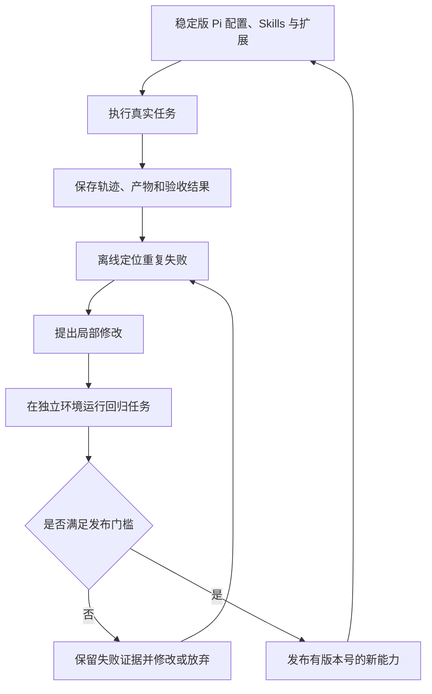

# 第八章　持续进化：让经验成为经过验证的改变

本章先分清一次对话纠正与长期能力变化，再学习从轨迹定位失败，把修复放到知识、Skill 或程序中；之后建立开发、保留与回归样例，最后用一份改进报告决定发布还是回退。我们继续沿用第七章的月报案例，重点回答“改了什么”和“凭什么认为更好”。

第一次让 Pi 生成月报，它遗漏了退款订单检查。你指出问题，Pi 修复脚本并重新运行。第二天换一个目录开始新会话，它又犯了同样的错误。

这并不矛盾。一次对话中纠正了行为，和系统在未来任务中稳定保留了改进，是两件事。前者可能只依赖当前上下文；后者需要某种持久改变，还需要后续运行能够找到并正确使用这个改变。

Pi 为这种持久改变提供了材料：会话历史、上下文文件、Skill、扩展和包。它并没有内建一套自动评估所有任务、训练模型并发布新能力的进化平台。本章会把现有接口与需要自行搭建的流程分开，说明怎样在 Pi 周围建立一个能够证明进步的循环。

综合调查的失败还可能发生在计算之外：它算对申请率，却回答了完成率的问题；用户已改变目标，它仍沿旧计划输出月报；看到新客占比变化，就过度推断“新版没有影响”。这些错误需要从任务理解、证据判断和计划更新中定位，不能只加一条算术检查。后面的程序回归是必要的一部分，还要加入[综合实验的变体评估](../examples/investigation/README.md)：在物流原因、不同数据粒度或明确监控需求下，检查它是否真的选择了不同方案。

## 8.1 先问“改变了哪里”

谈到 Agent 学习，人们常把几个不同层次放在一起。

| 改变的对象 | 月报场景中的例子 | 主要影响 |
| --- | --- | --- |
| 当前上下文 | 用户本轮补充退款率口径 | 影响当前任务的后续判断 |
| 外部知识 | 保存已批准的指标定义和生效日期 | 后续任务检索时获得事实 |
| 操作过程 | Skill 要求先检查重复订单 | 改变任务执行步骤 |
| 可执行程序 | 校验器拒绝未知订单状态 | 通过确定性逻辑限制行为 |
| 模型参数 | 用专门训练流程更新模型权重 | 改变模型自身的统计行为 |

这几层分别连接到[第三章的上下文与 Skill](03-context-engineering.md)、[第四章的记忆](04-memory.md)和[第五章的工具契约](05-tools.md)。Pi 直接适合承载前四类外围改变：读取知识、加载过程、运行程序、通过扩展调整运行方式。它调用模型进行推理，不会因为写入了一个 Skill 就自动更新模型权重。更新 Pi 软件、安装新包、替换提示词，也都不等于进行了参数训练。

为什么要严格区分？因为不同改变需要不同证据。修改知识，需要证明来源准确且适用；修改 Skill，需要证明模型会在合适任务中加载并遵循；修改程序，需要检查输入输出与异常；换模型，则要重新评估整个组合的行为。只说“Agent 学会了”会遮住真正的工程问题。

## 8.2 轨迹是调查材料，评分不是最终回复

**运行轨迹**指任务执行中留下的过程记录，包括用户输入、模型消息、工具参数、工具结果以及相关事件。没有轨迹，你只看到最后一句“报告已经完成”；有轨迹，才能知道它到底读取了哪份数据、执行了哪个脚本、是否看见异常。

Pi 的会话管理器会把消息和其他条目组织为历史，在启用持久化时写入 JSONL 文件。文件按条目保存，并带有分支关系。磁盘写入存在实现细节：新会话在出现助手消息前可能尚未落盘，因此不能假定每次 `appendEntry` 后磁盘立即已有完整审计记录；要求严格审计的宿主应自行定义日志落盘与备份策略。[源码：会话持久化](https://github.com/earendil-works/pi/blob/71dca871bc80b6bc97be37f0ca3189399d651fff/packages/coding-agent/src/core/session-manager.ts#L1029)

此外，`pi --mode json` 可以输出事件流，适合外部程序记录工具开始、结束、消息及错误等信息。事件流与会话存储不是同一种文件格式，读取程序应分别处理，不要因为两者都是“一行一个 JSON”就共用错误的解析假设。[官方说明：JSON 事件流](https://github.com/earendil-works/pi/blob/71dca871bc80b6bc97be37f0ca3189399d651fff/packages/coding-agent/docs/json.md#L1)

但有了轨迹仍然缺少一个东西：独立的完成判断。助手写“所有校验通过”只是待核对的声明。月报的收入总额是否正确，应由已知样例或另一个可信计算过程核对；是否偷偷改了输入文件，应比较执行前后的文件摘要；是否真正输出了报告，应检查实际文件。

```js
// 记录结构伪代码；变量由应用采集，此对象不是 Pi 自动生成的报告。
const taskRecord = {
  taskId, inputHash, ruleVersion,
  piVersion, modelId, extensionVersion, skillVersion,
  sessionPath, branchId, eventLogPath,
  artifactPaths, independentCheckResult,
  elapsedMs, usage, failureCategory
};
```

这是建议由应用保存的任务记录模式，不是 Pi 自动生成的完整评测报告。Pi 消息里可以提供模型及用量信息，但费用估算仍受提供商报告和价格配置影响，不能直接视为账单结算。[源码：助手消息字段](https://github.com/earendil-works/pi/blob/71dca871bc80b6bc97be37f0ca3189399d651fff/packages/ai/src/types.ts#L428)

## 8.3 从失败定位到最小修复

假设五次月报任务失败了两次。一个失败是没有发现重复订单；另一个失败是查询服务超时。若把两者统一写成“以后更仔细”，很难改善任何一项。

第一项可能是流程遗漏：模型不知道必须检查重复标识。它也可能是程序错误：已经运行检查，但字段读错了。还可能是证据误用：检查报告写着失败，模型仍然发布了月报。三者最终都表现为错误报告，修复位置却不同。

第二项则可能完全不需要改提示词。网络服务暂时不可用，正确方向也许是明确超时、有限重试和可恢复的任务状态。把临时网络故障写成永久知识“该服务不能使用”，会让系统在恢复后继续绕路。

可以按下面的顺序阅读轨迹：先确认失败的外部事实，再找到第一次偏离要求的位置，然后检查那个位置缺少了什么。

```js
// 调查思路伪代码，不是自动诊断器；各条件必须从轨迹与产物核实。
if (requiredFactsMissing) {
  inspect("检索与加载路径");
} else if (factsPresentButStepSkipped) {
  inspect("Skill 或任务编排");
} else if (schemaValidButBusinessInvalid) {
  inspect("工具或服务端校验");
} else if (toolFailedButReportedSuccess) {
  inspect("错误传播与验收门槛");
} else if (externalServiceUnavailable) {
  inspect("超时、有限重试与恢复策略");
} else {
  collectMoreEvidence(); // 跨任务反复理解失败时，再评估模型或更大改造
}
```

这不是自动诊断算法，而是一份调查顺序。目标是减少没有证据的全面改写。一个局部可解释的修改，通常比同时换模型、工具、提示词和数据源更容易验证：后者即便改善，也很难知道哪项改变起了作用。

对于重复订单问题，可以先让校验器明确拒绝重复 `order_id`，再让 Skill 要求报告读取校验结果，最后让发布入口只接受通过验收的产物。每层都有不同责任，不必把所有规则重复几十遍。

## 8.4 把经验保存为合适的产物

保存经验时，应先判断它究竟是什么。

“2026 年 9 月开始，退款率采用订单数口径”是一条带生效时间的业务事实，适合进入规则资料；“每次分析先确认金额单位和退款口径”是一项跨任务步骤，适合进入 Skill；“发现重复订单就输出异常并以非零退出码结束”可以成为程序行为。

一个经验条目至少应说明适用条件、结论、证据位置和版本。只写“金额计算要小心”既不能指导行动，也无法在将来验证是否仍然有效。更好的记录是：“处理按订单导出的 CSV 时，先按 order_id 检查唯一性；某些导出包含订单明细行，此时需要先确认一单多行是否属于正常结构，不可直接删除重复值。”这条记录不仅保留成功做法，也保留边界。

Skill 特别适合沉淀可重复的操作过程，但“已经创建”与“实际生效”之间还有距离。Pi 启动时主要加载名称和描述，完整 Skill 通常由模型按需读取；官方文档也明确指出模型不一定自动加载，可以通过 `/skill:name` 显式触发。[官方说明：Skill 加载机制](https://github.com/earendil-works/pi/blob/71dca871bc80b6bc97be37f0ca3189399d651fff/packages/coding-agent/docs/skills.md#L66)

因此，检验一次 Skill 改进，应分别观察三件事：相关任务有没有选择它；读取后有没有执行关键步骤；执行后有没有改善结果。如果根本没被加载，应修改名称、描述或路由，而不是继续在正文末尾追加更多规则。

程序经验也需要封装边界。一段只处理某次文件的脚本，未必已经是可靠工具。先让它接受明确输入参数、输出稳定字段、报告错误并通过变化样例，再考虑包装成扩展或共享包。过早把偶然成功的脚本推广，会把隐藏假设传播给所有后续任务。

## 8.5 用两个循环保护真实任务

在线任务的首要职责是完成用户要求并保存证据。经验整理可以放到另一个流程中：读取已经结束的轨迹、提出修改、运行评估、发布新版本。这样，一次错误或恶意资料不至于在当前任务中立刻改写所有未来行为。



这个双循环是建议架构，不是 Pi 默认启动的后台服务。你可以先手工做：每周挑选几条已验收轨迹，提交一个 Skill 或工具修订，再运行一组固定任务。等判断标准稳定后，才值得自动化调度。

扩展事件能帮助采集过程。`turn_end` 提供一轮消息与工具结果；`agent_end` 表示一次 Agent 循环结束；本书版本还提供 `agent_settled`，表示本次运行已完全稳定，没有自动重试、压缩或排队延续将继续发生。收集完整任务后的摘要时，应理解这些时点差异，而不是见到任何“end”就认定任务已经最终完成。[源码：结束事件语义](https://github.com/earendil-works/pi/blob/71dca871bc80b6bc97be37f0ca3189399d651fff/packages/coding-agent/src/core/extensions/types.ts#L734)

即使运行已经 settled，业务仍可能失败。例如 Agent 停下来请求缺失数据，或者因为错误无法继续。生命周期事件回答“还会不会自动运行”，业务验收回答“工作是否符合要求”，两者应分开记录。

## 8.6 评估既看改善，也看退化

为月报应用准备三类任务。开发样例用于发现和修复问题；保留样例用于判断修改能否迁移到未参与调试的输入；回归样例覆盖以前已经成功的功能，防止新规则破坏旧能力。

例如，开发样例是一张含重复订单的单店表；保留样例可以换成多店、不同金额和另一种行顺序；回归样例则保留正常表、退款表和空输入。不要让 Agent 在修复过程中不断查看保留样例的标准答案，否则它可能只是针对那几份数据写出特判。

最初不需要复杂评分平台，一个任务表就能开始：

| 指标 | 如何观察 | 为什么不能单独使用 |
| --- | --- | --- |
| 结果通过率 | 独立验收通过的任务占比 | 可能掩盖少量严重错误 |
| 无依据成功声明 | 声称成功但验收失败的次数 | 不反映有依据的任务质量 |
| 关键步骤完成率 | 是否执行输入检查和来源记录 | 步骤齐全仍可能计算错误 |
| 成本与耗时 | 每个已通过任务的用量、时长 | 快速失败会制造低成本假象 |
| 原有能力保持 | 旧任务是否继续通过 | 不能证明新任务有改善 |

一个新 Skill 把通过率从 6/10 提高到 8/10，是值得调查的信号，但十个任务太少，模型运行也存在波动。应保存任务级结果，并在有代表性的任务上做重复运行，观察收益是否稳定。不要只保留最好的一次截图。

比较时还要记录模型、推理设置、工具版本及环境。今天升级 Skill，明天更换模型，同时服务端数据又变了，即使成功率上升，也很难将改善归因于 Skill。无法完全固定的条件应写入结果说明，而不是假装实验完全可复现。

## 8.7 发布、回滚与自我修改

Pi 可以帮助编写自己的 Skill 和扩展，这是文件读写与代码能力的自然结果。但它写出了修改，不意味着已经证明自己变强。新能力应先进入候选版本，经过检查后再用于真实任务。

将 Skills、扩展、模板和相关配置放入版本控制，可以知道哪次修改引入了什么行为。共享能力使用固定的 npm 版本或 Git 提交；Pi 的包管理支持固定版本与引用，使环境不必随着上游变化悄悄漂移。[官方说明：固定包版本](https://github.com/earendil-works/pi/blob/71dca871bc80b6bc97be37f0ca3189399d651fff/packages/coding-agent/docs/packages.md#L53)

回滚也有两种。代码回滚可以恢复旧 Skill 或旧扩展；业务回滚需要处理已经发生的外部动作。错误版本曾经发出报告，退回旧代码不会自动撤回已发送的文件，因此还要记录影响范围，并按业务流程修正产物。

若要让 Agent 自动提出更新，验证它的门槛应由独立一侧控制。候选 Agent 可以修改报告生成程序，但不能为了通过评估而删除重复订单测试、修改标准答案或抹去失败记录。否则它最容易完成的“优化”可能只是改变分数定义。

资料到经验的转换也不能省略来源判断。网页里的一段命令即使被模型概括过，仍然可能是错误或恶意内容；摘要不会自动赋予它可信度。保留原始位置、检查适用条件，再决定它是否应进入长期 Skill。长期能力具有重复作用，一条坏规则的影响会跨越当前会话。

### 经验也需要退役

能力库持续增长后，维护任务会从“缺少步骤”变成“步骤互相冲突”。旧 Skill 说使用旧版接口，新 Skill 说使用新版接口；同一指标在两个文件里有不同定义。仅靠继续追加说明，模型要处理的冲突反而更多。

整理时应按主题检查重复、过期与冲突，优先给既有规则做局部修订。保留被替代的版本和依据，让正式索引只指向当前适用的内容。对于长期未使用的扩展，可以先停用，再在隔离环境重新验证依赖和接口。删除旧经验不应连同失败证据一起删除，否则下次整理可能再次提出已经验证无效的方案。

这项维护可以定期执行，也可以在接口变更或错误集中出现时触发。Pi 的资源机制允许应用换入整理后的版本，但什么时候整理、如何判断过期，以及是否发布，仍然是应用自己的职责。

## 8.8 练习：完成一次有证据的改进

回到上一章的月报任务，先记录未修改版本在正常输入、重复订单、未知状态和一单多行数据上的行为。随后只选择一个失败类别，提出最小修改。可以修改 Skill，也可以修改程序，但要写清你预计改变哪个可观察行为。

用开发样例调试后，再运行未参与调试的保留样例和原有成功样例。最终留下一个短报告：修改前的问题、对应轨迹、修改内容、每个样例的结果、耗时或用量变化，以及回退到旧版本的方法。如果其中某个原有任务退化，报告必须保留它，不能只展示修好的例子。

验收标准不是“生成了一份经验总结”，而是后续任务确实调用了新能力、正确执行了相关步骤，并在独立检查中改善，同时没有破坏必须保持的行为。只有这几件事连接起来，外部经验才真正成为 Pi 可持续使用的能力。

### 参考答案：一份没有隐去退化的改进报告

下面是一份填写完整的教学示例。**版本名、运行记录、耗时和通过情况均为假设数据，用来说明报告应该怎样写；本书没有实际运行这组模型对比，不能把它当成 Pi 的实测成绩。** 读者做实验时，应把这些字段替换成真实产物和记录。

**问题与假设。** 月报应用 v1 在订单级 CSV 中把重复 `order_id` 再次累计，重复订单样例的收入因此错误。示例轨迹 `runs/before/D2/events.jsonl` 显示程序直接加总，没有唯一性检查；示例产物 `runs/before/D2/summary.csv` 包含重复金额。预计在汇总前增加重复检查，可以让这类输入失败并指出行号，避免生成错误的正常报告。本轮只改程序，保持模型、提示输入、Skill、Pi 固定版本和测试环境一致。

**最小修改。** 候选 v2 在读到第二个相同 `order_id` 时记录两处行号，汇总结束前若存在错误则返回非零退出码并写入异常清单。本轮没有修改标准答案，也没有让被测 Agent 编辑保留样例。对“发现非法输入”的任务，正确拒绝并提供定位信息算通过，不能只把“生成报告”算成功。

| 样例与用途 | 预期行为 | v1 结果 / 秒 | 候选 v2 结果 / 秒 |
| --- | --- | --- | --- |
| D1 开发：第七章正常四行 | 保留收入 200 元、退款率 25% | 通过 / 12 | 通过 / 13 |
| D2 开发：末尾重复 A001 | 拒绝并指出第 2、6 行 | 失败：收入 300 元 / 12 | 通过 / 13 |
| H1 保留：多店、换金额、打乱顺序的重复订单 | 拒绝并定位实际重复行 | 失败：重复累计 / 14 | 通过 / 15 |
| R1 回归：未知状态 | 拒绝并指出状态值 | 通过 / 10 | 通过 / 10 |
| R2 回归：正常退款表 | 只加总 paid 金额 | 通过 / 11 | 通过 / 12 |
| R3 回归：空输入 | 明确报告无数据且不发布 | 通过 / 8 | 通过 / 8 |
| R4 回归：已声明为订单明细，一单多行 | 按明细模式处理，不能误判为重复订单 | 通过 / 14 | 失败：把合法明细拒绝 / 10 |

**结果与证据解释。** 假设记录中，通过数由 5/7 变为 6/7，但 R4 原有能力退化。平均耗时从约 11.6 秒变为约 11.6 秒；这个平均值还包含失败任务，不能据此宣称性能改善。只比较两版均通过的 D1、R1、R2、R3，耗时总计从 41 秒变为 43 秒。示例没有用量记录，因此费用变化写“未采集”，不能用秒数换算 token 或费用。每个样例只运行一次，也不足以估计模型输出波动。

**发布决定。** 本轮不发布 v2，保留 v1 作为当前版本，同时把重复订单问题列为已知缺陷并阻止受影响数据直接交付。下一轮修改应先区分数据粒度：订单级输入检查 `order_id` 唯一；已声明的明细级输入检查 `(order_id, line_id)`，并按明确的金额口径汇总。一单多行若没有粒度说明，则请求补充规则，不能擅自去重。修复后重跑整组回归，并准备另一组未参与修改的保留样例。

**回退与后续验证。** 候选只部署在独立实验目录，可将运行配置中的程序版本由 `report-v2` 改回 `report-v1`，用正常样例确认恢复。保留候选的错误清单、输入摘要和全部日志，方便调查；不要删除 R4 失败。若错误版本已经产生了外发报告，版本回退还不够，需按运行 ID 列出受影响报告并重新生成或更正。这个区别对应[第六章“恢复状态不撤销外部副作用”](06-extensibility.md)。

这份答案逐项回应了题目：失败类别是重复订单；第一次偏离在程序加总前缺少校验；最小改变是新增校验；保留样例验证跨输入迁移；回归暴露一单多行退化；报告保留耗时、未知用量和回退方法。结论是“候选有局部收益，但暂不发布”，这同样是一次有效的改进实验。

若你选择修改 Skill，报告还应多列两项过程证据：轨迹里是否实际读取了该 Skill，随后是否运行了所要求的校验。只有文件内容变了而运行轨迹没变，不能声称新经验已经影响了后续任务。

[上一章](07-general-agent.md) · [返回目录](../README.md)
